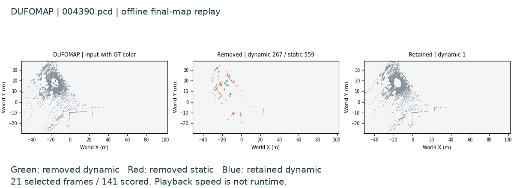
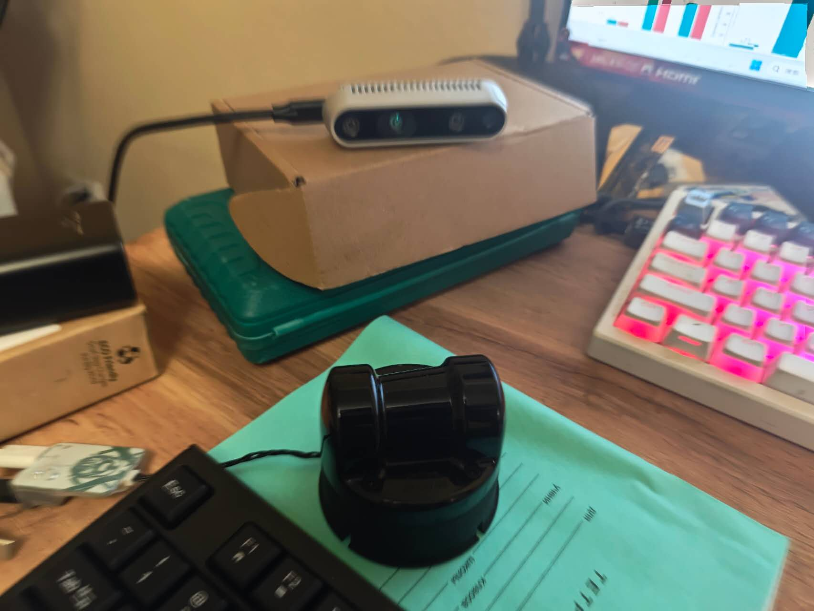
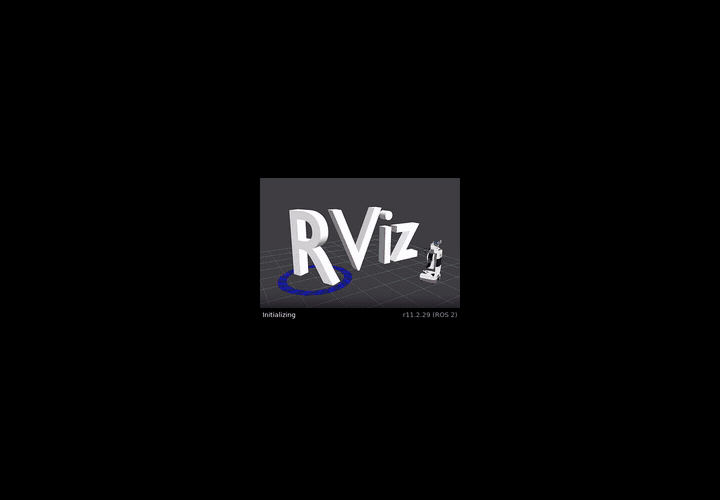

<div align="center">

# SLAM Learning

**Map repair?**

Dynamic robust mapping · Semantic mapping and localization

[](https://github.com/p20030920p/SLAM_Learning/actions/workflows/ci.yml)
[](src/pyproject.toml)

English | [中文](docs/HOME.zh-CN.md)

[Directions](#directions-analysis) · [Related works](#related-works) · [Questions](#open-questions) · [Results](#reproduction-results)

[Evidence](#evidence) · [Hardware tests](#hardware-tests) · [Hypothesis](#hypothesis) · [Branches](#branches)

</div>

Four related papers → selected mapping reproductions → an open question and hypothesis. **H1 remains unverified.**

## Directions analysis

**SLAM — Simultaneous Localization and Mapping:** estimate sensor motion while building a map from its observations.

- **Robust localization and SLAM in dynamic environments:** estimate motion and maintain a stable map despite moving objects.
- **Semantic mapping, visual localization and navigation:** describe objects and their locations, estimate pose from images, and reach a target.

Five elements organize this process:

```text
Sensor data → Front end → Back end (optimize) → Map build
                  ↓              ↑
             Loop detection ─────┘
```

| Element | Benefit | Dynamic SLAM | Semantic mapping |
| --- | --- | --- | --- |
| Sensor data | Cleaner input | Motion cues | RGB-D alignment |
| Front end | Stable matches | Static features | Object association |
| Back end | Consistent poses | Outlier rejection | Object alignment |
| Loop detection | Less drift | Place recognition | Relocalization |
| Map build | Stable maps | Dynamic removal | Object identities |

The first direction emphasizes reliable motion and geometry. The second adds object meaning and target retrieval. The completed mapping experiments use supplied poses to isolate **map construction**. Complete SLAM and navigation remain outside these experiments.

## Related works

These are saved-result replays from supplied-pose mapping runs. GIFs preserve the companion MP4 timing; each selected map observation is held for eight frames at 12 fps. [GIF timing and sources](results/reference/conceptgraphs/media/timing.json).

### [DUFOMap](docs/papers/dufomap.md)



**KITTI-00 outdoor scene, 141 LiDAR scans.** Observed empty space identifies dynamic points; pose margins protect static geometry. The GIF selects 21 scans to compare input, removed and retained points against the final map. [MP4](results/reference/dufomap/media/replay/replay.mp4).

### [BeautyMap](docs/papers/beautymap.md)


**KITTI-00 outdoor scene, 141 LiDAR scans.** Occupancy comparisons remove dynamic traces; restoration protects static geometry. The GIF selects 21 scans to compare input, removed and retained points against the final map. [MP4](results/reference/beautymap/media/replay/replay.mp4).

### [ConceptGraphs](docs/papers/conceptgraphs.md)


**Replica room0 indoor scene, 40 RGB-D frames.** Geometry/CLIP matching fuses observations into 39 object representations. The GIF selects 20 frames, showing image segments, the final map and a red text-query candidate. Candidate correctness is unverified. [MP4](results/reference/conceptgraphs/media/replay/replay.mp4).

### [HOV-SG](docs/papers/hovsg.md)

In progress

## open questions:

How can multi-frame mapping prevent localization errors from causing persistent mistakes in static-structure filtering and object association?

## Reproduction results

| Work | Data | Result |
| --- | --- | --- |
| [DUFOMap](https://github.com/p20030920p/SLAM_Learning/blob/535a2780af7ca7eb3aa02f722e1340fe90bc2dcf/docs/DUFOMAP_TABLE4.md) | KITTI-00, 141 scans | Table IV accuracy matched |
| [BeautyMap](https://github.com/p20030920p/SLAM_Learning/blob/535a2780af7ca7eb3aa02f722e1340fe90bc2dcf/docs/KITTI_PAPER_PROTOCOL.md) | Historical KITTI-02, 91 scans | Table III accuracy matched |
| [ConceptGraphs](https://github.com/p20030920p/SLAM_Learning/blob/535a2780af7ca7eb3aa02f722e1340fe90bc2dcf/docs/CONCEPTGRAPHS_ROOM0_RESULTS.md) | room0, 400 observations | Single-scene scored |
| [HOV-SG](docs/papers/hovsg.md) | | In progress |

## Evidence

Values below come from the papers linked by the original repositories and our recorded author-code runs. Each table concerns one method; no cross-method ranking is implied.

### DUFOMap

KITTI-00, 141 released scans; full setting: voxel 0.1 m, d_s=0.2 m, d_p=1. [Original repository](https://github.com/KTH-RPL/dufomap/tree/9e239ddd5995136e14f5212f33382a6ebc59e518) · [Paper Table IV](https://arxiv.org/html/2403.01449v1#S5.T4) · [Our results](https://github.com/p20030920p/SLAM_Learning/blob/535a2780af7ca7eb3aa02f722e1340fe90bc2dcf/docs/DUFOMAP_TABLE4.md).

| Metric | Paper % | Reproduced % |
| --- | ---: | ---: |
| SA | 97.96 | 97.9635 |
| DA | 98.72 | 98.7196 |
| AA | 98.34 | 98.3408 |

All three full-setting values match the paper at two decimals. Across all five Table IV settings, all 15 accuracy entries match; runtime and online experiments are outside this comparison.

### BeautyMap

Historical KITTI-02, frames 860–950, 91 scans; XY=1 m, Z=0.5 m, range=40 m. [Original repository](https://github.com/MKJia/BeautyMap/tree/98bce4a97db96ddd0d5342e31425c7679f58ba2e) · [Paper Table III](https://arxiv.org/html/2405.07283v1#S4.T3) · [Our results](https://github.com/p20030920p/SLAM_Learning/blob/535a2780af7ca7eb3aa02f722e1340fe90bc2dcf/docs/KITTI_PAPER_PROTOCOL.md).

| Metric | Paper % | Reproduced % |
| --- | ---: | ---: |
| SA | 83.40 | 83.3978 |
| DA | 82.41 | 82.4092 |
| HA | 82.90 | 82.9006 |

All three values match at two decimals. All nine accuracy entries across XY=0.5/1/2 m match. This uses historical preprocessing/GT and the author's HA scorer; the exact paper method commit remains unidentified. Other sequences and runtime are outside this comparison.

### ConceptGraphs

The paper reports Replica benchmark results; our completed result below covers **room0 only, 400 observations**, with the disclosed SAM batch-16 variant. These scopes differ, so the paper values are reference values, without a reproduction-gap calculation. [Original repository](https://github.com/concept-graphs/concept-graphs/tree/93277a02bd89171f8121e84203121cf7af9ebb5d) · [Paper Table II](https://arxiv.org/html/2309.16650v1#S3.T2) · [Our room0 results](https://github.com/p20030920p/SLAM_Learning/blob/535a2780af7ca7eb3aa02f722e1340fe90bc2dcf/docs/CONCEPTGRAPHS_ROOM0_RESULTS.md).

| Metric | Paper benchmark % | Our room0 % |
| --- | ---: | ---: |
| mAcc | 40.63 | 38.3156 |
| F-mIoU | 35.95 | 50.1379 |

The author's evaluator defines `mrecall` as mAcc and `fmiou` as F-mIoU. Our macro mIoU of 21.3460% is a different metric and is not substituted for F-mIoU. [Metric definitions](https://github.com/concept-graphs/concept-graphs/blob/93277a02bd89171f8121e84203121cf7af9ebb5d/README.md#evaluate-semantic-segmentation-from-the-object-based-mapping-results-on-replica-datasets).


## Hardware tests



Desktop setup: RealSense D435 depth camera (without IMU) and Unitree L2 LiDAR.

| Device | Basic test | Full video |
| --- | --- | --- |
| D435 | RGB / depth / stereo IR capture | [24.6 s](docs/media/hardware/d435-input.mp4) |
| L2 | Point cloud / ICP display | [42.2 s](docs/media/hardware/l2.mp4) |




Supplement: [D435 RGB-D odometry, 44.9 s](docs/media/hardware/d435.mp4). These are recorded acquisition and display checks; hardware accuracy, full SLAM and cross-sensor fusion remain unverified. [Timing and sources](docs/media/hardware/record.json).

## Hypothesis

We hypothesize that retaining the observation evidence behind map updates and revisiting these updates as pose estimates improve will reduce persistent mapping errors and preserve more consistent geometric and semantic maps

## Branches

| Branch | Role |
| --- | --- |
| main | Curated submission: question, four mapping reproductions, open question and hypothesis. |
| [reproduce/author-originals](https://github.com/p20030920p/SLAM_Learning/tree/reproduce/author-originals) | Original pipelines, paper-table/semantic scoring and recordings. |
| [notes/personal-study-guide-20261008](https://github.com/p20030920p/SLAM_Learning/tree/notes/personal-study-guide-20261008) | Personal study notes and hardware trials under `src/physical/`, including operations and failures. |


[AI use](docs/guides/DISCLOSURE.md) · [Sources/licenses](docs/guides/ATTRIBUTION.md) · [Citation](docs/CITATION.cff) · [License](src/LICENSE)
