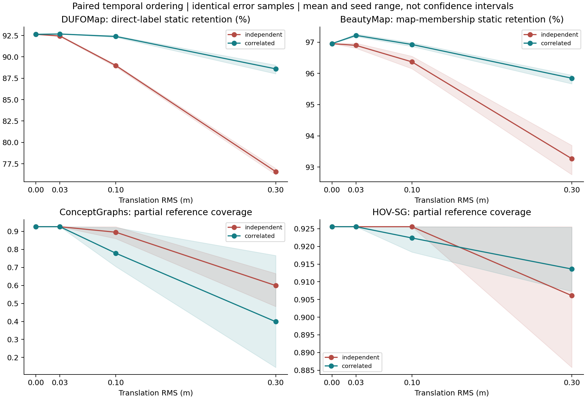
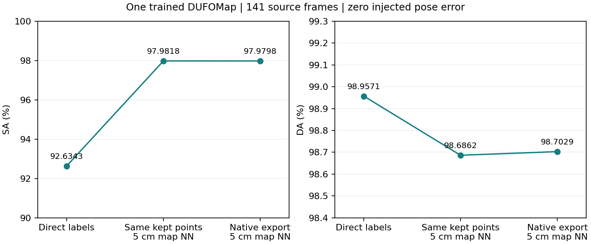

<div align="center">

# SLAM Learning

**When should a map believe that the world changed?**

Dynamic robust mapping · Semantic mapping and localization · Shared pose uncertainty

[](https://github.com/p20030920p/SLAM_Learning/actions/workflows/ci.yml)
[](pyproject.toml)
[](docs/papers/README.md)

[Quick start](#quick-start) &nbsp;•&nbsp; [Four papers](#four-related-reproductions) &nbsp;•&nbsp; [Paired evidence](#paired-evidence-97-native-core-cells) &nbsp;•&nbsp; [Repository layout](#repository-layout)

English &nbsp;|&nbsp; [中文](README.zh-CN.md)

</div>


*Measured final-map replay: 21 selected scans, fixed world view, raw → removed → retained. Green: removed dynamic; red: removed static; blue: retained dynamic. GT is used only for scoring/coloring. [Source and rendering settings](results/reference/reproduction-media-wsl/record.json).*

This study connects the two selected laboratory themes through one interface: **posed observations → spatial correspondence → map decision**. We reproduce author pipelines first, audit their measurements, then formulate a testable hypothesis. The supplied-pose mapping runs do not estimate a SLAM trajectory.

## Quick start

```bash
uv sync --frozen --python 3.10 --extra methods --extra dev
uv run slam-study fetch
uv run slam-study run --method dufomap
uv run slam-study run --method beautymap
uv run python scripts/verify_evidence.py
uv run python scripts/check_docs.py
```

For Linux/WSL CUDA cores, use `bash scripts/setup_semantic.sh` then `.venv-semantic/bin/python scripts/run_conceptgraphs.py`; use `bash scripts/setup_hovsg.sh` then `.venv-hovsg/bin/python scripts/run_hovsg.py`. Separate environments pin their dependencies and verify checkpoints. [WSL](docs/WSL.md) · [Full reproduction commands](docs/REPRODUCE.md).

## Four related reproductions

| Paper | Actually executed | Report | Watch | PDF |
| --- | --- | --- | --- | --- |
| DUFOMap, 2024 | Author dynamic-point removal, full 141-scan KITTI-00 teaser | [Card](docs/papers/dufomap.md) | [MP4](docs/media/dufomap/replay.mp4) / [GIF](docs/media/dufomap/preview.gif) | [EN](output/pdf/dufomap.en.pdf) / [中文](output/pdf/dufomap.zh-CN.pdf) |
| BeautyMap, 2024 | Author map cleaning, same full teaser | [Card](docs/papers/beautymap.md) | [MP4](docs/media/beautymap/replay.mp4) / [GIF](docs/media/beautymap/preview.gif) | [EN](output/pdf/beautymap.en.pdf) / [中文](output/pdf/beautymap.zh-CN.pdf) |
| ConceptGraphs, ICRA 2024 | SAM/CLIP and native association/fusion; 40 posed Replica observations, 39 objects | [Card](docs/papers/conceptgraphs.md) | [MP4](docs/media/conceptgraphs/replay.mp4) / [GIF](docs/media/conceptgraphs/preview.gif) | [EN](output/pdf/conceptgraphs.en.pdf) / [中文](output/pdf/conceptgraphs.zh-CN.pdf) |
| HOV-SG, RSS 2024 | Native segment feature-map core; 8 posed observations, 50 segments | [Card](docs/papers/hovsg.md) | [MP4](docs/media/hovsg/replay.mp4) / [GIF](docs/media/hovsg/preview.gif) | [EN](output/pdf/hovsg.en.pdf) / [中文](output/pdf/hovsg.zh-CN.pdf) |

The semantic runs are **explicit core subsets**: complete semantic paper benchmarks, full graph reasoning and navigation are unfinished. Object/segment counts are not accuracy and cannot rank the two systems. The interrupted HOV-SG 40-observation attempt is retained. [Scope and failures](docs/SEMANTIC.md).

| ConceptGraphs: native observations + final object map | HOV-SG: native observations + final segment map |
| --- | --- |
|  |  |

*Red is a text-query candidate, not annotated correctness. Both maps are final world-XZ projections; the clips are measured-output replays, not live screen recordings or FPS benchmarks. [Recording convention and coordinate audit](docs/RECORDING.md).*

## What the numbers establish

| Author method | SA % ↑ | DA % ↑ | Aggregate | Paper-table agreement |
| --- | ---: | ---: | --- | --- |
| DUFOMap 1.1.1 | 97.9798 | 98.7029 | Geometric AA 98.3407 | Not all values within 0.01 pp |
| BeautyMap, pinned source | 96.9529 | 98.3382 | Harmonic HA 97.6407 | Not all values within 0.01 pp |

All 141 scans and 17,362,230 labeled points are evaluated with 5 cm map proximity. Windows, fresh Ubuntu CI and WSL counts agree. Original PCL and SciPy agree **pointwise with zero disagreements** for both maps. This excludes that evaluator implementation as the cause of the remaining paper-table gaps. AA and HA are different aggregates. [Full counts, targets and controls](docs/RESULTS.md).

Changing only the scoring of the same DUFOMap retained points, from original identities to map proximity, raises SA by **5.347532 pp**. This is a measurement effect, not an algorithm gain. The actual ConceptGraphs mapper uses absolute poses; 39 saved camera matrices verify the coordinate convention. These audits matter before drawing a research conclusion.

## Paired evidence: 97 native-core cells

Four partial-surface targets now accompany **76 paired pose cells + 21 parameter controls**. At 30 cm RMS, monotone drift preserves more static LiDAR points than shuffled errors, while ConceptGraphs loses more reference coverage. This rejects “correlation is always worse”; it does not establish a universal shared-uncertainty bottleneck. H1 remains a candidate. Annotations are AI-assisted and await independent human review.



[Protocol](docs/PAIRED_PROTOCOL.md) · [Results, revised hypothesis and falsification plan](docs/PAIRED_RESULTS.md) · [EN PDF](output/pdf/paired-study.en.pdf) / [中文 PDF](output/pdf/paired-study.zh-CN.pdf).

Four complete terminal recordings are retained outside Git. See [recording evidence and commands](docs/RECORDING.md#complete-local-execution-recordings) for access details and reproduction.

## Research question

**Can map updates remain reliable under temporally correlated pose errors, at equal change recall, query coverage and update delay, when stable anchors exist?**

The shared dependency is spatial correspondence, not a claim that all four methods ignore noise or assume static scenes. DUFOMap already has tolerances, BeautyMap protects hidden geometry, ConceptGraphs supports updates, and HOV-SG explicitly acknowledges its static-scene limit. Wrong correspondence may cause false removal or incorrect semantic assignment; a shared empirical failure has not yet been established across all four.

Candidate H1 keeps one shared pose variable and observation provenance, delays ambiguous edits, and replays affected observations after a correction. A bounded object/submap sidecar is feasible. Stable anchors are required; known covariance is an oracle diagnostic. Khronos already jointly optimizes and reconciles maps, so memory or joint optimization alone is not a novelty claim.

Reject H1 if a simple threshold/visibility baseline matches its risk at the same recall, coverage and delay, or if deferred edits merely increase stale-target time. Existing room0 and synthetic trials informed the idea and remain exploratory. [Careful four-paper analysis](docs/STUDY.md) · [EN PDF](output/pdf/study.en.pdf) / [中文 PDF](output/pdf/study.zh-CN.pdf).



## D435i and Unitree L2 without a robot

**Planned; hardware data has not been collected.** A robot is unnecessary for testing map decisions and object-coordinate queries.

<details>
<summary>Physical test setups and required controls</summary>

| Setup | Distinguishing test | Required control |
| --- | --- | --- |
| Fixed D435i tripod | Static / occluded / moved / removed object, semantic identity and target coordinates | Identity sensor pose; background reference and annotated visibility |
| Fixed L2 tripod | Static geometry retention, rays through genuinely empty space | Raw point/time/ring data and verified sensor pose |
| Handheld loop | Same pixels/features, independent versus correlated injected pose errors | Estimated odometry separated from reference; equal achieved pose RMS |
| Rigid D435i + L2 mount | Whether an independent geometric source helps association | Extrinsics, timestamp-offset measurement and RGB-D/LiDAR interference control |

The detailed protocol specifies room layout, calibration, native/ROS capture, event states, labels, validation/test sessions, failure cases, metrics and publication files. D435i IMU is not ground-truth position. A shared-clock assumption is not made for L2. [Executable physical plan](docs/REAL_WORLD.md) · [EN PDF](output/pdf/real-world.en.pdf) / [中文 PDF](output/pdf/real-world.zh-CN.pdf).

</details>

## Repository layout

```text
SLAM_Learning/
├── src/slam_learning/   # Study code and the slam-study CLI
├── scripts/            # Setup, reproduction, rendering and verification
├── configs/            # Dataset, method, experiment and documentation settings
├── environments/       # Separate semantic-core and report dependencies
├── annotations/        # Paired-study target annotations
├── tests/              # Automated checks
├── docs/               # Bilingual narratives, paper cards and media
├── results/            # Measured ledger and traceable run records
├── output/pdf/         # Bilingual reports
└── archive/            # Historical migration index
```

See the [documentation index](docs/README.md) for all reading routes. Local environments, caches, datasets and new run outputs are excluded by `.gitignore`; committed reference records support measurement and media audits.

## Reading and interview route

| Goal | Start here |
| --- | --- |
| Audit reproductions and measurements | [Paper cards](docs/papers/README.md) · [Results](docs/RESULTS.md) · [Measured ledger](results/REPORT.md) |
| Understand the question and next experiments | [Cross-paper study](docs/STUDY.md) · [Experiment gates](docs/PLAN.md) · [Physical protocol](docs/REAL_WORLD.md) |
| Prepare a submission or defense | [Submission checklist](docs/SUBMISSION.md) · [AI disclosure](docs/INTERVIEW.md) · [Full documentation index](docs/README.md) |

Every narrative has an independent [Chinese edition](docs/README.zh-CN.md). Historical material is recoverable at `af1e58b` and contributes no current score.

[Citation](CITATION.cff) · [Sources, data and media credits](docs/ATTRIBUTION.md) · [Study-code license](LICENSE).
