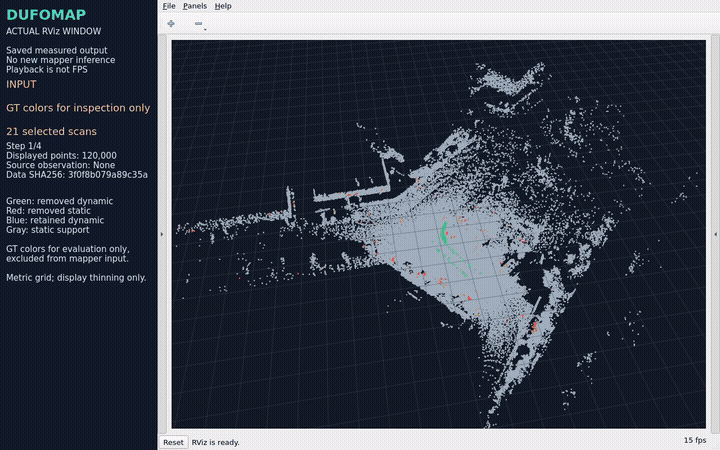
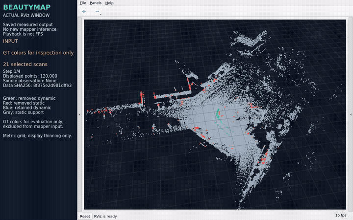
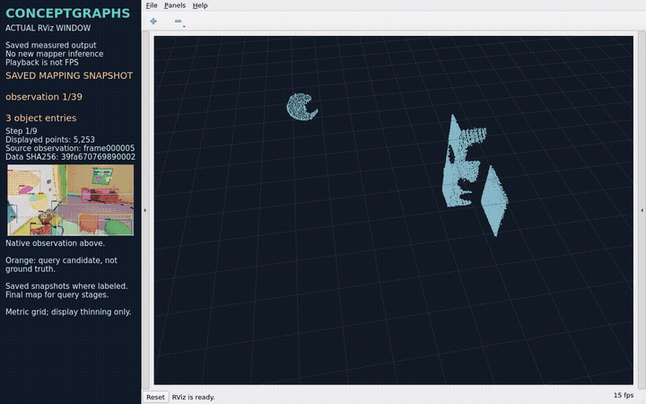
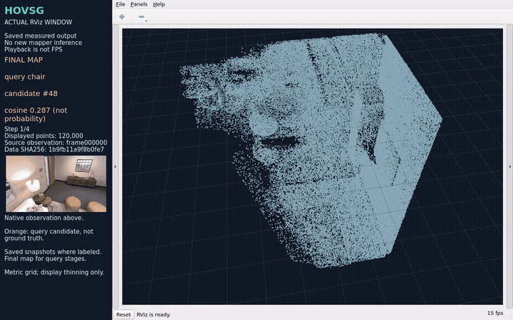
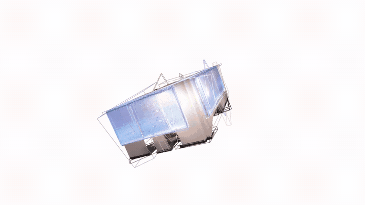
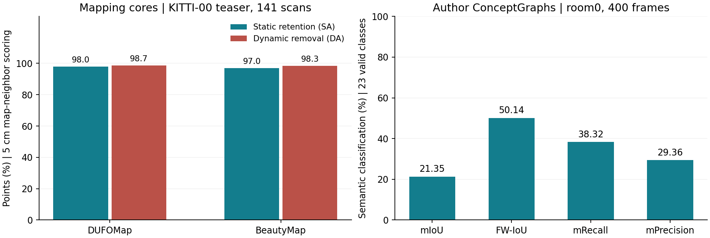
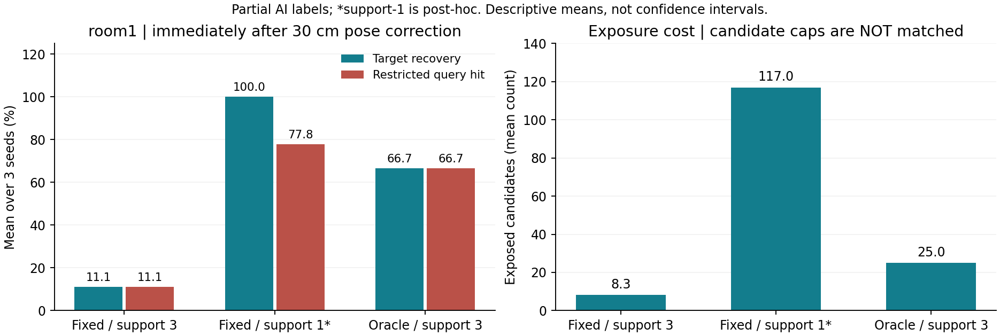

<div align="center">

# SLAM Learning

**When should a map believe that the world changed?**

Dynamic robust mapping · Semantic mapping and localization

[](https://github.com/p20030920p/SLAM_Learning/actions/workflows/ci.yml)
[](pyproject.toml)

English | [中文](README.zh-CN.md)

[Research analysis](docs/STUDY.md) · [Experimental results](docs/PAIRED_RESULTS.md) · [Home validation design](docs/REAL_WORLD.md)

</div>

> **In progress:** [room2 identity-budget study](docs/IDENTITY_BUDGET.md), with AI-only labels. All 28 native cells have run; analysis is pending. H1 remains unverified.


*Saved-map replay, not live inference; GT is used for evaluation and coloring. [Source](results/reference/reproduction-media-wsl/record.json).*

Four 2024 mapping cores, followed by controlled pose-error experiments. These runs use supplied poses; they do not estimate trajectories.

## Direction choice and analysis

**I choose:**

- Robust localization and SLAM in dynamic environments;
- Semantic mapping, visual anchoring and navigation.

**Analysis:**

SLAM means **Simultaneous Localization and Mapping**: *an agent uses sensor data to build a map of an initially unknown environment while estimating its own motion.*

The two coupled tasks are localization and mapping. Real-time processing is a goal of online SLAM; practical systems may also use prior information.

```text
Sensor data → Front end → Back end (optimize) → Map build
                  ↓              ↑
             Loop detection ─────┘
```

**Direction 1 — keep geometry reliable when the world moves.** [DUFOMap](https://arxiv.org/html/2403.01449v1) uses observed empty space; [BeautyMap](https://arxiv.org/html/2405.07283v1) compares occupancy and restores hidden static regions. Both clean maps to support localization; neither estimates a trajectory in our reproduction.

**Direction 2 — connect “what” to “where.”** [ConceptGraphs](https://arxiv.org/html/2309.16650v1) associates object geometry and language features; [HOV-SG](https://arxiv.org/html/2403.17846v2) organizes segments into floors, rooms and objects for language-guided navigation. Our runs test mapping and retrieval, not closed-loop navigation.

| SLAM element | Direction 1: dynamic robustness | Direction 2: semantic grounding |
| --- | --- | --- |
| Sensor data | Motion, occlusion and sparse returns | RGB-D alignment and semantic observations |
| Front end | Stable correspondences and ego-motion | Segmentation, features and object association |
| Back end | Robust pose constraints | Consistent coordinates for fused semantics |
| Loop detection | Recognize a changed place | Revisit the same place/object; refresh anchors |
| Map build | Retain static geometry, remove dynamics | Maintain identity, meaning and target coordinates |

The selected four papers mainly occupy **map building and its correspondence interface**. Backend and loop corrections motivate our question; those SLAM modules are not reproduced here. Navigation consumes their outputs.

## Open research question

**After a late pose correction, does recomputing historical associations recover object identities and target coordinates more reliably than geometry correction alone at the same candidate cap?**

## Related works

Four related 2024 papers; ConceptGraphs first appeared as a 2023 preprint. These four GIFs show **our measured core outputs replayed against saved final maps**. Green/red/blue in LiDAR clips denote correct dynamic removal/static loss/missed dynamics; a red semantic candidate is not verified correctness. [Media sources](docs/RECORDING.md).

| DUFOMap | BeautyMap |
| --- | --- |
|  |  |
| **Idea:** classify points using previously observed empty space. **Seen:** dynamic returns are removed while road/building geometry remains, with visible static losses. All 141 teaser scans scored. [Core + video](docs/papers/dufomap.md). | **Idea:** binary occupancy, ground adaptation and static restoration. **Seen:** a cleaned map with removed/retained points; restoration does not eliminate every error. Same 141-scan teaser. [Core + video](docs/papers/beautymap.md). |

| ConceptGraphs | HOV-SG |
| --- | --- |
|  |  |
| **Idea:** lift SAM/CLIP observations, then associate and fuse objects. **Seen:** masks beside a final object map and text-query candidate. 40 posed frames, 39 representations; not 39 verified identities. [Core + video](docs/papers/conceptgraphs.md). | **Idea:** merge 3D segments and select semantic features before hierarchy construction. **Seen:** segmentation and a queried final feature map. Eight posed frames, 50 segments; hierarchy/navigation not run. [Core + video](docs/papers/hovsg.md). |

<details>
<summary>Paper evidence behind the question</summary>

| Work | Existing protection and remaining issue |
| --- | --- |
| [DUFOMap, III-B / V-C / V-E](https://arxiv.org/html/2403.01449v1) | Already tolerates pose/range error. Pose quality and never-observed empty space still limit classification. |
| [BeautyMap, III / our cell-size reproduction](https://arxiv.org/html/2405.07283v1) | Already restores out-of-view static regions. Occupancy correspondence and the static-retention/removal trade-off still matter. |
| [ConceptGraphs, II-A / III-H](https://arxiv.org/html/2309.16650v1) | Supports map updates, but reports thin-object misses, duplicates and caption errors. Association recovery after pose revision is our question, not a reported universal failure. |
| [HOV-SG, III-A / V](https://arxiv.org/html/2403.17846v2) | Projects using accurate odometry; explicitly assumes static scenes and reports slow construction. Online semantic recovery remains outside our reproduced core. |

Their common dependency is **pose → spatial correspondence → map decision**, not an established common failure. [Khronos](https://arxiv.org/html/2402.13817v2) already reconciles maps after optimization; [DovSG](https://arxiv.org/html/2410.11989v2) updates local semantic memory. Both are literature comparisons, not reproduced baselines. History or dynamic updates alone are not our novelty claim.

</details>

The separate [`reproduce/author-originals`](https://github.com/p20030920p/SLAM_Learning/tree/reproduce/author-originals) branch runs pinned official repositories. Snapshot **`3b0b9a8`** adds:

| Work | Author-workflow progress | Evidence |
| --- | --- | --- |
| DUFOMap | Four labeled releases, 1,997 scans; Table IV: all 15 SA/DA/AA entries match two-decimal paper precision | [Table IV](https://github.com/p20030920p/SLAM_Learning/blob/3b0b9a88ac7c77431268b6c869c369e01bd19b3e/docs/DUFOMAP_TABLE4.zh-CN.md) |
| BeautyMap | Same four releases; historical KITTI-02 preprocessing and three grid sizes reproduce all nine Table III SA/DA/HA entries | [Table III](https://github.com/p20030920p/SLAM_Learning/blob/3b0b9a88ac7c77431268b6c869c369e01bd19b3e/docs/KITTI_PAPER_PROTOCOL.zh-CN.md) |
| ConceptGraphs | room0: 400 frames, 77 object records; original semantic scoring independently recalculated; original viewer recorded | [Results](https://github.com/p20030920p/SLAM_Learning/blob/3b0b9a88ac7c77431268b6c869c369e01bd19b3e/docs/CONCEPTGRAPHS_ROOM0_RESULTS.zh-CN.md) |
| HOV-SG | Additional 20-frame sampling completes 156 segments and 399,663 global points; scoring pending. Default 200-frame fusion timed out | [Scope/failure](https://github.com/p20030920p/SLAM_Learning/blob/3b0b9a88ac7c77431268b6c869c369e01bd19b3e/docs/HOVSG_HOME_RESULTS.zh-CN.md) |

The GIFs above depict the earlier core subsets, not these larger runs. Paper-table agreement covers the stated accuracy entries, not every paper experiment.

<details>
<summary>Five more GIFs: recorded 3D viewing of saved outputs</summary>

| DUFOMap RViz | BeautyMap RViz |
| --- | --- |
|  |  |

| ConceptGraphs RViz | HOV-SG RViz |
| --- | --- |
|  |  |

RViz clips inspect the earlier core outputs; they show actual graphical viewing, not new inference. Full videos: [DUFOMap](docs/media/rviz/dufomap.mp4) · [BeautyMap](docs/media/rviz/beautymap.mp4) · [ConceptGraphs](docs/media/rviz/conceptgraphs.mp4) · [HOV-SG](docs/media/rviz/hovsg.mp4).



The **400-frame author run** in its original Open3D viewer: RGB/instance colors and orbit controls. This is a saved-map window recording, without text queries or relation-graph visualization. [Full 60-second video](https://github.com/p20030920p/SLAM_Learning/blob/3b0b9a88ac7c77431268b6c869c369e01bd19b3e/evidence/videos/conceptgraphs-room0-original-window.mp4) · [Derivative hashes and clip times](results/reference/homepage-media/record.json).

</details>

**Measured indicators:**



| Run | Metric | Measured |
| --- | --- | ---: |
| DUFOMap, 141-scan core | Static retention SA / dynamic removal DA | 97.9798% / 98.7029% |
| BeautyMap, same core inputs | SA / DA | 96.9529% / 98.3382% |
| ConceptGraphs, author room0 | mIoU / frequency-weighted IoU | 21.3460% / 50.1379% |
| HOV-SG, author 20-frame variant | Semantic accuracy | Pending |

LiDAR uses 5 cm map-neighbor scoring. ConceptGraphs uses 23 valid classes and 4,085,377 reconstructed scoring points after exclusions. These are separate protocols, not a four-method ranking. Counts are execution scope, not accuracy; AA is geometric mean, HA harmonic mean. [Plot inputs](results/reference/homepage-media/record.json) · [Renderer](scripts/build_homepage_media.py).

<details>
<summary>Earlier core scope, commands and bilingual reports</summary>

| Work | Actually completed | Inspect | Bilingual reports |
| --- | --- | --- | --- |
| DUFOMap | Author 1.1.1; all 141 KITTI teaser scans and 17,362,230 points | [Card](docs/papers/dufomap.md) · [Video](docs/media/dufomap/replay.mp4) · [RViz](docs/media/rviz/dufomap.mp4) | [EN](output/pdf/dufomap.en.pdf) / [中文](output/pdf/dufomap.zh-CN.pdf) |
| BeautyMap | Author map cleaning on the same teaser; GT excluded from algorithm inputs | [Card](docs/papers/beautymap.md) · [Video](docs/media/beautymap/replay.mp4) · [RViz](docs/media/rviz/beautymap.mp4) | [EN](output/pdf/beautymap.en.pdf) / [中文](output/pdf/beautymap.zh-CN.pdf) |
| ConceptGraphs | SAM/CLIP and association/fusion on 40 posed room0 observations; 39 objects | [Card](docs/papers/conceptgraphs.md) · [Video](docs/media/conceptgraphs/replay.mp4) · [RViz](docs/media/rviz/conceptgraphs.mp4) | [EN](output/pdf/conceptgraphs.en.pdf) / [中文](output/pdf/conceptgraphs.zh-CN.pdf) |
| HOV-SG | Segment feature-map core on 8 room0 observations; 50 segments | [Card](docs/papers/hovsg.md) · [Video](docs/media/hovsg/replay.mp4) · [RViz](docs/media/rviz/hovsg.mp4) | [EN](output/pdf/hovsg.en.pdf) / [中文](output/pdf/hovsg.zh-CN.pdf) |

Semantic reproductions are explicit core subsets. Complete semantic benchmarks, LLM graph reasoning, floor/room hierarchy and navigation remain unfinished. The interrupted 40-observation HOV-SG attempt is retained. [Scope and failures](docs/SEMANTIC.md).

</details>

## Hypothesis

**Candidate H1:** retain bounded observation provenance and pose versions. After correction, mark affected query results stale, then replay their contributors and associations. This may recover identities that coordinate-only correction cannot; benefit and memory cost are unverified.



The room1 counterexample matters: at 30 cm RMS, recovery is **11.1%** for corrected geometry/fixed history, **66.7%** for oracle reassociation, but **100%** after lowering the fixed-history support gate. Exposed candidates rise from **8.3 to 117.0**, versus oracle's **25.0**. These are three-seed means with partial AI labels; support-1 is post-hoc and candidate caps differ. [Scores/definitions](docs/DELAYED_RESULTS.md).

Therefore room2 compares fixed history, threshold 1.0, visibility protection and full replay at the **same candidate cap**. All 28 native cells ran; independent analysis is pending. At fixed RMS/support, advance only if oracle beats every simple control by ≥10 percentage points at two finite caps, ≥2/3 seeds improve, and annotated identity errors do not increase. This permits a prototype plan, not H1 confirmation. Equal caps do not match memory. [Frozen study](docs/IDENTITY_BUDGET.md).

**Personal learning:** [`notes/personal-study-guide-20261008`](https://github.com/p20030920p/SLAM_Learning/blob/71a2e7556e231c1d0e6814febb085bea9d225f44/notes/OPEN_QUESTION_AND_HYPOTHESIS.zh-CN.md) contains the paper comparison, research draft and rejection controls. [`Personal-Learning-Physical`](https://github.com/p20030920p/SLAM_Learning/blob/4e5a5e8b703e5072ca5e11cf6893d03bca244473/README.zh-CN.md) contains D435/L2 capture, RTAB-Map stereo/RGB-D, ICP/KISS trials and recordings; both semantic loaders passed an eight-frame real RGB-D input check. The SDK identifies **D435 without IMU**. Old fixed-sensor LiDAR odometry drift failed; LIO, cross-sensor fusion and semantic mapping quality remain unvalidated. Hardware input checks do not validate H1; indoor raw recordings stay local.

<details>
<summary>Earlier paired and delayed-correction evidence</summary>

## How the results revise the question


**76 primary cells + 21 exploratory parameter controls** show that at 30 cm RMS, monotone drift preserves more static LiDAR points than shuffled errors, while ConceptGraphs loses more partial-surface coverage. This rejects “temporal correlation is always worse.” A common dominant shared-uncertainty bottleneck remains unproven; simple threshold changes already improve some outcomes.

Changing only correspondence in the scoring of the same DUFOMap output changes SA by **5.347532 percentage points**. This is a measurement effect, not an algorithm gain. One teaser, one static room and four partial surfaces without independent human annotation review limit the claims.

**Narrowed open question:** when a later pose correction changes historical correspondence, how can object identity and query coordinates become valid again, while exposing results that remain stale? Candidate H1 retains observation provenance, pose versions and bounded replay. No prototype benefit has been established.

[Standalone analysis: achievements, gaps, metrics and H1](docs/STUDY.md) · [Full paired results](docs/PAIRED_RESULTS.md) · [Protocol](docs/PAIRED_PROTOCOL.md) · [Paired report EN](output/pdf/paired-study.en.pdf) / [中文](output/pdf/paired-study.zh-CN.pdf)

## Delayed correction on a new scene

**35 frozen room1 cells + 6 separate post-hoc controls** revise the diagnosis. At 30 cm, immediate recovery is 11.1% with corrected geometry and fixed history versus 66.7% with oracle reassociation. Lowering the support gate from 3 to 1 raises fixed-history recovery to 100%, while exposed candidates rise from 8.3 to 117.0. Labels are partial and await independent human review. Reassociation is not yet shown necessary; test identity quality and equal candidate budgets before implementing H1. [New results and decision](docs/DELAYED_RESULTS.md) · [EN report](output/pdf/delayed-study.en.pdf) / [中文](output/pdf/delayed-study.zh-CN.pdf).

The [home experiment design](docs/REAL_WORLD.md) separates static, occlusion, movement and removal sessions before handheld revisits. The personal hardware branch has input/odometry trials; **no validated real-world semantic-map or navigation score is available.**

</details>

## Inspect and reproduce

[Minimal reproduction commands](docs/REPRODUCE.md) · [Paper cards and raw results](docs/papers/README.md) · [Visualization scope](docs/RECORDING.md) · [Document index](docs/README.md)

`src/`, `scripts/` and `configs/` contain study code and pinned settings; `results/reference/` contains portable raw evidence and failures; `output/pdf/` contains 16 report snapshots. Full datasets, weights, maps and personal operating notes stay outside main.

[AI use and research boundaries](docs/DISCLOSURE.md) · [Sources and licenses](docs/ATTRIBUTION.md) · [Citation](CITATION.cff) · [License](LICENSE)
