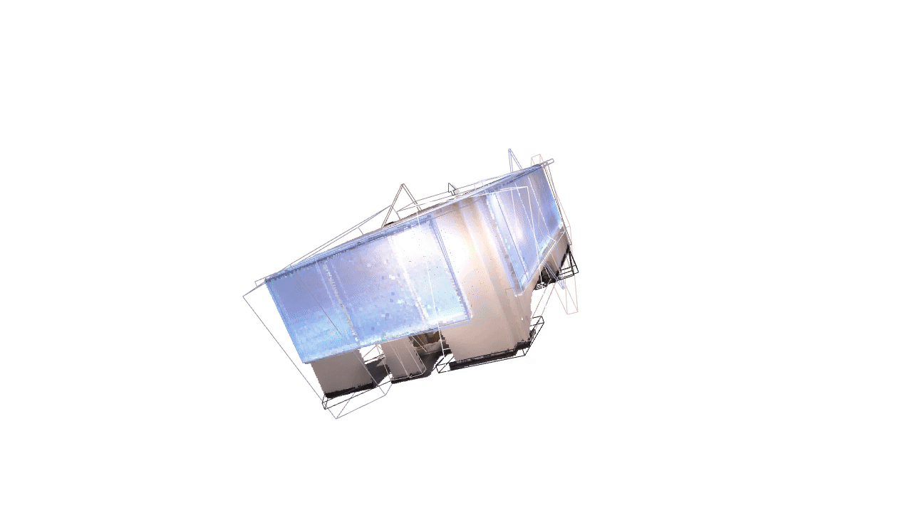

<div align="center">

# SLAM Learning

**Map repair?**

Dynamic robust mapping · Semantic mapping and localization

[](https://github.com/p20030920p/SLAM_Learning/actions/workflows/ci.yml)
[](src/pyproject.toml)

English | [中文](docs/HOME.zh-CN.md)

[Analysis](docs/research/STUDY.md) · [Evidence](docs/README.md) · [Setup](docs/guides/REPRODUCE.md) · [Structure](docs/guides/STRUCTURE.md)

</div>


*21 saved-map snapshots over 14 seconds; display timing is not algorithm runtime. GT only for evaluation/coloring. [Timing audit](results/reference/media-previews-v3/record.json).*

Four related papers → selected mapping experiments → pose-error controls → a candidate recovery hypothesis. **HOV-SG is not reproduced; H1 remains unverified.**

## Directions analysis

**SLAM — Simultaneous Localization and Mapping:** estimate sensor motion while building a map from its observations.

- **Robust localization and SLAM in dynamic environments:** estimate motion and maintain a stable map despite moving objects.
- **Semantic mapping, visual localization and navigation:** describe objects and their locations, estimate pose from images, and reach a target.

Five elements organize this process:

```text
Sensor data → Front end → Back end (optimize) → Map build
                  ↓              ↑
             Loop detection ─────┘
```

| SLAM element | Effect of improving it | Dynamic direction | Semantic direction |
| --- | --- | --- | --- |
| Sensor data | Cleaner, synchronized observations | Observe motion and occlusion | Align RGB and depth |
| Front end | More reliable matches | Match stable structure | Extract masks/features; associate observations |
| Back end | More consistent poses | Reject bad motion constraints | Align object coordinates |
| Loop detection | Revisit constraints help reduce drift | Recognize places despite changes | Support relocalization |
| Map build | A more usable map | Remove dynamic traces | Maintain identities and query targets |

The first direction emphasizes reliable motion and geometry. The second adds object meaning and target retrieval. The completed mapping experiments use supplied poses to isolate **map construction**. Complete SLAM and navigation are not reproduced; HOV-SG remains incomplete.

## Related works

These are saved-result replays from supplied-pose mapping runs. GIFs preserve the companion MP4 timing. DUFOMap/BeautyMap hold each selected observation for eight frames at 12 fps; ConceptGraphs uses the complete 5 fps RViz recording. [Preview timing](results/reference/media-previews-v3/record.json) · [Complete ConceptGraphs](results/reference/conceptgraphs-full-media/record.json).

### [DUFOMap](docs/papers/dufomap.md)


**KITTI-00 outdoor scene, 141 LiDAR scans.** Observed empty space identifies dynamic points; pose margins protect static geometry. The GIF selects 21 scans to compare input, removed and retained points against the final map. [MP4](docs/media/dufomap/replay.mp4).

### [BeautyMap](docs/papers/beautymap.md)


**KITTI-00 outdoor scene, 141 LiDAR scans.** Occupancy comparisons remove dynamic traces; restoration protects static geometry. The GIF selects 21 scans to compare input, removed and retained points against the final map. [MP4](docs/media/beautymap/replay.mp4).

### [ConceptGraphs](docs/papers/conceptgraphs.md)


**Replica room0 indoor scene, 40 RGB-D frames.** Geometry/CLIP matching fuses observations into 39 object representations. The complete **69.6-second GIF (348 frames, 5 fps)** shows five saved mapping snapshots (observations 1/10/20/30/39), then four text-query stages. It includes the recording's opening, transitions and ending. Candidate correctness is unverified. [Full MP4](docs/media/rviz/conceptgraphs.mp4).

### [HOV-SG](docs/papers/hovsg.md)

**Not reproduced for this delivery.** The default 200-frame run, full benchmark, floor/room hierarchy and navigation are incomplete. Completed 8/20-frame subsets are retained as limited diagnostic attempts, not a completed paper reproduction. [Status and retained evidence](docs/papers/hovsg.md).

## open questions:

- How can multi-frame mapping prevent localization errors from causing persistent mistakes in static-structure filtering and object association?

## Reproduction results

Later original-code runs use separate protocols, pinned at **535a278**:

| Work | Scored scope | Result |
| --- | --- | --- |
| [DUFOMap](https://github.com/p20030920p/SLAM_Learning/blob/535a2780af7ca7eb3aa02f722e1340fe90bc2dcf/docs/DUFOMAP_TABLE4.md) | Table IV, 141 released scans | SA 97.9635%, DA 98.7196%; 15 entries match paper rounding |
| [BeautyMap](https://github.com/p20030920p/SLAM_Learning/blob/535a2780af7ca7eb3aa02f722e1340fe90bc2dcf/docs/KITTI_PAPER_PROTOCOL.md) | Historical KITTI-02, 91 scans | At XY=1 m: SA 83.3978%, DA 82.4092%; 9 Table III entries match rounding |
| [ConceptGraphs](https://github.com/p20030920p/SLAM_Learning/blob/535a2780af7ca7eb3aa02f722e1340fe90bc2dcf/docs/CONCEPTGRAPHS_ROOM0_RESULTS.md) | room0, 400 observations | mIoU 21.3460%, frequency-weighted IoU 50.1379% |
| [HOV-SG](docs/papers/hovsg.md) | Not reproduced | Default 200-frame run and complete paper experiments unfinished; reduced-subset diagnostics retained separately |

SA/DA measure static retention/dynamic removal. Semantic scoring uses scene-GT classes and different supports/exclusions, not identity recovery or open-world query success. These scores cannot rank the four methods; complete trajectories and robot navigation remain untested. [Scope](https://github.com/p20030920p/SLAM_Learning/blob/535a2780af7ca7eb3aa02f722e1340fe90bc2dcf/docs/SCOPE.md).

<details>
<summary>Recorded GIFs</summary>

Each clip records a 3D viewer displaying saved results. RViz retains its recorded 5 fps; the author viewer retains 15 fps. No new inference; query highlights are unverified.

**DUFOMap RViz**


**KITTI-00, 141-scan run.** RViz switches between input, removed and retained point clouds to inspect dynamic-point removal. [MP4](docs/media/rviz/dufomap.mp4).

**BeautyMap RViz**


**KITTI-00, 141-scan run.** RViz compares input, removed and retained point clouds in the same 3D view. [MP4](docs/media/rviz/beautymap.mp4).

**ConceptGraphs viewer**



**Replica room0, separate 400-observation run.** The complete **60-second GIF (900 frames, 15 fps)** rotates the saved map and switches RGB/instance colors in the original author viewer. Queries and scene-graph relations are not displayed. [Full video](https://github.com/p20030920p/SLAM_Learning/blob/3b0b9a88ac7c77431268b6c869c369e01bd19b3e/evidence/videos/conceptgraphs-room0-original-window.mp4) · [Timing and sources](results/reference/conceptgraphs-full-media/record.json).

</details>

## Evidence


room1, immediately after 30 cm correction: fixed-history recovery **11.1%**, oracle **66.7%**, post-hoc support-1 **100%**; candidates **8.3 / 25 / 117**. Three-seed means, partial AI labels, unequal caps. [Results](docs/research/DELAYED_RESULTS.md).

A lower support gate closes this selected recovery gap while exposing more fragments; later observations also repair part of it. **Reassociation is not yet shown necessary.** The next test matches candidate caps and checks identities separately.

room2 has **28 completed mapping cells; identity/budget analysis remains pending**. Object annotations have not been independently reviewed; bounded replay is not implemented. [Further analysis](docs/research/PLAN.md).

## Hypothesis

- We hypothesize that retaining the observation evidence behind map updates and revisiting these updates as pose estimates improve will reduce persistent mapping errors and preserve more consistent geometric and semantic maps

## Branches

| Branch | Role |
| --- | --- |
| main | Curated submission: question, selected mapping experiments, counterevidence and candidate H1. |
| [reproduce/author-originals](https://github.com/p20030920p/SLAM_Learning/tree/reproduce/author-originals) | Original pipelines, paper-table/semantic scoring and recordings. |
| [notes/personal-study-guide-20261008](https://github.com/p20030920p/SLAM_Learning/tree/notes/personal-study-guide-20261008) | Personal study notes and hardware trials under `physical/`, including operations and failures. |

Late-correction and candidate-budget experiments remain in a [pinned snapshot](https://github.com/p20030920p/SLAM_Learning/tree/4361d4f353a7449c7d6964887643915d2fc72a11); they are exploratory and H1 remains unverified.

[AI use](docs/guides/DISCLOSURE.md) · [Sources/licenses](docs/guides/ATTRIBUTION.md) · [Citation](docs/CITATION.cff) · [License](src/LICENSE)
