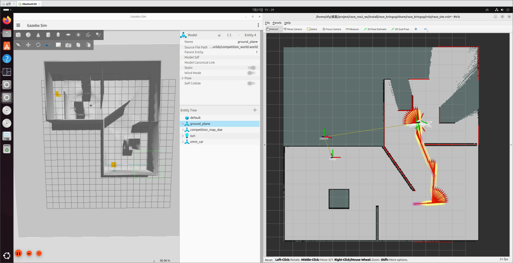
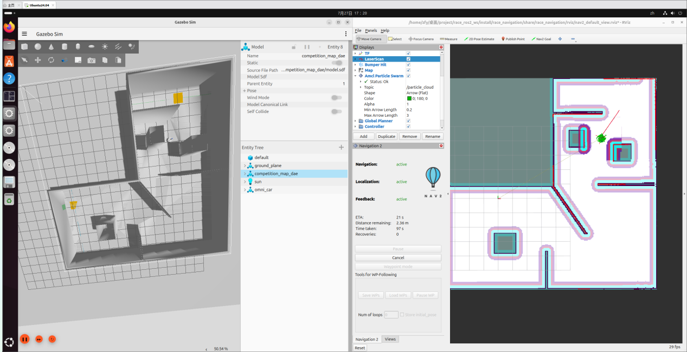
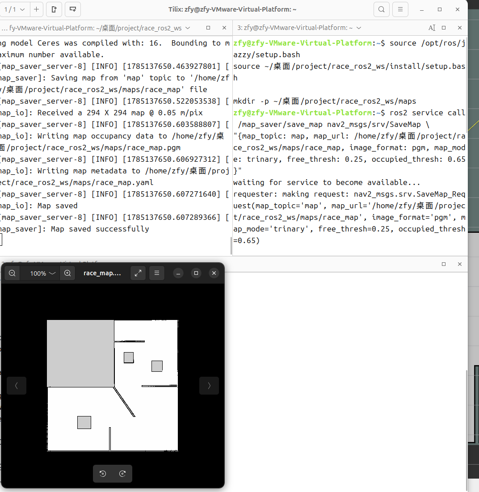
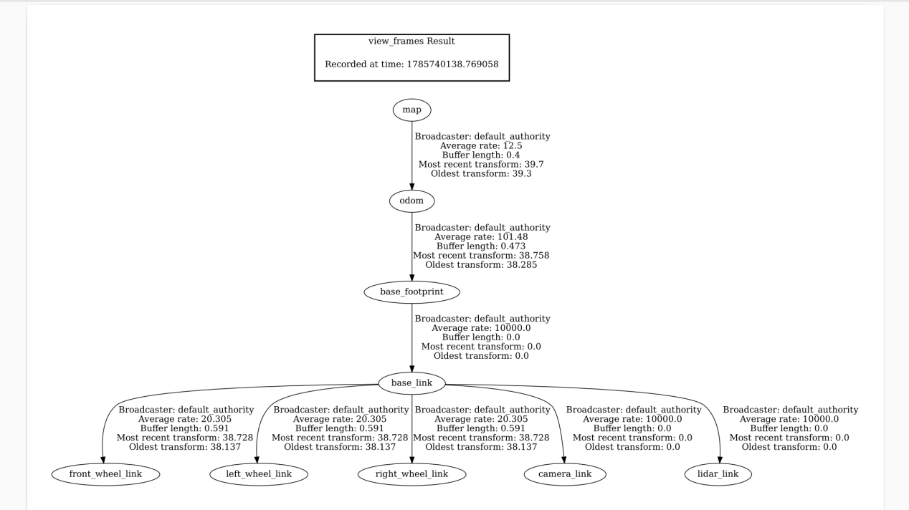

<div align="center">

# SLAM_Learning

**A ROS 2 Jazzy + Gazebo arena for SLAM practice — one omnidirectional robot, one arena, and the three pieces that matter: mapping, localization, planning.**

[](https://docs.ros.org/en/jazzy/)
[](https://gazebosim.org/)
[](#the-stack)
[](#the-stack)
[](LICENSE)

[The stack](#the-stack) &nbsp;•&nbsp; [Quick start](#quick-start) &nbsp;•&nbsp; [Workflows](#workflows) &nbsp;•&nbsp; [The planner](#the-planner)

*English &nbsp;|&nbsp; [中文](README.zh-CN.md)*

</div>

<p align="center">
  
</p>

<p align="center">
  <em>Mapping: slam_toolbox grows the map from the simulated lidar while the arena runs in Gazebo.</em>
</p>

## The stack

This repository is the modelling, mapping, localization and planning base extracted from
[Sim2Real-AlgoBench](https://github.com/p20030920p/Sim2Real-AlgoBench). The benchmark's algorithm
zoo was removed on purpose: what is left is one planner you can read end to end, and everything
around it that a SLAM exercise needs.

| Layer | Package | What it holds |
| :--- | :--- | :--- |
| Modelling | `race_description` | The three-wheeled omni car: URDF, meshes, `ros2_control` joint definitions |
| Modelling | `race_gazebo` | The arena world, the competition map model, the dynamic-obstacle variant |
| Modelling | `race_bringup` | Simulation bring-up: Gazebo, controller spawners, sensor bridges, RViz layout |
| Modelling | `race_control` | One node: `Twist` → `TwistStamped`, so Nav2 and teleop can drive the wheels |
| Mapping | `race_navigation` | `slam_toolbox` configuration and the mapping launch |
| Localization | `race_navigation` | AMCL, tuned for the holonomic chassis, plus the saved arena map |
| Planning | `algo_core` | A\* over an 8-connected cost grid — ROS-free C++, unit-testable offline |
| Planning | `algo_nav2_plugins` | The Nav2 `GlobalPlanner` adapter that runs `algo_core` inside Nav2 |

The arena is 14.7 × 14.7 m at 5 cm per cell (294 × 294), saved as
`src/race_navigation/maps/race_map.{pgm,yaml}`. The robot spawns at `(8.07, 7.53)` facing into the
arena, carries a 12 m lidar and a front camera, and uses an omnidirectional motion model in AMCL.

Package names keep their upstream `race_*` prefix so this tree still lines up one-to-one with
Sim2Real-AlgoBench; the launch files and the configuration are what you actually work with.

<p align="center">
  
</p>

<p align="center">
  <em>Localization and planning: the AMCL particle cloud, the global costmap, and A* steering the car to a Nav2 goal.</em>
</p>

## Quick start

```bash
git clone https://github.com/p20030920p/SLAM_Learning.git
cd SLAM_Learning
source /opt/ros/jazzy/setup.bash
rosdep install --from-paths src --ignore-src -r -y
colcon build --symlink-install
source install/setup.bash
```

## Workflows

### 1. Build a map

```bash
ros2 launch race_navigation mapping.launch.py
# second terminal: drive around with the keyboard
ros2 launch race_navigation keyboard.launch.py
```

`slam_toolbox` publishes the map as you drive. When it looks right, save it:

```bash
ros2 run nav2_map_server map_saver_cli -f src/race_navigation/maps/my_map
```

That writes `my_map.pgm` and `my_map.yaml`. Point the next workflow at it with `map:=...`.

### 2. Localize against the saved map and plan with A\*

```bash
ros2 launch race_navigation localization_navigation.launch.py
# or with your own map:
ros2 launch race_navigation localization_navigation.launch.py map:=$PWD/src/race_navigation/maps/my_map.yaml
```

AMCL starts from the pose configured in `nav2_params.yaml` (the arena spawn pose), so the particle
cloud is already converged. The `spawn_*` launch arguments move the robot in Gazebo only — they are
deliberately not wired to AMCL's `initial_pose`, so if you spawn elsewhere either edit that block or
click **2D Pose Estimate** in RViz, then send a **Nav2 Goal**. The path you get back is A\*.

### 3. Map and navigate at the same time

```bash
ros2 launch race_navigation navigation_slam.launch.py
```

Here `slam_toolbox` owns the `map → odom` transform and AMCL stays off — starting both would put two
publishers on the same TF edge. Use this to explore an unknown arena; use workflow 2 once the map is
saved.

| Saved map | TF tree |
| :---: | :---: |
|  |  |

### Notes

* `stress:=true` on either simulation launch loads the obstacle arena. Its two obstacle joints are
  commanded on `/dynamic_obstacle/cmd_pos` and `/dynamic_obstacle_2/cmd_pos`; nothing in this
  repository publishes there any more, so the obstacles stand still until you write that publisher.
  Until then the variant is a usable static-obstacle arena.
* `slam_toolbox` owns `map → odom` in workflow 3, and AMCL owns it in workflow 2. Never run both —
  two publishers on one TF edge is the classic way to get a map that jitters.

## The planner

`algo_core` implements A\* with a binary heap, an octile heuristic, and the diagonal corner-cutting
rule that stops a footprint from slipping between two touching obstacles. It depends on nothing but
the C++ standard library — no ROS, no costmap types — so it can be tested without a simulator:

```bash
# invariants: path found, endpoints connected, no pose in a lethal cell, reported
# cost equals the cost of the returned path, 8-connected not longer than 4-connected
./install/algo_core/lib/algo_core/algo_core_selftest

# the same search over the real arena map, offline
./install/algo_core/lib/algo_core/algo_plan_dump \
  src/race_navigation/maps/race_map.pgm /tmp/astar_dump.bin \
  8.0727 7.5312 -2.5 -5.5 -3.700 -6.342 0.050 0.196 0.65
```

Inside Nav2, the planner is configured in `src/race_navigation/config/nav2_params.yaml`:

```yaml
planner_server:
  ros__parameters:
    planner_plugins: ["GridBased"]
    GridBased:
      plugin: "algo_nav2_plugins/GridPlanner"
      algorithm: "astar"        # name the planner registered itself under
      cost_scale: 1.0           # 0.0 = plan on lethal/free only, higher = avoid inflated cells
      snap_radius: 6.0          # cells searched for a free cell near the start/goal pose
      allow_diagonal: true
      remove_collinear: true
      publish_expanded: true    # MarkerArray on GridBased/expanded — watch the search in RViz
```

Adding a planner back is two steps: subclass `algo_core::GridPlanner`, register it with
`ALGO_CORE_REGISTER(YourPlanner, "your_name")`, add the source file to
`src/algo_core/CMakeLists.txt`, and set `algorithm: "your_name"` above. The Nav2 adapter does not
change.

## Reproductions

`reproductions/` is the paper-reproduction area, organised by the two research directions this
workspace is meant to serve — **D1** robust localization and SLAM in dynamic environments, and
**D2** semantic mapping, visual anchoring and navigation. Every paper gets a numbered folder with a
plan (goal, data, steps, acceptance criteria) plus `code/`, `data/`, `work/` and `results/`
subfolders; upstream checkouts and datasets stay local and are gitignored.

| | Direction | Reproductions |
| :--- | :--- | :--- |
| **01** | Robust localization & SLAM in dynamic environments | DynamicMap_Benchmark · KISS-ICP · ERASOR · Removert · DUFOMap · BeautyMap · DynoSAM · NGD-SLAM · LT-mapper |
| **02** | Semantic mapping, visual anchoring & navigation | 3RScan · OASIS-Map · ConceptGraphs · DualMap · HOV-SG · Clio · AnyLoc · Revisit Anything |

[`reproductions/README.md`](reproductions/README.md) holds the index, how the two directions line up
with the task book, and the suggested order.

<!-- PROGRESS:START -->

## 复现进度 Reproduction progress

**进度** — 8/17 跑通 · 8 本次实际运行 · 8/17 已自动化 · 更新于 2026-10-05 02:12 CST

| # | 方向 | 复现对象 | 状态 | 本次运行 | 回测 | 关键指标 / 阻塞原因 / findings |
| :-- | :-- | :-- | :-- | :-- | :-- | :-- |
| 01-01 | D1 | DynamicMap_Benchmark | 🟢 green | ✅ | ✅ 通过 | 17 项指标 · 2 条 finding |
| 01-02 | D1 | KISS-ICP | 🟢 green | ✅ | ✅ 通过 | 8 项指标 · 4 条 finding |
| 01-03 | D1 | ERASOR | 🟢 green | ✅ | ✅ 通过 | 9 项指标 · 2 条 finding |
| 01-04 | D1 | Removert | 🟢 green | ✅ | ✅ 通过 | 9 项指标 · 2 条 finding |
| 01-05 | D1 | DUFOMap | 🟢 green | ✅ | ✅ 通过 | 11 项指标 · 3 条 finding |
| 01-06 | D1 | BeautyMap | 🟢 green | ✅ | ✅ 通过 | 9 项指标 · 3 条 finding |
| 01-07 | D1 | DynoSAM | ⬜ planned | — | — | 待开始（缺 reproduce.py） |
| 01-08 | D1 | NGD-SLAM | 🟢 green | ✅ | ✅ 通过 | 11 项指标 · 3 条 finding |
| 01-09 | D1 | LT-mapper | ⬜ planned | — | — | 待开始（缺 reproduce.py） |
| 02-01 | D2 | 3RScan | 🟢 green | ✅ | ✅ 通过 | objects_total=32, unchanged=26, moved=5, absent_unlabelled=1 · 5 条 finding |
| 02-02 | D2 | OASIS-Map | ⬜ planned | — | — | 待开始（缺 reproduce.py） |
| 02-03 | D2 | ConceptGraphs | ⬜ planned | — | — | 待开始（缺 reproduce.py） |
| 02-04 | D2 | DualMap | ⬜ planned | — | — | 待开始（缺 reproduce.py） |
| 02-05 | D2 | HOV-SG | ⬜ planned | — | — | 待开始（缺 reproduce.py） |
| 02-06 | D2 | Clio | ⬜ planned | — | — | 待开始（缺 reproduce.py） |
| 02-07 | D2 | AnyLoc | ⬜ planned | — | — | 待开始（缺 reproduce.py） |
| 02-08 | D2 | Revisit Anything | ⬜ planned | — | — | 待开始（缺 reproduce.py） |

> 本表由 `python3 reproductions/run_all.py` 自动生成，块内内容请勿手改。
> 新增复现：建好文件夹与 `README.md`，再放一个实现 `require(ctx)` / `run(ctx)` 的 `reproduce.py`，重跑本命令即可。

<!-- PROGRESS:END -->

## What was removed from the benchmark

Dijkstra, weighted A\*, GBFS, JPS, Theta\* and D\* Lite, the `algo_bringup` registry that swapped
between them, the green-marker vision package, the race autonomy state machine, and the demo
recording tools and media. Nothing else changed: the robot, the arena, the control chain, the
mapping and localization configuration are the ones the benchmark shipped.

## Verified

* `colcon build --symlink-install` — 7 packages, no warnings.
* `algo_core_selftest` — all invariants pass; `astar` is the only registered planner.
* `algo_plan_dump` over `race_map.pgm` — path found, 24,563 cells expanded in about 0.1 s.
* Nav2 `planner_server` with this `nav2_params.yaml` — loads `GridBased` as
  `algo_nav2_plugins/GridPlanner`, reports `algorithm 'astar' ready`, and a `ComputePathToPose`
  goal over the saved map returns `SUCCEEDED` with a valid path in ~6 ms.
* `localization_launch.py` with this `nav2_params.yaml` — `map_server` and `amcl` both reach
  `active`, and AMCL applies the configured initial pose.
* All nine launch files build their launch descriptions.

<p align="center">
  <sub>Gazebo needs a working GPU/rendering stack. On machines where the camera sensor cannot
  initialise, Gazebo exits with a segmentation fault during sensor setup; the upstream benchmark
  behaves identically there. The rest of the stack — mapping, localization and planning — can be
  exercised without rendering.</sub>
</p>

## Licence

MIT, see [LICENSE](LICENSE). Derived from
[Sim2Real-AlgoBench](https://github.com/p20030920p/Sim2Real-AlgoBench) by p20030920p and zfyyyyy.
