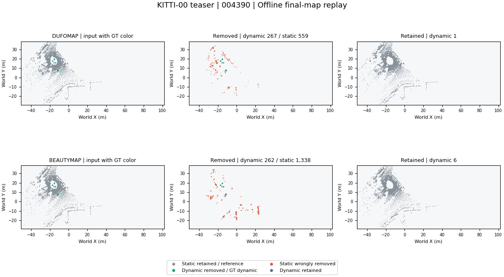
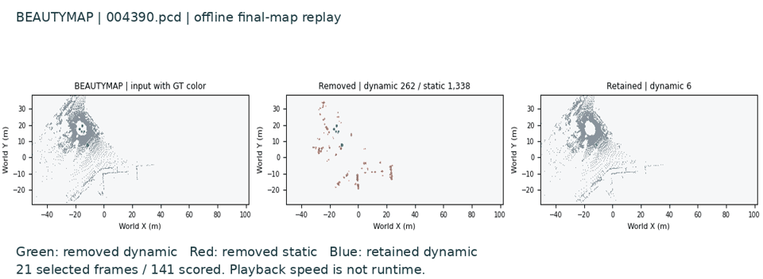
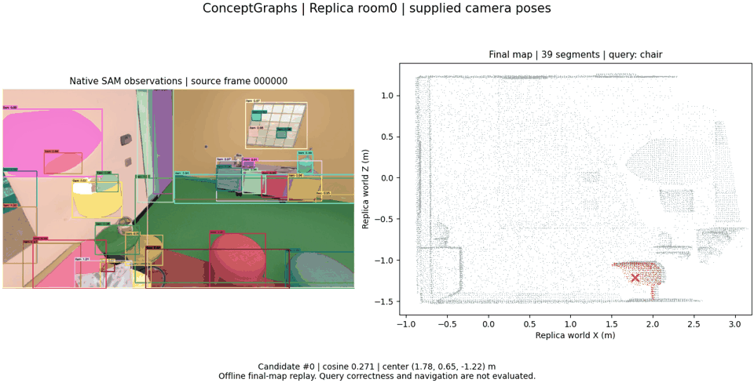
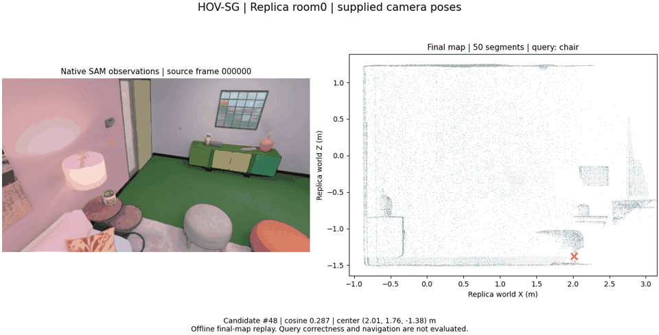

<div align="center">

# SLAM Learning

**Does correcting poses also repair the map?**

Dynamic robust mapping · Semantic mapping and localization

[](https://github.com/p20030920p/SLAM_Learning/actions/workflows/ci.yml)
[](pyproject.toml)

English | [中文](README.zh-CN.md)

[Analysis](docs/STUDY.md) · [Evidence](docs/README.md) · [Setup](docs/REPRODUCE.md)

</div>



*Saved-map replay; GT only for evaluation/coloring. [Source](results/reference/reproduction-media-wsl/record.json).*

Four 2024 mapping works → pose-error controls → a candidate recovery hypothesis. **H1 remains unverified.**

## 1. Open research question

At the same candidate cap, does reassociation recover more targets after a late pose correction than coordinate correction and simple guards?

## 2. Direction and common interface

- **Dynamic SLAM:** retain stable geometry despite moving objects.
- **Semantic mapping, visual localization and navigation:** attach identities and queries to reliable coordinates.

SLAM estimates motion while building a map. Our reproductions isolate mapping with supplied poses.

```text
Sensor data → Front end → Back end (optimize) → Map build
                  ↓              ↑
             Loop detection ─────┘
```

| SLAM element | Dynamic robustness | Semantic grounding |
| --- | --- | --- |
| Sensor data | Motion and occlusion | RGB-D alignment |
| Front end | Stable correspondences | Masks, features, association |
| Back end | Robust pose constraints | Consistent coordinates |
| Loop detection | Recognize changed places | Supply revisit constraints |
| Map build | Remove dynamic traces | Maintain identities and targets |

All four use **pose → correspondence → map decisions**. Corrected coordinates may leave earlier deletion/fusion/association decisions unresolved. This is our candidate failure mode, not a demonstrated shared failure. We first test **ConceptGraphs association and map exposure**, keeping pose correction fixed. [Why this test](docs/STUDY.md).

## 3. Related works and reproductions

The GIFs show earlier core subsets; semantic highlights are unverified query candidates.

| [DUFOMap](docs/papers/dufomap.md) | [BeautyMap](docs/papers/beautymap.md) |
| --- | --- |
|  |  |
| Void-space tests with pose tolerances remove dynamic returns. **141 scans.** | Binary occupancy and static restoration clean the map. **141 scans.** |

| [ConceptGraphs](docs/papers/conceptgraphs.md) | [HOV-SG](docs/papers/hovsg.md) |
| --- | --- |
|  |  |
| Geometry/CLIP association fuses object observations. **40 frames, 39 representations.** | Posed feature fusion produces queryable segments. **8 frames, 50 segments.** |

Later original-code runs use separate protocols, pinned at **535a278**:

| Work | Scored scope | Result |
| --- | --- | --- |
| [DUFOMap](https://github.com/p20030920p/SLAM_Learning/blob/535a2780af7ca7eb3aa02f722e1340fe90bc2dcf/docs/DUFOMAP_TABLE4.md) | Table IV, 141 released scans | SA 97.9635%, DA 98.7196%; 15 entries match paper rounding |
| [BeautyMap](https://github.com/p20030920p/SLAM_Learning/blob/535a2780af7ca7eb3aa02f722e1340fe90bc2dcf/docs/KITTI_PAPER_PROTOCOL.md) | Historical KITTI-02, 91 scans | At XY=1 m: SA 83.3978%, DA 82.4092%; 9 Table III entries match rounding |
| [ConceptGraphs](https://github.com/p20030920p/SLAM_Learning/blob/535a2780af7ca7eb3aa02f722e1340fe90bc2dcf/docs/CONCEPTGRAPHS_ROOM0_RESULTS.md) | room0, 400 observations | mIoU 21.3460%, frequency-weighted IoU 50.1379% |
| [HOV-SG](https://github.com/p20030920p/SLAM_Learning/blob/535a2780af7ca7eb3aa02f722e1340fe90bc2dcf/docs/HOVSG_HOME_RESULTS.md) | room0, 20-frame resource variant | mIoU 34.7500%, F-mIoU 62.8725%; default 200-frame run incomplete |

SA/DA measure static retention/dynamic removal. Semantic scoring uses scene-GT classes and different supports/exclusions, not identity recovery or open-world query success. These scores cannot rank the four methods; complete trajectories and robot navigation remain untested. [Scope](https://github.com/p20030920p/SLAM_Learning/blob/535a2780af7ca7eb3aa02f722e1340fe90bc2dcf/docs/SCOPE.md).

<details>
<summary>Five more GIFs: recorded 3D viewing</summary>

| DUFOMap RViz | BeautyMap RViz |
| --- | --- |
|  |  |

| ConceptGraphs RViz | HOV-SG RViz |
| --- | --- |
|  |  |

Earlier core outputs in RViz; saved-map viewing, no new inference. Full videos: [DUFOMap](docs/media/rviz/dufomap.mp4) · [BeautyMap](docs/media/rviz/beautymap.mp4) · [ConceptGraphs](docs/media/rviz/conceptgraphs.mp4) · [HOV-SG](docs/media/rviz/hovsg.mp4).


400-frame author map: RGB/instance colors and orbit controls, without query/graph display. [60-second video](https://github.com/p20030920p/SLAM_Learning/blob/3b0b9a88ac7c77431268b6c869c369e01bd19b3e/evidence/videos/conceptgraphs-room0-original-window.mp4) · [Sources](https://github.com/p20030920p/SLAM_Learning/blob/4361d4f353a7449c7d6964887643915d2fc72a11/results/reference/homepage-media/record.json).

</details>

## 4. Evidence that narrowed the question


room1, immediately after 30 cm correction: fixed-history recovery **11.1%**, oracle **66.7%**, post-hoc support-1 **100%**; candidates **8.3 / 25 / 117**. Three-seed means, partial AI labels, unequal caps. [Results](docs/DELAYED_RESULTS.md).

A lower support gate closes this selected recovery gap while exposing more fragments; later observations also repair part of it. **Reassociation is not yet shown necessary.** The next test matches candidate caps and checks identities separately.

## 5. Candidate H1 and next test

Retain observation sources and pose versions, then replay affected associations within a bounded cache to recover more valid targets than simple guards. The bounded implementation is **not built or tested**.

room2 freezes one frontend, five AI-labelled instances and exact correction after observation eight. Four arms compare fixed history, threshold-1.0, visibility guards and oracle reassociation at support 1/2/3 and caps 25/50/100/unlimited. **All 28 mapping cells ran; analysis remains pending.** [Protocol](https://github.com/p20030920p/SLAM_Learning/blob/4361d4f353a7449c7d6964887643915d2fc72a11/docs/IDENTITY_BUDGET.md).

Only plan a prototype if oracle gains ≥10 percentage points over every simple control at two finite caps, with ≥2/3 positive paired seeds and no seed increasing labelled duplicates/mixes. Otherwise narrow or stop H1. Equal caps do not match memory; AI-only labels cannot confirm H1. [Decision and remaining work](docs/PLAN.md).

[Khronos](https://arxiv.org/html/2402.13817v2) and [DovSG](https://arxiv.org/html/2410.11989v2) already reconcile/update maps. A contribution must demonstrate a recovery–cost benefit over existing protections; replay alone is not novel.

## Branches

| Branch | Role |
| --- | --- |
| main | Curated submission: question, four reproductions, counterevidence and candidate H1. |
| [reproduce/author-originals](https://github.com/p20030920p/SLAM_Learning/tree/reproduce/author-originals) | Original pipelines, paper-table/semantic scoring and recordings. |
| [study/identity-budget-v2](https://github.com/p20030920p/SLAM_Learning/tree/study/identity-budget-v2) | Exploratory late-correction and equal-cap identity experiments. |

Optional: [personal learning notes](https://github.com/p20030920p/SLAM_Learning/tree/notes/personal-study-guide-20261008) explain H1 and rejection controls; [hardware branch](https://github.com/p20030920p/SLAM_Learning/tree/Personal-Learning-Physical) contains D435/L2 trials, separate from H1 validation.

[AI use](docs/DISCLOSURE.md) · [Sources/licenses](docs/ATTRIBUTION.md) · [Citation](CITATION.cff) · [License](LICENSE)
