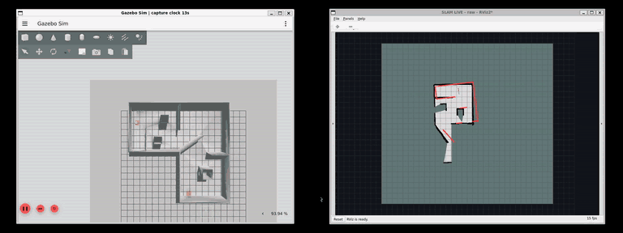
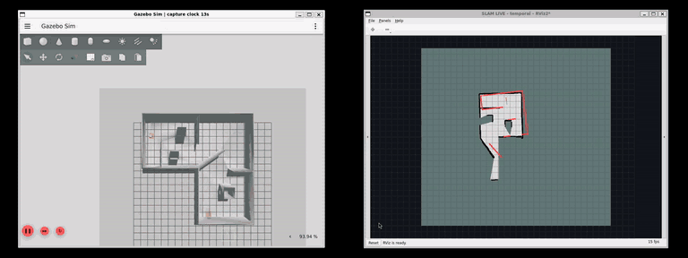
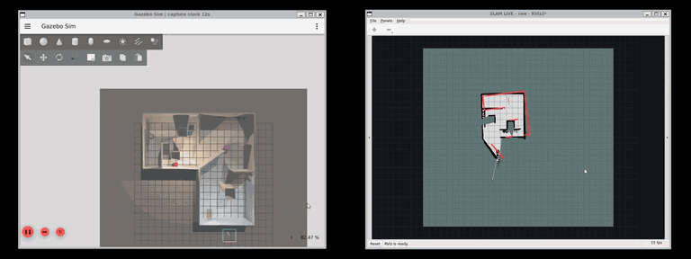
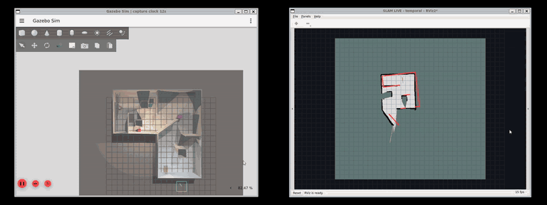
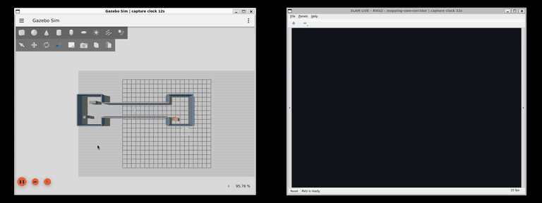
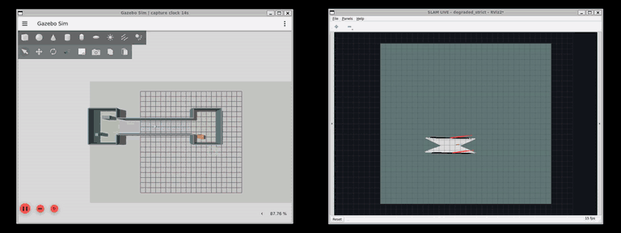
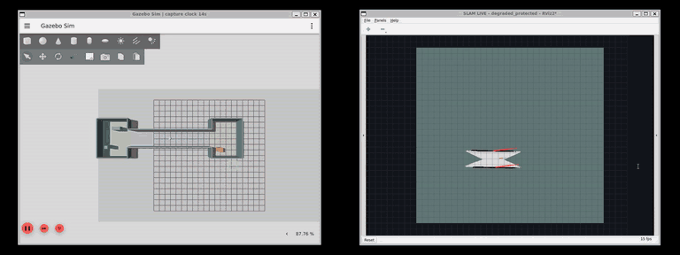

<div align="center">

# SLAM Learning

**Robust localization and SLAM in dynamic environments**

Dynamic map cleaning · Static structure retention · Downstream localization

[](https://github.com/p20030920p/SLAM_Learning/actions/workflows/ci.yml)
[](src/pyproject.toml)

English | [中文](docs/HOME.zh-CN.md)

[Physical test problems](#problem-getting-from-physical-test) · [Direction](#direction-analysis) · [Open question](#open-question) · [Hypothesis](#hypothesis) · [Related works](#related-works) · [Metrics](#metrics)

[Practice](#practice-index) · [Hypothesis test](#hypothesis-test-index)

</div>

## Problem getting from Physical test

<a id="physical-test-mirror"></a>

### Mirror and incomplete mapping

| Figure 1: mirror | Figure 2: incomplete mapping associated with the mirror |
| --- | --- |
| <a id="physical-test-mirror-photo"></a><a href="docs/media/physical-test/20261015-mirror/mirror-surface.jpg"></a> | <a id="physical-test-mirror-map"></a><a href="docs/media/physical-test/20261015-mirror/mirror-incomplete-map.png"></a> |

Observation from Figure 2: the mirror region lacks a usable mapped boundary, which also removes a reference for localization.

**Analysis:**
<!-- PHYSICAL_TEST_ANALYSIS:mirror -->

<!-- /PHYSICAL_TEST_ANALYSIS:mirror -->

<a id="physical-test-real"></a>

### Physical scene

<a href="docs/media/physical-test/20261015/real.gif"></a>


<!-- PHYSICAL_TEST_ANALYSIS:real -->

<!-- /PHYSICAL_TEST_ANALYSIS:real -->

<a id="physical-test-rviz-static"></a>

### RViz static video

<a href="docs/media/physical-test/20261015/rviz_Static.gif"></a>
<!-- PHYSICAL_TEST_ANALYSIS:rviz-static -->

<!-- /PHYSICAL_TEST_ANALYSIS:rviz-static -->

<a id="physical-test-rviz-dynamic"></a>

### 3. RViz dynamic video

<a href="docs/media/physical-test/20261015/rviz_dyn.gif"></a>


**Analysis:** The video suggests distortion during fast motion, and the moving person leaves unwanted points in the map. These are the author's observations motivating separate controlled tests.
<!-- PHYSICAL_TEST_ANALYSIS:rviz-dynamic -->

<!-- /PHYSICAL_TEST_ANALYSIS:rviz-dynamic -->

<a id="physical-test-additional"></a>

### Additional physical tests

| Test 4 · `4.mp4` | Test 5 · `5.mp4` |
| --- | --- |
| <a href="docs/media/physical-test/20261016-additional/4.gif"></a> | <a href="docs/media/physical-test/20261016-additional/5.gif"></a> |
| **Test 6 · `6.mp4`** | **Test 7 · `7.mp4`** |
| <a href="docs/media/physical-test/20261016-additional/6.gif"></a> | <a href="docs/media/physical-test/20261016-additional/7.gif"></a> |

**Analysis:**
<!-- PHYSICAL_TEST_ANALYSIS:additional-four -->

<!-- /PHYSICAL_TEST_ANALYSIS:additional-four -->

<a id="physical-test-annotated-maps"></a>

### Annotated map comparison

<a href="docs/media/physical-test/20261016-additional/annotated-maps.png"></a>

**Analysis:**
<!-- PHYSICAL_TEST_ANALYSIS:annotated-maps -->

<!-- /PHYSICAL_TEST_ANALYSIS:annotated-maps -->

## Direction analysis

### 1. What does the research title ask?

**Direction: robust localization and SLAM in dynamic environments.**

Mapping and localization support each other. Our evaluation changes the map, then uses the same localization method to test whether error decreases.

My understanding of localization:

- Given a motion prior, use current observations to score consistency with the map and infer pose and confidence.
- AMCL represents possible poses with particles and weights them using an observation model; GICP estimates pose through geometric consistency.
- The map supplies the references against which sensor observations can be matched.

Our goal is therefore **to improve mapping and test the resulting improvement in localization**.

- **Moving objects leave traces that contaminate the map. This is our main focus.** Detect and remove motion while preserving static structures.
  - 2D LiDAR: SRRG.
  - 3D LiDAR: DUFOMap and BeautyMap.

    

  - Depth/RGB camera: DynaSLAM.

    

- **Sensor motion within a scan causes motion distortion**, which can affect registration, trajectory drift and map alignment. High speed or rotation makes timing errors more visible; drift can also have other causes.

  

  FAST-LIO estimates motion using LiDAR and IMU and compensates points before registration. This is a candidate for fast-motion tests, rather than a guarantee against all failures. [Official implementation](https://github.com/hku-mars/FAST_LIO/tree/ROS2).

  

  My interpretation: combining vision, LiDAR and odometry can provide complementary evidence, but synchronization, calibration and fusion themselves need validation.

- **Special materials and geometrically weak environments can damage mapping and localization.**
  - Mirrors:

    

  - Corridors:

    

    Repeated or parallel structures can leave the along-corridor position weakly constrained. A possible intervention is an identifiable landmark, such as a mapped visual marker. A QR marker requires a camera and detector; a LiDAR-only test must use visible geometry.

- **Maps need maintenance after construction** to remain useful for localization. Relocated furniture motivates updates, for example Khronos.

  

  Temporal evidence helps distinguish persistent structures, occasional relocation and rapid motion. Recognition and segmentation can support these decisions and object-level navigation or manipulation; a semantic class alone does not establish whether something is moving now.

The core question is:

**In a dynamic environment, how can we build a geometrically trustworthy map that retains useful static constraints, and test whether it improves localization accuracy and continuity?**

## Open question

**Broad direction: which strategies enable reliable mapping in changing environments, and thereby reliable localization?**

**Question 1:** Given multiple scans and mapping poses, how can dynamic traces be removed while preserving static structures, and under which contamination and geometric conditions does this improve independent localization?

**Question 2:** With other conditions controlled, how can motion distortion caused by fast translation or rotation of the sensor be reduced?

**Question 3:** How can special obstacles be identified and weak environments such as corridors handled, limiting their effect on mapping and subsequent localization?

<a id="mapping-hypothesis-tests"></a>

## Hypothesis

<!-- SIMPLE_HYPOTHESES_V2 -->
<!-- OWN_HYPOTHESES_20261016 -->

| Question | Hypothesis | Controls | Metrics |
| --- | --- | --- | --- |
| H1 / Q1 | Repeated hits plus free-ray confirmation reduce dynamic traces and improve held-out localization. | Own accumulation / own temporal cleaning | A: DA, SA; B: XY RMSE |
| H2 / Q2 | Wheel-odometry compensation for point timestamps reduces map and held-out localization error. | Own compensation off / on | A: Eₘ; B: XY RMSE |
| H3 / Q3 | Detecting geometric degeneracy and retaining reliable static structures that constrain the weak direction reduces along-corridor error. | Own uniform threshold / own degeneracy-aware cleaning | A: additional retained cells; B: along RMSE |

All three interventions are implemented in this repository; AMCL is the common downstream localizer. Mirror identification still needs physical validation.

<a id="hypothesis-math"></a>

### Mathematical form

A builds the maps; B is a separate acquisition. Freeze the maps and share B scans, odometry and AMCL settings across controls.

DA/SA measure removal and retention, not geometric or localization accuracy. B evaluates localization while moving through an existing map; complete navigation-task outcomes were not measured.

```math
M_j=\mathcal{B}_j(Z^A,\hat T_{\rm odom}^A),\qquad \hat T_{j,t}^B=\mathcal{L}_{\rm AMCL}(Z_{\leq t}^B,M_j)
```

```math
E_L(j)=\sqrt{\frac{1}{N}\sum_t\lVert\hat p_{j,t}^B-p_t^{B,\ast}\rVert^2},\qquad \Delta E_L=E_L(\mathrm{baseline})-E_L(\mathrm{method})
```

**H1**

```math
H_c=\sum_b\mathbf{1}[\text{hit in time bin }b],\quad F_c=\sum_b\mathbf{1}[\text{free ray through }c],\quad K_c=\mathbf{1}[H_c\geq3\ \land\ H_c\geq1.5F_c]
```

```math
\mathrm{DA}_{\rm temporal}\gt\mathrm{DA}_{\rm raw},\quad\mathrm{SA}_{\rm temporal}\geq\mathrm{SA}_{\rm raw}-\varepsilon,\quad\Delta E_L\gt0
```

**H2**

```math
\tilde p_i=\hat T_{\rm odom}(t_e)^{-1}\hat T_{\rm odom}(t_i)p_i,\qquad E_M(\mathrm{on})\lt E_M(\mathrm{off}),\quad\Delta E_L\gt0
```

**H3**

Proposed solution: estimate the weak direction from observed local surface normals, then lower the deletion threshold for structures that constrain that direction, have repeated hits and have no contradicting free rays. Here n is a local normal, G approximates translational constraints and v is the weakest direction.


```math
G=\sum_{c\in C}n_cn_c^{\mathsf T},\quad v_{\min}=\mathrm{eigvec}_{\min}(G),\quad R_c=\mathbf{1}[H_c\geq2,\ F_c=0,\ |n_c^{\mathsf T}v_{\min}|\gt0.7]
```

```math
D=\mathbf{1}[\lambda_{\min}(G)\lt0.25\lambda_{\max}(G)],\qquad K_c^{\rm protected}=\mathbf{1}[(H_c\geq5\land H_c\geq1.5F_c)\lor(D=1\land R_c=1)]
```

```math
E_{\parallel}=\sqrt{\frac1N\sum_t[u^{\mathsf T}(\hat p_t-p_t^\ast)]^2},\qquad E_{\parallel}(\mathrm{protected})\lt E_{\parallel}(\mathrm{strict})
```

Time bins: 0.5 s; free rays stop 15 cm before each return; static-loss tolerance ε = 1 percentage point. H3 keeps the corridor, route, sensors and localizer fixed and changes only the cleaning rule. It protects observed constraints; a corridor with no along-axis information still needs additional observations. Truth is used only for scoring.

<a id="hypothesis-pseudocode"></a>

### Pseudocode

```text
for scene in [static, dynamic, motion, corridor]:
    A = acquire_scans_and_wheel_odometry(scene)
    for control in controls_for(scene):
        if H2: compensate_sector_points_by_interpolated_odometry()
        update_hit_and_free_evidence_in_distinct_time_bins()
        if H1: retain_temporally_supported_cells()
        if H3: protect_supported_normals_along_the_weak_direction()
        freeze_map(control)
    B = acquire_a_separate_session(scene)
    run_the_same_AMCL_on_all_frozen_maps(B)
    score_map_and_localization_on_common_times_using_truth_only_here()
```

[Implementation, experiments and recordings](#hypothesis-test-index)

## Related works

<!-- HOME_RELATED_TABLE -->
Grouped by algorithm family. Click a GIF for the full video. The application-direction column is intentionally blank. Different data protocols prevent cross-row ranking.

| Method / algorithm family | Native GIF / original point-cloud figure | Measured metrics and scope | Application direction |
| --- | --- | --- | --- |
| <a id="related-fast_lio"></a>[FAST-LIO / FAST-LIO2](docs/papers/fast_lio.md) |  | Original-paper experiments: **not reproduced**; original figure and method summary; custom-scene tests in Practice |  |
| <a id="related-srrg_mapper2d"></a>[SRRG / srrg_mapper2d](docs/papers/srrg_mapper2d.md) |  | Original-paper experiments: **not reproduced**; original figure and method summary; custom-scene tests in Practice |  |
| <a id="related-dufomap"></a>[DUFOMap](docs/papers/dufomap.md)<br>3D map cleaning | <a href="results/reference/desktop-live-dufomap/execution.mp4"></a><br>[Point-cloud capture excerpt](results/reference/desktop-live-dufomap/execution.mp4) | SA 97.98% / DA 98.7%<br>KITTI-00 · 141 scans; cleaning demonstrated<br>[Record](results/reference/desktop-live-dufomap/record.json) |  |
| <a id="related-beautymap"></a>[BeautyMap](docs/papers/beautymap.md)<br>Offline 3D map cleaning | <a href="results/reference/desktop-live-beautymap/execution.mp4"></a><br>[Point-cloud capture excerpt](results/reference/desktop-live-beautymap/execution.mp4) | SA 96.95% / DA 98.34%<br>KITTI-00 · 141 scans; cleaning demonstrated<br>[Record](results/reference/desktop-live-beautymap/record.json) |  |
| <a id="related-ir-mcl"></a>[IR-MCL](docs/papers/ir-mcl.md)<br>2D neural-field localization | <a href="results/reference/desktop-live-ir-mcl/execution.mp4"></a><br>[Point-cloud capture excerpt](results/reference/desktop-live-ir-mcl/execution.mp4) | RMSE 5.31 cm / 1.07°<br>Bonn IPBLab Seq 1<br>[Record](results/reference/desktop-live-ir-mcl/record.json) |  |
| <a id="related-adam-mcl"></a>[AdaM-MCL](docs/papers/adam-mcl.md)<br>Learned proposals + particle localization | <a href="results/reference/desktop-adam-mcl/result.mp4"></a><br>2D particle-result replay | RMSE 32.23 cells; authored 128-cell map, 2432 training steps; historical sustained convergence 0/10, no comparison to paper metre-scale accuracy<br>[Record](results/reference/desktop-adam-mcl/record.json) |  |
<!-- /HOME_RELATED_TABLE -->

See [Metrics](#metrics) for SA/DA and pose-RMSE definitions. SRRG scores 2D observed support; DUFOMap/BeautyMap score 3D points. IR-MCL/AdaM-MCL do not clean maps.

<details>
<summary>Inputs, processing and reproduction boundaries</summary>

<!-- HOME_RELATED_DETAILS -->
### DUFOMap — dynamic-point removal during map integration

**Input:** successive 3D LiDAR scans and provided sensor poses. **Process:** observed free space supplies evidence that earlier occupied points are transient; an octree accumulates this evidence with margins for pose uncertainty. **Output:** a map with dynamic remnants removed. It does not estimate the robot pose. [Paper and reproduced scope](docs/papers/dufomap.md).

In the live video, gray points are retained, red points are removed, and cyan points are the current scan. Watch how decisions change as later scans supply evidence. KITTI-00, 141 scans; SA 97.98% / DA 98.70%. SA measures retained static points and DA measures removed dynamic points; neither is localization error.

[Live MP4](results/reference/desktop-live-dufomap/execution.mp4) · [record](results/reference/desktop-live-dufomap/record.json)

### BeautyMap — clean an existing point-cloud map

**Input:** the full accumulated 3D map, scans and provided poses. **Process:** the native occupancy representation detects inconsistent occupied structure, followed by the authors' static-structure recovery stage. **Output:** a cleaned reference map. This offline map cleaner is shown while it computes; the input map already exists at the start. [Paper and reproduced scope](docs/papers/beautymap.md).

Gray/red show retained/removed points. Watch the cumulative removal decisions, rather than interpreting the complete initial map as online SLAM. KITTI-00, 141 scans; SA 96.95% / DA 98.34%. Cleaner maps may help downstream localization, but that requires a separate test.

[Live MP4](results/reference/desktop-live-beautymap/execution.mp4) · [record](results/reference/desktop-live-beautymap/record.json)

### IR-MCL — localize with a neural observation model

**Input:** a pretrained neural occupancy field, measured 2D scans and motion input. **Process:** each particle represents a possible robot pose; the field renders a predicted scan at that pose, scan agreement changes particle weights, and resampling concentrates the belief. **Output:** an estimated pose and particle distribution. [Paper, original code and protocol](docs/papers/ir-mcl.md).

In RViz, the map supplies context, yellow particles show pose hypotheses, blue is the displayed estimate and green is the reference trajectory. Watch particle concentration and agreement with the reference. The displayed weighted particle mean is an observer; scoring uses the native saved estimate. Bonn IPBLab Seq 1: 1543 processed / 1354 scored poses, fresh RMSE 5.31 cm / 1.07°. This author-data run is separate from deployment into Gazebo.

[Live MP4](results/reference/desktop-live-ir-mcl/execution.mp4) · [record](results/reference/desktop-live-ir-mcl/record.json)

### AdaM-MCL — combine learned proposals and particle tracking

**Input:** a map, laser observation, motion input and trained proposal model. **Process:** the learned model proposes candidate poses; the adaptive mixture combines proposals with conventional particle tracking. **Output:** pose belief, including hypotheses after a kidnapping event. [Paper and limits](docs/papers/adam-mcl.md).

Our run uses an authored 128-cell map and a 2432-step checkpoint: 123 filter updates, RMSE 32.23 cells. The released paper dataset/checkpoint was unavailable. This verifies a limited original-code workflow; it neither reproduces the paper's metre-scale scores nor demonstrates successful recovery. [Score correction](results/reference/adam-mcl/ERRATUM.md).

[Live MP4](results/reference/desktop-adam-mcl/execution.mp4) · [record](results/reference/desktop-adam-mcl/record.json)

[Result MP4](results/reference/desktop-adam-mcl/result.mp4)

<!-- SRRG_RELATED -->
### SRRG · Native 2D dynamic-environment mapping

**Original-paper experiments: not reproduced.** The original figure introduces the method. Custom Gazebo runs of the author code appear separately in [Practice](#practice-srrg); these do not reproduce the LCAS/MIT Stata long-term multi-session benchmark.


Source: Lázaro et al., *Efficient Long-term Mapping in Dynamic Environments*, IROS 2018, Fig. 7, page 6. [Paper](https://iris.uniroma1.it/handle/11573/1340118) · [Author code](https://gitlab.com/srrg-software/srrg_mapper2d). Registration, local maintenance and graph optimization connect H1 to geometric conditions in H3.
<!-- /SRRG_RELATED -->

<!-- FASTLIO_RELATED -->
### FAST-LIO / FAST-LIO2 · LiDAR–IMU estimation and point compensation

**Original-paper experiments: not reproduced.** This is the original FAST-LIO2 paper figure. Our custom-scene ablation uses the official ROS2 branch and FAST-LIO2 direct registration, distinct from reproducing the first FAST-LIO paper. [FAST-LIO Practice](#practice-fastlio).


Source: Xu et al., *FAST-LIO2: Fast Direct LiDAR-inertial Odometry*, Fig. 12, page 16. [FAST-LIO](https://arxiv.org/abs/2010.08196) · [FAST-LIO2](https://arxiv.org/abs/2107.06829) · [Official ROS2 code](https://github.com/hku-mars/FAST_LIO/tree/ROS2). IMU propagation and backward point compensation address H2. The incremental spatial index is not a dynamic-object removal or mirror detector.
<!-- /FASTLIO_RELATED -->
<!-- /HOME_RELATED_DETAILS -->

</details>

## Metrics

| Metric | Definition |
| --- | --- |
| DA ↑ / SA ↑ | Cleaning A only: dynamic removal / static retention; omit DA without dynamics. Units are observed support in 2D and points in 3D. |
| Eₘ ↓ | Deskew A: map-point distance RMSE to static reference geometry, cm. |
| XY / XYZ RMSE ↓ | Localization B on frozen maps: 2D / 3D position error, cm. |
| Along RMSE ↓ | H3 during limited observations: position error along the corridor, cm. |
| Angular RMSE ↓ | Yaw or 3D rotation error when pose orientation is evaluated, degrees; A odometry is labelled separately. |

### Evidence

| DUFOMap · KITTI-00 · Metric | Paper % | Reproduced % |
| --- | ---: | ---: |
| SA | 97.96 | 97.9635 |
| DA | 98.72 | 98.7196 |

| BeautyMap · KITTI-02 · Metric | Paper % | Reproduced % |
| --- | ---: | ---: |
| SA | 83.40 | 83.3978 |
| DA | 82.41 | 82.4092 |

| IR-MCL · Metric | Paper, Seq 1 | Reproduced |
| --- | ---: | ---: |
| Location RMSE (cm) | 5.13 | 5.32 |
| Yaw RMSE (deg) | 1.05 | 1.07 |

## Practice

This section practices methods in Related works. A = mapping; B = a separate localization session on frozen maps. Click A/B in the contents to reach its recordings and metrics.

<a id="practice-index"></a>

### Experiment contents

| No. | Method / subexperiment | Go directly |
| --- | --- | --- |
| P0 | Setup and devices | [Open experiment](#practice-setup) |
| P1.1 | SRRG · Static | [A](#h1-static-a) / [B](#h1-static-b) |
| P1.2 | SRRG · Dynamic | [A](#h1-dynamic-a) / [B](#h1-dynamic-b) |
| P1.3 | SRRG · Original corridor | [A](#h3-original-a) / [B](#h3-original-b) |
| P1.4 | SRRG · Persistent change | [A](#supp-srrg) |
| P2.1 | FAST-LIO · Mapping and motion phases | [A](#h2-a) / [Stationary](#h2-stationary) / [Slow turn](#h2-slow) / [Fast turn](#h2-fast) / [Translation](#h2-translation) |
| P2.2 | FAST-LIO · Frozen-map localization | [B](#h2-b) |
| P3.0 | DUFOMap / BeautyMap · KITTI-00 | [Map-cleaning practice](#practice-kitti) |
| P3.1 | DUFOMap / BeautyMap · 3D · Static | [A/B](#scene-static-3d) |
| P3.2 | DUFOMap / BeautyMap · 3D · Dynamic | [A/B](#scene-dynamic-3d) |
| P3.3 | DUFOMap / BeautyMap · 3D · Corridor | [A/B](#scene-corridor-3d) |
| P3.4 | DUFOMap / BeautyMap · 3D · Changed world | [A/B](#scene-change-3d) |
| P4 | IR-MCL · Bonn | [Open experiment](#practice-irmcl) |
| P5 | AdaM-MCL | [Open experiment](#practice-adam) |
| P6.1 | NDT / GICP | [Open experiment](#supp-registrations) |
| P6.2 | slam_toolbox / AMCL | [Open experiment](#supp-acquisition) |
| P6.3 | Saved-cloud replay | [Open experiment](#map-review-3d) |
| P6.4 | Failure diagnostics | [Open experiment](#srrg-diagnostics) |

<a id="practice-setup"></a>

### Setup

| Item | Setting |
| --- | --- |
| Platform | Windows / WSL2 · ROS 2 Jazzy · Gazebo Harmonic · RViz2 |
| Robot | Sim2Real omni chassis; rendered URDF below. |
| 2D devices | 720-beam 2D LiDAR + wheel odometry. |
| 3D devices | 16×720 3D LiDAR; FAST-LIO arm adds a 200 Hz IMU. |


<a id="robot-urdf"></a>


<a id="practice-metrics"></a>

### Metric definitions

[Short definitions in Metrics](#metrics)

A measures cleaning or geometry for the task; B measures localization on frozen maps. B uses common 10 Hz times after 5 s warmup, with pose age ≤0.15 s; counts and missing outputs remain in records. One run per arm; complete navigation outcomes were not measured.

<a id="practice-srrg"></a>

### P1 · SRRG · Static and dynamic

| Scene | Change | Keep fixed |
| --- | --- | --- |
| Static control / moving obstacles | Raw / SRRG | Shared A scans, shared B scans, AMCL settings and initial offset |


<a id="h1-static-a"></a>

#### Static · A

| Method | SA ↑ |
| --- | --- |
| Raw | 100.00% |
| SRRG | 100.00% |


[Record](results/reference/direction-20261016-v2/2d-A-static/record.json)

| A · Raw / SRRG |
| --- |
| <a href="results/reference/direction-20261016-v2/2d-A-static/execution.mp4"></a> |


**Analysis:**
<!-- PRACTICE_ANALYSIS:h1-static-a -->

<!-- /PRACTICE_ANALYSIS:h1-static-a -->

[↑ Contents](#practice-index)

<a id="h1-static-b"></a>

#### Static · B

| Map | XY RMSE / cm | yaw / ° |
| --- | --- | --- |
| Raw | 5.03 | 2.88 |
| SRRG | 5.84 | 2.91 |


[Scores](results/reference/direction-20261016-v2/2d-static/time-grid-score.json)

| Raw | SRRG |
| --- | --- |
| <a href="results/reference/direction-20261016-v2/2d-static/executions/raw.mp4"></a> | <a href="results/reference/direction-20261016-v2/2d-static/executions/srrg.mp4"></a> |


**Analysis:**
<!-- PRACTICE_ANALYSIS:h1-static-b -->

<!-- /PRACTICE_ANALYSIS:h1-static-b -->

[↑ Contents](#practice-index)

<a id="h1-dynamic-a"></a>

#### Dynamic · A

| Method | DA ↑ | SA ↑ |
| --- | --- | --- |
| Raw | 0.00% | 100.00% |
| SRRG | 36.94% | 99.84% |


[Record](results/reference/direction-20261016-v2/2d-A-dynamic/record.json)

| A · Raw / SRRG |
| --- |
| <a href="results/reference/direction-20261016-v2/2d-A-dynamic/execution.mp4"></a> |


**Analysis:**
<!-- PRACTICE_ANALYSIS:h1-dynamic-a -->

<!-- /PRACTICE_ANALYSIS:h1-dynamic-a -->

[↑ Contents](#practice-index)

<a id="h1-dynamic-b"></a>

#### Dynamic · B

| Map | XY RMSE / cm | yaw / ° |
| --- | --- | --- |
| Raw | 5.53 | 0.76 |
| SRRG | 5.13 | 0.70 |


[Scores](results/reference/direction-20261016-v2/2d-dynamic/time-grid-score.json)

| Raw | SRRG |
| --- | --- |
| <a href="results/reference/direction-20261016-v2/2d-dynamic/executions/raw.mp4"></a> | <a href="results/reference/direction-20261016-v2/2d-dynamic/executions/srrg.mp4"></a> |


**Analysis:**
<!-- PRACTICE_ANALYSIS:h1-dynamic-b -->

<!-- /PRACTICE_ANALYSIS:h1-dynamic-b -->

[↑ Contents](#practice-index)

<a id="practice-srrg-corridor"></a>

### P1.3 · SRRG · Corridor

<a id="h3-original-a"></a>

#### Original corridor · A

| Method | SA ↑ |
| --- | --- |
| Raw | 82.63% |
| SRRG | 82.05% |


[Record](results/reference/direction-20261016-v2/2d-A-corridor/record.json)

| A · Raw / SRRG |
| --- |
| <a href="results/reference/direction-20261016-v2/2d-A-corridor/execution.mp4"></a> |


**Analysis:**
<!-- PRACTICE_ANALYSIS:h3-original-a -->

<!-- /PRACTICE_ANALYSIS:h3-original-a -->

[↑ Contents](#practice-index)

<a id="h3-original-b"></a>

#### Original corridor · B

| Map | XY RMSE / cm | yaw / ° |
| --- | --- | --- |
| Raw | 113.30 | 1.38 |
| SRRG | 102.72 | 1.08 |


[Scores](results/reference/direction-20261016-v2/2d-corridor/time-grid-score.json)

| Raw | SRRG |
| --- | --- |
| <a href="results/reference/direction-20261016-v2/2d-corridor/executions/degraded_raw.mp4"></a> | <a href="results/reference/direction-20261016-v2/2d-corridor/executions/degraded_srrg.mp4"></a> |


**Analysis:**
<!-- PRACTICE_ANALYSIS:h3-original-b -->

<!-- /PRACTICE_ANALYSIS:h3-original-b -->

[↑ Contents](#practice-index)

<a id="practice-fastlio"></a>

### P2 · FAST-LIO · Motion distortion

| Scene | Change | Keep fixed |
| --- | --- | --- |
| Existing static scene; stationary → slow/fast turns → translation | FAST-LIO point compensation off / on | Same scans, point timing, IMU and state prediction; identical GICP for B |


Three measured 120° sectors form a 0.2 s scan; this is controlled grouped sampling.

<a id="h2-a"></a>

#### A · Mapping and motion phases

| Point compensation | Eₘ / cm ↓ |
| --- | --- |
| Off | 13.49 |
| On | 4.61 |


[Scores](results/reference/direction-20261016-v2/fastlio-maps/score.json)

| A · FAST-LIO on / off |
| --- |
| <a href="results/reference/direction-20261016-v2/fastlio-motion/execution.mp4"></a> |


<a id="h2-stationary"></a>

##### Stationary

| Point compensation | Phase time | A odometry XYZ RMSE / cm | Rotation / ° |
| --- | --- | --- | --- |
| Off | 0–7 s | 0.12 | 0.02 |
| On | 0–7 s | 0.15 | 0.03 |


<a id="h2-slow"></a>

##### Slow turn

| Point compensation | Phase time | A odometry XYZ RMSE / cm | Rotation / ° |
| --- | --- | --- | --- |
| Off | 7–15 s | 1.30 | 0.95 |
| On | 7–15 s | 0.42 | 0.14 |


<a id="h2-fast"></a>

##### Fast turn

| Point compensation | Phase time | A odometry XYZ RMSE / cm | Rotation / ° |
| --- | --- | --- | --- |
| Off | 15–31 s | 3.18 | 4.35 |
| On | 15–31 s | 0.79 | 0.26 |


<a id="h2-translation"></a>

##### Translation

| Point compensation | Phase time | A odometry XYZ RMSE / cm | Rotation / ° |
| --- | --- | --- | --- |
| Off | 31–39 s | 5.33 | 3.68 |
| On | 31–39 s | 1.45 | 0.25 |


**Analysis:**
<!-- PRACTICE_ANALYSIS:h2-a -->

<!-- /PRACTICE_ANALYSIS:h2-a -->

[↑ Contents](#practice-index)

<a id="h2-b"></a>

#### B · GICP on frozen maps

| A compensation | XYZ RMSE / cm | Rotation / ° |
| --- | --- | --- |
| Off | 14.03 | 3.62 |
| On | 2.04 | 0.87 |


[Scores](results/reference/direction-20261016-v2/fastlio-B/score-3d.json)

| Off map | On map |
| --- | --- |
| <a href="results/reference/direction-20261016-v2/fastlio-B/executions/no_deskew.mp4"></a> | <a href="results/reference/direction-20261016-v2/fastlio-B/executions/deskew.mp4"></a> |


**Analysis:**
<!-- PRACTICE_ANALYSIS:h2-b -->

<!-- /PRACTICE_ANALYSIS:h2-b -->

[↑ Contents](#practice-index)

<a id="practice-kitti"></a>

### P3.0 · DUFOMap / BeautyMap · KITTI-00

KITTI-00, 141 scans; this experiment evaluates map cleaning only.

| Method | DA ↑ | SA ↑ | Point-cloud excerpt (click for full recording) | Record |
| --- | --- | --- | --- | --- |
| DUFOMap | 98.70% | 97.98% | <a href="results/reference/desktop-live-dufomap/execution.mp4"></a> | [Record](results/reference/desktop-live-dufomap/record.json) |
| BeautyMap | 98.34% | 96.95% | <a href="results/reference/desktop-live-beautymap/execution.mp4"></a> | [Record](results/reference/desktop-live-beautymap/record.json) |

<a id="baseline-3d"></a>

### Existing 3D tests

Original Raw/DUFOMap/BeautyMap and GICP results are retained; see records for scoring windows.

<a id="scene-static-3d"></a>

#### Static · 3D

**A · Map cleaning**

| Map | SA ↑ |
| --- | --- |
| Raw | 100% |
| DUFOMap | 99.999% |
| BeautyMap | 83.33% |


**B · Localization on frozen maps**

<!-- HOME_EXPERIMENT_TABLE -->
| Map | XYZ RMSE / cm | Rotation RMSE / ° |
| --- | --- | --- |
| Raw | 0.95 | 0.15 |
| DUFOMap | 0.99 | 0.16 |
| BeautyMap | 1.07 | 0.17 |
<!-- /HOME_EXPERIMENT_TABLE -->

[Record](results/reference/robot-3d-static/record.json)

| Raw | DUFOMap | BeautyMap |
| --- | --- | --- |
| <a href="results/reference/robot-3d-static/executions/raw.mp4"></a> | <a href="results/reference/robot-3d-static/executions/dufomap.mp4"></a> | <a href="results/reference/robot-3d-static/executions/beautymap.mp4"></a> |


**Analysis:**
<!-- PRACTICE_ANALYSIS:scene-static-3d -->

<!-- /PRACTICE_ANALYSIS:scene-static-3d -->

[↑ Contents](#practice-index)

<a id="scene-dynamic-3d"></a>

#### Dynamic · 3D

**A · Map cleaning**

| Map | DA ↑ | SA ↑ |
| --- | --- | --- |
| Raw | 0% | 100% |
| DUFOMap | 46.59% | 99.998% |
| BeautyMap | 74.36% | 81.15% |


**B · Localization on frozen maps**

<!-- HOME_EXPERIMENT_TABLE -->
| Map | XYZ RMSE / cm | Rotation RMSE / ° |
| --- | --- | --- |
| Raw | 0.98 | 0.17 |
| DUFOMap | 0.98 | 0.18 |
| BeautyMap | 1.04 | 0.17 |
<!-- /HOME_EXPERIMENT_TABLE -->

[Record](results/reference/robot-3d-dynamic/record.json)

| Raw | DUFOMap | BeautyMap |
| --- | --- | --- |
| <a href="results/reference/robot-3d-dynamic/executions/raw.mp4"></a> | <a href="results/reference/robot-3d-dynamic/executions/dufomap.mp4"></a> | <a href="results/reference/robot-3d-dynamic/executions/beautymap.mp4"></a> |


**Analysis:**
<!-- PRACTICE_ANALYSIS:scene-dynamic-3d -->

<!-- /PRACTICE_ANALYSIS:scene-dynamic-3d -->

[↑ Contents](#practice-index)

<a id="scene-corridor-3d"></a>

#### Corridor · 3D

**A · Map cleaning**

| Map | SA ↑ |
| --- | --- |
| Raw | 100% |
| DUFOMap | 100% |
| BeautyMap | 99.9% |


**B · Localization on frozen maps**

<!-- HOME_EXPERIMENT_TABLE -->
| Map | XYZ RMSE / cm | Rotation RMSE / ° |
| --- | --- | --- |
| Raw | 474.38 | 0.53 |
| DUFOMap | 497.05 | 0.48 |
| BeautyMap | 592.00 | 49.16 |
<!-- /HOME_EXPERIMENT_TABLE -->

[Record](results/reference/robot-3d-corridor/record.json)

Valid localization intervals differ in this group; RMSE covers available outputs only and cannot rank stability. See records for missing outputs.

| Raw | DUFOMap | BeautyMap |
| --- | --- | --- |
| <a href="results/reference/robot-3d-corridor/executions/raw.mp4"></a> | <a href="results/reference/robot-3d-corridor/executions/dufomap.mp4"></a> | <a href="results/reference/robot-3d-corridor/executions/beautymap.mp4"></a> |


**Analysis:**
<!-- PRACTICE_ANALYSIS:scene-corridor-3d -->

<!-- /PRACTICE_ANALYSIS:scene-corridor-3d -->

[↑ Contents](#practice-index)

<a id="scene-change-3d"></a>

#### Changed world · 3D

**A · Map cleaning**

| Map | SA ↑ |
| --- | --- |
| Raw | 100% |
| DUFOMap | 99.999% |
| BeautyMap | 83.33% |


**B · Localization on frozen maps**

<!-- HOME_EXPERIMENT_TABLE -->
| Map | XYZ RMSE / cm | Rotation RMSE / ° |
| --- | --- | --- |
| Raw | 0.93 | 0.17 |
| DUFOMap | 1.01 | 0.19 |
| BeautyMap | 1.04 | 0.17 |
<!-- /HOME_EXPERIMENT_TABLE -->

[Record](results/reference/robot-3d-large-change/record.json)

| Raw | DUFOMap | BeautyMap |
| --- | --- | --- |
| <a href="results/reference/robot-3d-large-change/executions/raw.mp4"></a> | <a href="results/reference/robot-3d-large-change/executions/dufomap.mp4"></a> | <a href="results/reference/robot-3d-large-change/executions/beautymap.mp4"></a> |


**Analysis:**
<!-- PRACTICE_ANALYSIS:scene-change-3d -->

<!-- /PRACTICE_ANALYSIS:scene-change-3d -->

[↑ Contents](#practice-index)

<a id="practice-appendix"></a>

### Supplementary experiments

<a id="supp-srrg"></a>

#### SRRG · Persistent change

| Method | SA | New structure coverage | Separate B |
| --- | --- | --- | --- |
| Raw | 100.00% | 100.00% | Not tested |
| SRRG | 99.71% | 98.90% | Not tested |


[Record](results/reference/srrg-2d-large-change/record.json)

| SRRG changed-world A |
| --- |
| <a href="results/reference/srrg-2d-large-change/execution.mp4"></a> |


**Analysis:**
<!-- PRACTICE_ANALYSIS:srrg-large-change-2d -->

<!-- /PRACTICE_ANALYSIS:srrg-large-change-2d -->

[↑ Contents](#practice-index)

<a id="map-review-3d"></a>

#### Saved point-cloud replay

| Saved results; no new inference |
| --- |
| <a href="results/reference/robot-3d-map-review-v2/execution.mp4"></a> |


<a id="supp-registrations"></a>

#### Raw · NDT / GICP

| Method | XY RMSE / cm | yaw / ° | Evidence |
| --- | --- | --- | --- |
| NDT initial | 34.43 | 0.15 | [Record](results/reference/robot-ndt-static-initial/record.json) · [MP4](results/reference/robot-ndt-static-initial/execution.mp4) |
| NDT | 0.93 | 0.17 | [Record](results/reference/robot-ndt-static/record.json) · [MP4](results/reference/robot-ndt-static/execution.mp4) |
| GICP | 1.09 | 0.16 | [Record](results/reference/robot-gicp-static/record.json) · [MP4](results/reference/robot-gicp-static/execution.mp4) |


<a id="supp-acquisition"></a>

#### Additional acquisition and localization

| Scene | Method | Scan frames | Record | Recording |
| --- | --- | --- | --- | --- |
| Static | slam_toolbox | 54 | [Record](results/reference/robot-supp-static/record.json) | [MP4](results/reference/robot-supp-static/execution.mp4) |
| Dynamic | slam_toolbox | 55 | [Record](results/reference/robot-supp-dynamic/record.json) | [MP4](results/reference/robot-supp-dynamic/execution.mp4) |
| Changed world | AMCL | — | [Record](results/reference/robot-supp-large-change/record.json) | [MP4](results/reference/robot-supp-large-change/execution.mp4) |


<a id="srrg-diagnostics"></a>

#### SRRG failed runs

| Stage | Status | Record | Recording |
| --- | --- | --- | --- |
| Eigen ABI | diagnostic_failed | [Record](results/reference/srrg-diagnostic-20261015-025711-mapping-srrg-static-dd423d/record.json) | [MP4](results/reference/srrg-diagnostic-20261015-025711-mapping-srrg-static-dd423d/execution.mp4) |
| stdout | diagnostic_failed | [Record](results/reference/srrg-diagnostic-20261015-030327-mapping-srrg-static-a275d3/record.json) | [MP4](results/reference/srrg-diagnostic-20261015-030327-mapping-srrg-static-a275d3/execution.mp4) |
| g2o | diagnostic_failed | [Record](results/reference/srrg-diagnostic-20261015-030729-mapping-srrg-dynamic-14123d/record.json) | [MP4](results/reference/srrg-diagnostic-20261015-030729-mapping-srrg-dynamic-14123d/execution.mp4) |


[↑ Contents](#practice-index)

<a id="practice-irmcl"></a>

### IR-MCL

| Recording | Metrics | Record |
| --- | --- | --- |
| <a href="results/reference/desktop-live-ir-mcl/execution.mp4"></a> | XY RMSE 5.31 cm / yaw 1.07° | [Record](results/reference/desktop-live-ir-mcl/record.json) |

**Analysis:**

[↑ Contents](#practice-index)

<a id="practice-adam"></a>

### AdaM-MCL

| Recording | Metrics | Record |
| --- | --- | --- |
| <a href="results/reference/desktop-adam-mcl/result.mp4"></a> | RMSE 32.23 cells; sustained convergence 0/10; saved-result replay | [Record](results/reference/desktop-adam-mcl/record.json) |

**Analysis:**

[↑ Contents](#practice-index)

<a id="hypothesis-test"></a>

## Hypothesis test

<a id="hypothesis-test-index"></a>

Experiments for project-written methods. Reacquire A/B per scene and share inputs across its controls. One trial per control, fixed parameters, no truth-based tuning.

| Experiment | Mapping and scores | Held-out localization and scores |
| --- | --- | --- |
| H1 Static retention | [A](#own-static-a) | [B](#own-static-b) |
| H1 Dynamic cleaning | [A](#own-dynamic-a) | [B](#own-dynamic-b) |
| H2 Odometry deskew | [A](#own-motion-a) | [B](#own-motion-b) |
| H3 Weak-axis protection | [A](#own-corridor-a) | [B](#own-corridor-b) |

Use the same omni robot as Practice; algorithms use only 2D LiDAR and wheel odometry. H2 combines sectors from three actual scan times, preserving each point timestamp, without FAST-LIO. H3 keeps the same corridor and changes only map retention.

[Own algorithms](src/slam_learning/runtime/own_mapping.py) · [Record all](demo/record-own-hypotheses.ps1)

H2 recording phases: stationary 0–7 s, slow turn 7–15 s, fast turns 15–31 s, translation 31–39 s.

<a id="own-static-a"></a>

### H1 · Static retention · A

| Control | SA ↑ |
| --- | --- |
| raw | 99.55% |
| temporal | 95.62% |

| Mapping: grey baseline, blue own intervention |
| --- |
| <a href="results/reference/own-hypotheses-20261016/static-A/execution.mp4"></a> |

[Record](results/reference/own-hypotheses-20261016/static-A/record.json)

**Analysis:**
<!-- OWN_ANALYSIS:static-a -->

<!-- /OWN_ANALYSIS:static-a -->

<a id="own-static-b"></a>

### H1 · Static retention · B

| Map / AMCL | XY RMSE / cm ↓ |
| --- | --- |
| raw | 4.74 |
| temporal | 5.68 |

| raw | temporal |
| --- | --- |
| <a href="results/reference/own-hypotheses-20261016/static-B/executions/raw.mp4"></a> | <a href="results/reference/own-hypotheses-20261016/static-B/executions/temporal.mp4"></a> |

[Common-time scores](results/reference/own-hypotheses-20261016/static-B/time-grid-score.json) · [Record](results/reference/own-hypotheses-20261016/static-B/record.json)

**Analysis:**
<!-- OWN_ANALYSIS:static-b -->

<!-- /OWN_ANALYSIS:static-b -->

[↑ Contents](#hypothesis-test-index)

<a id="own-dynamic-a"></a>

### H1 · Dynamic cleaning · A

| Control | DA ↑ | SA ↑ |
| --- | --- | --- |
| raw | 5.13% | 99.50% |
| temporal | 94.87% | 92.55% |

| Mapping: grey baseline, blue own intervention |
| --- |
| <a href="results/reference/own-hypotheses-20261016/dynamic-A/execution.mp4"></a> |

[Record](results/reference/own-hypotheses-20261016/dynamic-A/record.json)

**Analysis:**
<!-- OWN_ANALYSIS:dynamic-a -->

<!-- /OWN_ANALYSIS:dynamic-a -->

<a id="own-dynamic-b"></a>

### H1 · Dynamic cleaning · B

| Map / AMCL | XY RMSE / cm ↓ |
| --- | --- |
| raw | 5.72 |
| temporal | 6.11 |

| raw | temporal |
| --- | --- |
| <a href="results/reference/own-hypotheses-20261016/dynamic-B/executions/raw.mp4"></a> | <a href="results/reference/own-hypotheses-20261016/dynamic-B/executions/temporal.mp4"></a> |

[Common-time scores](results/reference/own-hypotheses-20261016/dynamic-B/time-grid-score.json) · [Record](results/reference/own-hypotheses-20261016/dynamic-B/record.json)

**Analysis:**
<!-- OWN_ANALYSIS:dynamic-b -->

<!-- /OWN_ANALYSIS:dynamic-b -->

[↑ Contents](#hypothesis-test-index)

<a id="own-motion-a"></a>

### H2 · Odometry deskew · A

| Control | Eₘ / cm ↓ |
| --- | --- |
| off | 34.10 |
| deskew | 4.57 |

| Mapping: grey baseline, blue own intervention |
| --- |
| <a href="results/reference/own-hypotheses-20261016/motion-A/execution.mp4"></a> |

[Record](results/reference/own-hypotheses-20261016/motion-A/record.json)

**Analysis:**
<!-- OWN_ANALYSIS:motion-a -->

<!-- /OWN_ANALYSIS:motion-a -->

<a id="own-motion-b"></a>

### H2 · Odometry deskew · B

| Map / AMCL | XY RMSE / cm ↓ |
| --- | --- |
| off | 4.70 |
| deskew | 4.71 |

| off | deskew |
| --- | --- |
| <a href="results/reference/own-hypotheses-20261016/motion-B/executions/off.mp4"></a> | <a href="results/reference/own-hypotheses-20261016/motion-B/executions/deskew.mp4"></a> |

[Common-time scores](results/reference/own-hypotheses-20261016/motion-B/time-grid-score.json) · [Record](results/reference/own-hypotheses-20261016/motion-B/record.json)

**Analysis:**
<!-- OWN_ANALYSIS:motion-b -->

<!-- /OWN_ANALYSIS:motion-b -->

[↑ Contents](#hypothesis-test-index)

<a id="own-corridor-a"></a>

### H3 · Weak-axis protection · A

| Additional cells retained by protection | Frozen maps are byte-identical |
| --- | --- |
| 0 | Yes |

The protection rule did not change the final map in this trial; random differences in B cannot establish improvement from the map intervention.

| Mapping: grey baseline, blue own intervention |
| --- |
| <a href="results/reference/own-hypotheses-20261016/corridor-A/execution.mp4"></a> |

[Record](results/reference/own-hypotheses-20261016/corridor-A/record.json)

**Analysis:**
<!-- OWN_ANALYSIS:corridor-a -->

<!-- /OWN_ANALYSIS:corridor-a -->

<a id="own-corridor-b"></a>

### H3 · Weak-axis protection · B

Use along-corridor RMSE during the first 50 s of limited observations to test weak-direction localization.

| Map / AMCL | Along RMSE / cm ↓ |
| --- | --- |
| degraded_strict | 80.56 |
| degraded_protected | 80.56 |

| degraded_strict | degraded_protected |
| --- | --- |
| <a href="results/reference/own-hypotheses-20261016/corridor-B/executions/degraded_strict.mp4"></a> | <a href="results/reference/own-hypotheses-20261016/corridor-B/executions/degraded_protected.mp4"></a> |

[Common-time scores](results/reference/own-hypotheses-20261016/corridor-B/time-grid-score.json) · [Record](results/reference/own-hypotheses-20261016/corridor-B/record.json)

**Analysis:**
<!-- OWN_ANALYSIS:corridor-b -->

<!-- /OWN_ANALYSIS:corridor-b -->

[↑ Contents](#hypothesis-test-index)

H1 uses DA/SA for cleaning and only SA in its static control; H2 uses Eₘ for map geometry; H3 checks additional retained cells, then B along-corridor error. Localization uses common 10 Hz times after 5 s warmup, with output age at most 0.15 s; sample counts and missing outputs remain in the score records. Better mapping scores without lower B error support only the mapping claim.
