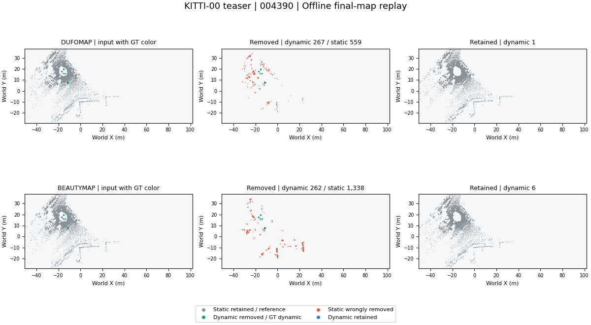

<div align="center">

# SLAM Learning

**变化场景中的地图更新复现研究**

动态点清除 · 语义建图 · 定位不确定性

[](pyproject.toml)
[](docs/RESULTS.zh-CN.md)

[复现](#复现) &nbsp;•&nbsp; [瓶颈](#瓶颈) &nbsp;•&nbsp; [快速开始](#快速开始)

[English](README.md) &nbsp;|&nbsp; 中文

</div>


> **作者地图实测回放。** 21 个选定 teaser 条目，固定世界坐标视角：原始 → 移除 → 保留。绿色为移除动态点，红色为误删静态点，蓝色为保留动态点。使用最终离线地图，真值仅用于评分／着色。[渲染配置与来源记录](results/reference/reproduction-media-wsl/record.json)。

这个仓库研究机器人怎样判断地图中的表面或对象已经变化。先运行原作者方法，检查输出和评价口径，再分析哪些决策依赖可信定位。范围覆盖动态场景中的鲁棒建图，以及长期语义地图。

| 当前材料 | 范围 |
| --- | --- |
| 作者方法复现 | DUFOMap、BeautyMap；KITTI-00 的 141 帧 teaser |
| 已检查的平台 | Windows、干净 Ubuntu 22.04 CI、本机 WSL2 Ubuntu 22.04；作者清图方法使用 CPU |
| 测量 | 静态保留、动态清除；论文表格一致性另行记录 |
| 探索性分析 | 真实数据位姿敏感性；两个受控机制实验 |
| 语义前端 | ConceptGraphs：40 次提供位姿的 Replica 观测、39 个对象和文本查询坐标 |
| 下一步前提 | 关联／目标标注、更多场景与配对位姿误差对照 |

## 复现

两种方法均完成全部 141 帧，对 17,362,230 个标注点评分。清理后的地图使用相同的 5 cm 最近邻评价规则。这是给定扫描位姿的地图清理实验，不是轨迹估计或导航实验。

| 作者方法 | SA % ↑ | DA % ↑ | 对应综合指标 | 与论文表格一致性 |
| --- | ---: | ---: | ---: | --- |
| DUFOMap 1.1.1 | 97.9798 | 98.7029 | AA 98.3407 | 超出 0.01 个百分点容差 |
| BeautyMap，固定源码 | 96.9529 | 98.3382 | HA 97.6407 | 超出 0.01 个百分点容差 |

*SA 表示静态点保留率；DA 表示动态点清除率。AA 是几何均值，HA 是调和均值，不能把它们当成同一排名。Windows 与 Ubuntu 分数一致。[完整口径、论文数值与原始记录](docs/RESULTS.zh-CN.md)。*



*来源帧 `004390`；图中计数来自完整扫描，早于显示抽稀。[运行／帧元数据](results/reference/reproduction-media-wsl/render.json)。*

原 benchmark PCL 与 SciPy 在每张地图的 **17,362,230 个真值点上逐点一致**，分歧为 0。这排除了本次论文表格差异来自评价器实现的解释，尚未解决源码版本／参数差异。[对照证据](results/reference/evaluation-check-wsl/summary.json)。

另一个诊断使用 DUFOMap 的直接点标签接口。较大的位姿容差保留更多静态点，但漏掉更多动态点；小幅注入位姿误差也不总是降低得分。这些值不能合并进上面的地图对应评分表。


*三个平滑平移幅度、两个位姿容差、一段序列。这是敏感性观察，不是普遍失效结论。*

## 瓶颈

当前的问题是：**变化残差能否与定位误差区分，下一次观测是否提供了独立证据？** 一个公共位姿误差可以同时改变许多对象的对应关系。缺少稳定锚点时，对象共同运动也可能像相机运动。

这是候选结构性瓶颈。真实复现证明了容差权衡与评价差异；语义前端子集已可执行，但共性实测失效仍需标注和位姿误差对照。Khronos 已联合优化位姿和结构，新近长期地图也已处理可见性和记忆。[各论文的假设与反例](docs/LITERATURE.zh-CN.md)。

<!-- MEDIA: bottleneck-diagram -->
<!--  -->

*结构图预留位：给定／估计位姿 → 对应关系 → 变化证据 → 地图更新；标明共享不确定性以及可以回退的更新。文件位：`docs/figures/bottleneck_diagram.svg`。*

## 候选假设

在匹配查询覆盖率、更新延迟和观测预算时，提交变化之前建模共享位姿不确定性，可能比可见性阈值与独立噪声基线降低误删和过期目标错误。前提是有足够稳定几何或外部位姿约束。

这个假设**尚未冻结为验证结论**。原 PCL／地图最近邻对照和首个语义子集基线已完成；确认之前仍需标注和位姿误差对照。[研究笔记](docs/RESEARCH.zh-CN.md)写出了否定条件，[实验计划](docs/PLAN.zh-CN.md)规定了下一步阶段门槛。

## 探索性实验

已有实验用来形成问题。看过结果之后选出的假设，不能再把这些结果当作独立验证。

| 探索 | 观察 | 边界 |
| --- | --- | --- |
| 位姿与运动混淆 | 少数对象移动时，公共偏差修正和可见性处理有帮助 | 同向移动的多数对象会欺骗中位数修正 |
| 相关证据 | 一个共享偏差下，独立位姿噪声推断会过度自信 | 共享潜变量方法变化召回较低，而且使用已知噪声尺度 |


*一维合成模型，不是语义 SLAM 实现。误删、召回、校准必须同时报告。[全部试验与负面结果](docs/RESULTS.zh-CN.md)。*

<!-- MEDIA: pose-drift-video / semantic-update-video / risk-coverage -->
*后续对照位置：`docs/figures/pose_drift.gif`、`docs/figures/semantic_update.mp4`、`docs/figures/risk_coverage.png`。[媒体索引](docs/figures/README.zh-CN.md)在渲染之前固定输入、视角、颜色与发布要求。*

## 快速开始

锁文件选择 Python 3.10 与精确依赖。当前作者方法不需要 CUDA。

```bash
uv sync --frozen --python 3.10 --extra methods --extra dev
uv run slam-study fetch
uv run slam-study run --method dufomap
uv run slam-study run --method beautymap
uv run slam-study report --runs results/runs --output results/local-reproduction.zh-CN.md --lang zh
```

`fetch` 校验 385 MB 公开压缩包并固定上游提交。`--frames 10` 仅做冒烟检查，不给论文评分。每次输出目录独立，失败无法沿用旧成绩。[环境、指标和导出命令](docs/REPRODUCE.zh-CN.md)。

在准备好的 Linux／WSL 仓库内：

```bash
bash scripts/setup_linux.sh
bash scripts/run_reproduction.sh --smoke
bash scripts/run_reproduction.sh
```

本机 WSL2 Ubuntu 22.04 已执行 CPU 作者方法和独立 CUDA 语义前端。活跃副本位于 `~/projects/SLAM_Learning`。[WSL 说明](docs/WSL.zh-CN.md)、[语义复现](docs/SEMANTIC.zh-CN.md)。

## 接下来的顺序

1. PCL 一致性与作者地图实测动画已完成；论文版本差值仍待解释。
2. 为语义子集基线补身份／目标标注，建立对应关系失效对照。
3. 保留或修订瓶颈，再冻结假设与留出验证协议。
4. 在匹配覆盖率和延迟下比较简单基线，把图、失败案例与原始证据一起发布。

## 文档

| 阅读 | 内容 |
| --- | --- |
| [结果](docs/RESULTS.zh-CN.md) | 已执行方法、探索性观察与原始记录 |
| [文献](docs/LITERATURE.zh-CN.md) | 近期方向、八篇核心工作与已有解决方案 |
| [研究笔记](docs/RESEARCH.zh-CN.md) | 复现观察 → 瓶颈 → 候选假设 |
| [实验计划](docs/PLAN.zh-CN.md) | 复现门槛与后续区分性实验 |
| [复现](docs/REPRODUCE.zh-CN.md)／[WSL](docs/WSL.zh-CN.md) | 安装、执行、评分与证据导出 |
| [语义前端](docs/SEMANTIC.zh-CN.md) | 实际 ConceptGraphs 子集、CUDA 环境与查询边界 |
| [图与视频索引](docs/figures/README.zh-CN.md) | 已发布资产与预留 GIF／视频位置 |
| [实测汇总](results/REPORT.zh-CN.md) | 从运行记录生成 |
| [审计](docs/AUDIT.zh-CN.md)／[说明](docs/INTERVIEW.zh-CN.md) | 源码迁移与面试准备 |

全部叙述文档均有独立[英文版本](docs/README.md)。历史文件可由 `af1e58b` 恢复，不贡献当前研究的成绩。
