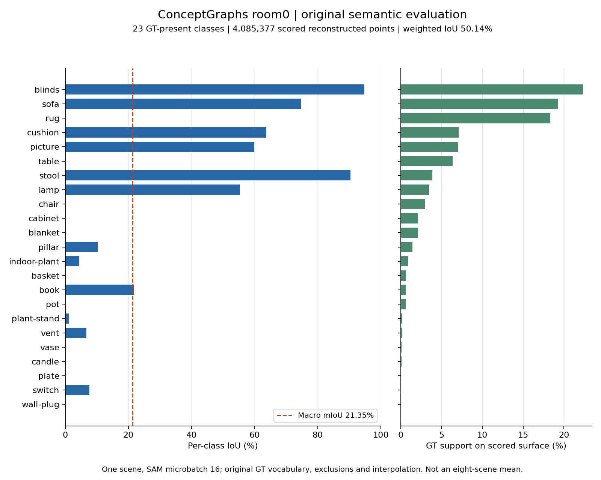

# ConceptGraphs room0：原始语义评价结果

[English](CONCEPTGRAPHS_ROOM0_RESULTS.md) | 中文

2026-10-09。原始 SAM 前端、对象映射、RGB PointFusion 和语义评价均已执行成功。**这是 room0 单场景、SAM 批量 16 的兼容运行；完整八场景 benchmark 尚未完成。** Detect 前端另行运行。

| 作者 CSV 指标 | room0，% |
| --- | ---: |
| mIoU | 21.3460 |
| mRecall（平均类别召回） | 38.3156 |
| mPrecision | 29.3624 |
| mF1，作者原公式 | 25.2661 |
| F-mIoU，按 GT 类别频率加权 | 50.1379 |

数值来自[原始 CSV](../evidence/runs/conceptgraphs-room0-evaluation-cuda-05/results/none_overlap_maskconf0.95_simsum1.2_dbscan.1_merge20_masksub/replica_ex6_results.csv)，其 SHA-256 为 `cc15189793c805f58dc54da10eecffa271ec304e34394aaf599a0f0156760141`。CSV 的 `all` 行只汇总本次选择的 room0，与 room0 相同，不能称八场景均值。

## 1. 分母与实际配置

作者源码固定于 `93277a02`，checkout 保持干净。完整输入有 2000 组 1200×680 RGB-D；stride=5 使用 400 帧。

SAM 单批提示点从 144 改为 16，保留全部 12×12 提示点；这是显式兼容变体，已比较的 26 个共同帧不能证明全序列逐位一致。映射保留作者 README 默认的 `save_objects_all_frames=False`。

最终 77 个对象记录、357,134 个点成员不是独立物体真值或唯一点数。

| 支持面 | 数量与用途 |
| --- | --- |
| 原始语义 GT | 1,556,890 点，102 维类别标签 |
| RGB PointFusion 表面 | 7,754,935 点；先用对象预测的 1NN 标签填充该表面 |
| 最终混淆矩阵 | 排除类别后，23 个有效类别、4,085,377 个重建点参与评分 |

作者先限制当前场景 GT 出现的类别，再按 `n_exclude=6` 排除 other / floor / wall / ceiling / door / window，按其原始最近邻流程关联 GT。此分数衡量该支持面上的语义分类，不能当作几何重建准确率、对象身份准确率或真正未知词表上的检索表现。

输入规模见[只读元数据](../evidence/runs/conceptgraphs-room0-evaluation-cuda-05/evaluation-audit/input-metadata.json)，类别和分母见[混淆矩阵审计](../evidence/runs/conceptgraphs-room0-evaluation-cuda-05/evaluation-audit/validation.json)。

## 2. 检查了什么

原始评价退出 0；修复的 chamferdist CUDA 依赖已通过真实 GPU 运算。独立审计用保存的混淆矩阵、float64 重新计算五项 CSV 指标，最大差异为 `1.96e-7` 个百分点，低于 `1e-5` 的 float32 舍入容差。原始 CSV 和公式未改。

固定版作者 mF1 使用 `2pr / max(1, p+r)`，低召回／精度类别的值与标准调和 F1 不同。标准宏 F1 的补充复算为 25.8221%，只列在审计中，不能替换表内作者 mF1。

[固定版指标源码](https://github.com/concept-graphs/concept-graphs/blob/93277a02bd89171f8121e84203121cf7af9ebb5d/conceptgraph/utils/eval.py)。

评价记录耗时 690.65 秒，包含换页。运行中仅将该任务的 RAM 限额由 12G 提到 16G，swap 仍为 48G；未改输入、权重或评分公式，不能用这次时间比较论文效率。

记录器完成后，资源采样器才写入终态；已另存终态，并按原记录哈希恢复完全一致的较早采样快照，保留[完整说明](../evidence/runs/conceptgraphs-room0-evaluation-cuda-05/diagnostics/monitor-snapshot-preservation.json)。作者记录、日志和指标未追改。

## 3. 本机复查

从 Windows PowerShell 进入 WSL，设置两个目录后，可读取已完成结果；最后一条只复算指标，输出路径必须未存在，不重新占用 GPU 建图。

```powershell
wsl -d Ubuntu-22.04 -u qzl
```

```bash
export DOCS=/mnt/d/workspace/be2/SLAM_Author_Originals
export RUNTIME=/home/qzl/projects/SLAM_Author_Originals
cat "$RUNTIME/runs/conceptgraphs-room0-evaluation-cuda-05/metrics.json"
"$RUNTIME/envs/conceptgraphs/bin/python" "$DOCS/scripts/audit_cg_semantic_results.py" \
  --run-root "$RUNTIME/runs/conceptgraphs-room0-evaluation-cuda-05" \
  --output "$RUNTIME/local/cg-room0-audit-manual-01.json"
```

## 4. 哪些类别达到了效果



| 类别 | IoU % | 计分表面 GT 占比 % | 可直接观察到的结果 |
| --- | ---: | ---: | --- |
| blinds | 94.77 | 22.33 | 该类别分类较好 |
| sofa | 74.78 | 19.30 | 有较好重叠，仍有漏分／误分 |
| rug | 0.00 | 18.34 | 计分表面没有预测为 rug 的点 |
| table | 0.00 | 6.36 | 计分表面没有预测为 table 的点 |

23 类中 10 类 IoU 为 0，其中 7 类没有预测点。失败并非只发生于稀有类别；rug、table 也占有较大支持面。

[完整逐类 CSV](../evidence/runs/conceptgraphs-room0-class-analysis-01/room0-class-metrics.csv)和[图表来源、哈希与零值清单](../evidence/runs/conceptgraphs-room0-class-analysis-01/summary.json)来自同一已核验混淆矩阵。零类别预测不能证明对应几何没建出，也不能区分掩码、CLIP 命名、关联和插值的各自责任。

当前未施加迟到位姿修正，未测试 H1 的关联恢复、坐标有效性或过期时长。与 HOV-SG 的 GT、提示及插值也不同，不能据此跨方法排名。[协议对照](SCOPE.zh-CN.md)。
