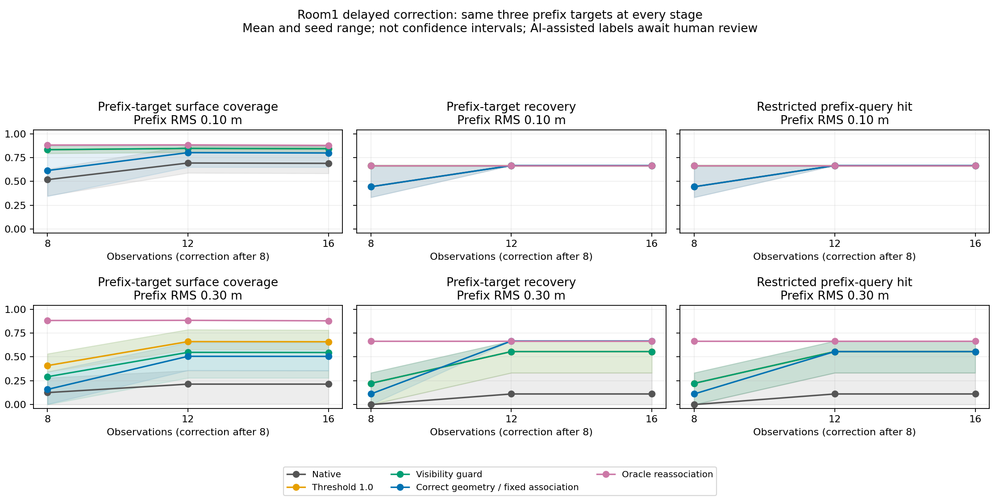
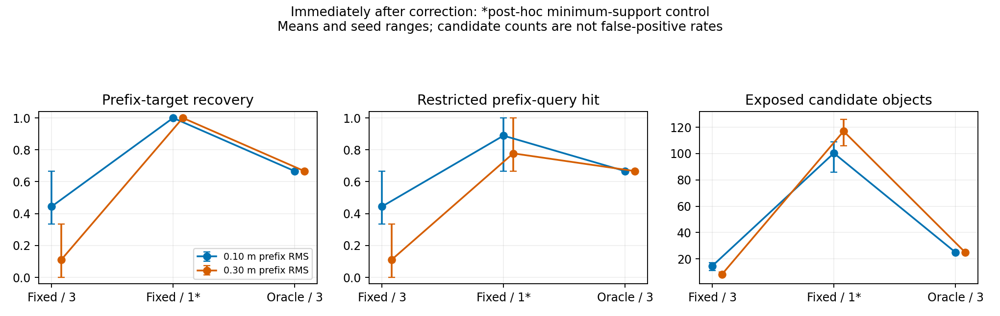

# Late pose correction: a support gate changes the diagnosis

English | [中文](DELAYED_RESULTS.zh-CN.md)

> Historical measurements/analysis; current question and next decision: [STUDY](STUDY.md) · [PLAN](PLAN.md).

**The frozen experiment passes its historical-decision prerequisite, but a simpler support-gate control removes the selected target deficit without reassociation. H1 remains a candidate; a bounded replay prototype is not justified yet.** This is a new-scene ConceptGraphs diagnostic, not a SLAM, navigation or four-method benchmark.

## What was frozen and checked

The design was committed before downloading Replica room1; four raw-view instance labels were sealed before SAM/CLIP extraction or mapping. Sixteen mapping views and four held-out reference views are disjoint. Labels cover dresser, tall vase, wicker basket and bed; they are AI-assisted, visually inspected and **not independently human-reviewed or official GT**. Dresser, vase and basket define the same three-target prefix cohort throughout this report; bed is evaluated separately in the raw records.

Five arms use one frozen frontend: native core, threshold 1.0, threshold plus visibility, corrected geometry with fixed historical associations, and oracle full reassociation. Eight initial poses receive a world-x random walk at 10/30 cm RMS, with three seeds. Exact historical poses arrive after observation eight; subsequent poses are exact. Evaluation occurs at observations 8, 12 and 16. See the [frozen protocol](DELAYED_PROTOCOL.md).

All **35 primary cells** completed. Seven parity gates passed with zero coordinate/feature difference and identical memberships: the extracted loop versus the pinned native batch mapper, then fixed-association and oracle controls versus native at zero error at all three stages. Every corrected oracle map also equals the zero-error native map exactly. The fixed-history control rebuilds geometry from every original observation at corrected poses, retaining the original add/merge decisions and semantic memberships; it is stronger than shifting a fused centroid and is itself a full-history oracle. Per-observation RNG reset is an execution adaptation shared with the native parity run. One earlier setup failure is preserved alongside its executed source.

## Primary result: immediate loss, partial later repair

At 30 cm RMS, immediately after correction, means over three seeds are:

| Arm | Surface coverage | Target recovery | Query hit |
| --- | ---: | ---: | ---: |
| Native, no historical correction | 0.1253 | 0.0000 | 0.0000 |
| Association threshold 1.0 | 0.4085 | 0.2222 | 0.2222 |
| Threshold plus visibility | 0.2917 | 0.2222 | 0.2222 |
| Corrected geometry, fixed history | 0.1587 | 0.1111 | 0.1111 |
| Oracle reassociation | 0.8817 | 0.6667 | 0.6667 |

Recovery requires at least 20% coverage of an annotated partial surface within 10 cm and at least 50% visible projection precision. Query hit requires the top-1 CLIP candidate to satisfy that target's same criteria. Best coverage may come from a different candidate. These are selected-instance readouts, not complete identity accuracy or open-world retrieval precision.

Oracle improves recovery/query over fixed history in 2/3 seeds at 10 cm and 3/3 at 30 cm, satisfying the declared categorical gate. However, at observation 16 the 30 cm recovery means are both 0.6667; query hit is 0.5556 versus oracle 0.6667. Later observations repair much of the deficit. **This does not establish permanent or irreversible information loss.** Annotated mixed-object count is zero throughout the primary study; these labels do not support a cross-instance false-merge explanation.

## Post-hoc control: expose low-support fragments

Inspection showed that fixed history contained many objects hidden by the default minimum of three supporting detections. A separate six-cell follow-up was declared after all primary results were seen. It changes only that minimum from 3 to 1 in the fixed-history arm, keeping the same oracle geometry correction, frontend and original prefix associations. At observation 16 the changed final filter also changes objects admitted to the final native merge. It is exploratory evidence, not independent confirmation.

| RMS | Fixed / 3 recovery; query | Fixed / 1 recovery; query | Oracle / 3 recovery; query |
| --- | --- | --- | --- |
| 10 cm | 0.4444; 0.4444 | 1.0000; 0.8889 | 0.6667; 0.6667 |
| 30 cm | 0.1111; 0.1111 | 1.0000; 0.7778 | 0.6667; 0.6667 |

These are immediate post-correction means over the same three targets and three seeds. At 30 cm, fixed-history coverage rises from 0.1587 to 0.8704, near oracle 0.8817. Exposed candidates rise from 8.3 to 117.0, versus oracle 25.0. At 10 cm the counts are 14.7, 100.3 and 25.0. **Candidate counts are not false-positive rates:** unlabelled candidates may be valid objects, duplicate fragments or background. A one-hit fragment can satisfy a partial-surface test without constituting a stable whole-object identity.

Zero-error native already fails the vase recovery/query test despite coverage 1.0: its selected candidate has visible precision about 0.209. Frontend granularity, nested plant/vase parts and partial-label ontology remain possible explanations. Its baseline failure cannot be attributed to injected pose error. Exposing smaller fragments also changes which parts qualify, so the higher follow-up recovery is not evidence of superior complete semantics.

## Decision and a falsifiable next step

The evidence supports a narrower mechanism: **pose-induced association fragmentation interacts with support-based map exposure.** It weakens the claim that reassociation is necessary for these selected targets. Lowering a gate is inexpensive, but this control still uses full-history oracle geometry; it does not demonstrate a cheap deployable end-to-end solution. Neither simple guards nor H1 have been compared at equal identity quality, candidate budget, change recall or correction cost.

Do not implement bounded provenance/replay on this result alone. First freeze a second scene and obtain independent human review of instance identities, parts and duplicate labels. With the same corrected geometry, compare support minima 1/2/3, visibility, threshold and reassociation under equal exposed-object/point budgets. Measure instance coverage, duplicate and mixed identities, current query validity, wall-clock correction cost and peak memory. Include zero-error support controls and removal/movement events to quantify the cost of retaining one-hit objects. Select settings on separate development views, then evaluate the frozen test views.

Reconsider bounded replay only if, at matched budgets and identity/change accuracy, reassociation reliably restores useful targets that exposure/threshold controls cannot. Then compare a 16-observation / 512 MiB prototype against full replay, reporting contributors outside the window as unresolved rather than silently correct. Stop or narrow H1 if simple controls reach the same frontier. The current one-scene static test cannot establish a common dominant bottleneck across DUFOMap, BeautyMap, ConceptGraphs and HOV-SG, or a novel solution to it.

## Evidence and recordings

[35-cell evidence](../results/reference/delayed-pose/record.json), [per-cell measurements](../results/reference/delayed-pose/measurements.csv), [six-cell follow-up](../results/reference/delayed-support-control/record.json) and [follow-up measurements](../results/reference/delayed-support-control/measurements.csv) retain every seed, stage, decision trace and executed source. Primary and post-hoc records stay separate. The immutable configuration's initial `annotations_pending` status is a design snapshot; the later freeze and completed execution records establish actual progress.

Three complete real-time terminal videos are retained locally: frontend 82.4 s, primary suite 509.4 s, follow-up 189.8 s. They show command execution, not live 3D inference or RViz. The follow-up recorder held one frame; videos are fully decoded and their commands, hashes and start/middle/end reviews are [recorded separately](../results/reference/delayed-recordings/record.json). Saved-map RViz demonstrations remain linked from the [recording description](RECORDING.md).
