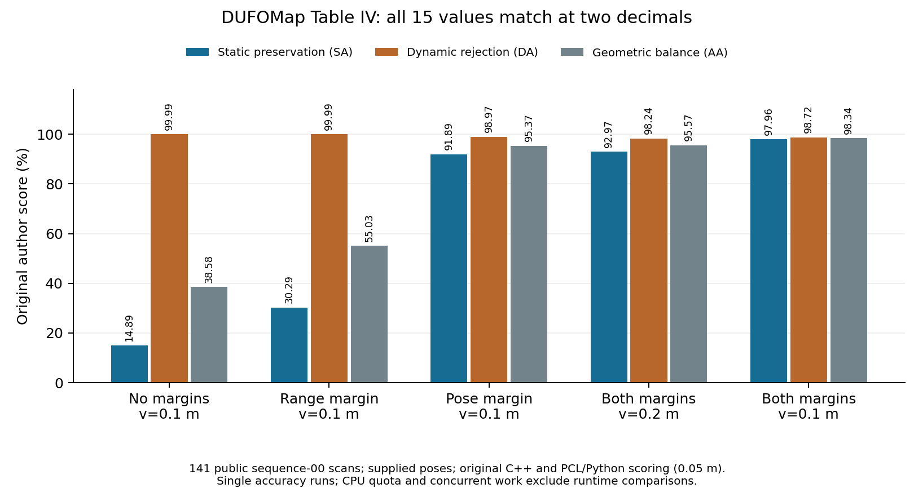

# DUFOMap Table IV reproduction

English | [中文](DUFOMAP_TABLE4.zh-CN.md)

Five original C++ settings on all 141 released 00 scans. Only public TOML parameters change; full-setting output is hash-verified and reused. All settings run the original 0.05 m PCL export and author scoring.

## 1. Paper comparison

| Setting | Measured SA / DA / AA % | Paper SA / DA / AA % |
| --- | --- | --- |
| No d_s/d_p, v=0.1 m | 14.8856 / 99.9917 / 38.5802 | 14.89 / 99.99 / 38.58 |
| d_s=0.2 m only, v=0.1 m | 30.2853 / 99.9865 / 55.0284 | 30.29 / 99.99 / 55.03 |
| d_p=1 only, v=0.1 m | 91.8936 / 98.9727 / 95.3675 | 91.89 / 98.97 / 95.37 |
| d_s=0.2 m, d_p=1, v=0.2 m | 92.9696 / 98.2424 / 95.5696 | 92.97 / 98.24 / 95.57 |
| Full, v=0.1 m | 97.9635 / 98.7196 / 98.3408 | 97.96 / 98.72 / 98.34 |

All 15 entries match two-decimal paper rounding; maximum difference 0.0047 percentage points. [Paper](https://arxiv.org/html/2403.01449v1#S5.T4).



[PDF](../evidence/figures/dufomap-table4.pdf) · [Figure provenance](../evidence/figures/dufomap-table4.json) · [Metrics](../evidence/runs/dufomap-table4-ablation-01/metrics.json).

## 2. Limits and rerun

Existing compensation is a strong baseline. This does not establish online localization, pose-source invariance or new-sensor accuracy. CPU 200%, RAM/swap 4G/6G and concurrent tasks prevent a paper-runtime comparison.

The command uses prepared `data/00-pristine`, verifies inputs and refuses existing output directories. Use a new run name.

## 3. Commands

Use the shell shown by each block. Keep the order, use new output names, and check whether the task has already run before starting it.

```powershell
wsl -d Ubuntu-22.04 -- python3 /mnt/d/workspace/be2/SLAM_Author_Originals/scripts/run_dufo_ablation.py --runtime /home/qzl/projects/SLAM_Author_Originals --name dufomap-table4-manual-01
```
