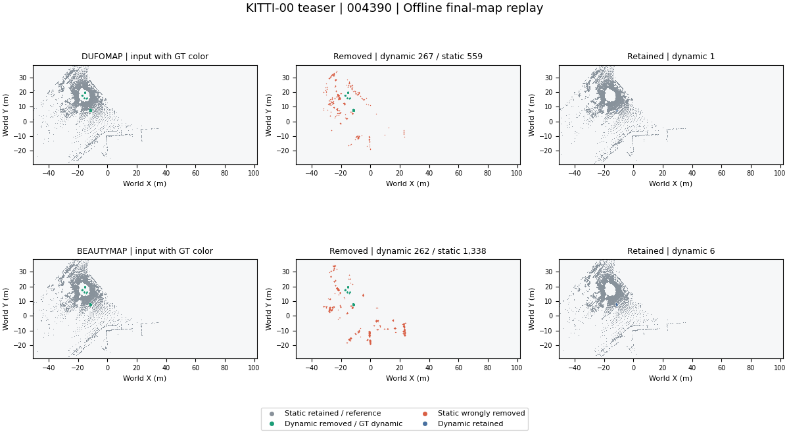
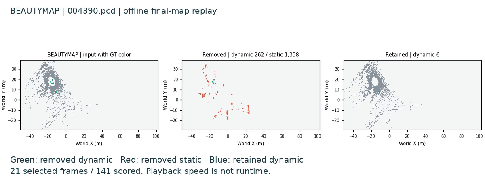

<div align="center">

# SLAM Learning

**地图修复？**

动态环境稳健建图 · 语义建图与定位

[](https://github.com/p20030920p/SLAM_Learning/actions/workflows/ci.yml)
[](../src/pyproject.toml)

[English](../README.md) | 中文

[分析](research/STUDY.zh-CN.md) · [证据](README.zh-CN.md) · [安装](guides/REPRODUCE.zh-CN.md) · [结构](guides/STRUCTURE.zh-CN.md)

</div>



*21 个保存地图快照播放 14 秒；显示速度不代表算法运行速度。GT 仅用于评价／着色。[时序核对](../results/reference/media-previews-v3/record.json)。*

四篇相关论文 → 部分建图实验 → 位姿误差对照 → 候选恢复假设。**H1 尚未验证。**

## 方向分析

**SLAM — Simultaneous Localization and Mapping，同步定位与建图：**利用传感器观测，同时估计自身运动并构建地图。

- **动态环境中的鲁棒定位与 SLAM：**物体运动时，仍能可靠估计自身运动并维护稳定地图。
- **语义建图、视觉定位与导航：**描述物体及其位置，用图像确定自身位姿，并据此到达目标。

用五个要素理解这个过程：

```text
传感器数据 → 前端 → 后端（优化） → 地图构建
              ↓       ↑
           回环检测 ──┘
```

| 要素 | 收益 | 动态 SLAM | 语义建图 |
| --- | --- | --- | --- |
| 传感器数据 | 干净输入 | 运动线索 | RGB-D 对齐 |
| 前端 | 稳定匹配 | 静态特征 | 对象关联 |
| 后端 | 一致位姿 | 异常约束剔除 | 对象对齐 |
| 回环检测 | 减少漂移 | 地点识别 | 重定位 |
| 地图构建 | 稳定地图 | 动态剔除 | 对象身份 |

第一个方向重在可靠运动与几何。第二个方向增加物体含义与目标检索。已完成的建图实验使用给定位姿，单独检查**地图构建**；完整 SLAM 与导航不在这些实验范围内。

## 相关工作

以下回放给定位姿建图后的保存结果。GIF 保留对应 MP4 的播放时序；每个选定地图观测在 12 fps 下保持八帧。[GIF 时序与来源](../results/reference/media-previews-v3/record.json)。

### [DUFOMap](papers/dufomap.zh-CN.md)


**KITTI-00 户外场景，141 帧激光雷达扫描。**用已观测的空区域识别动态点，位姿容差保护静态几何。GIF 节选 21 帧，对比原始、剔除与保留点，背景为最终地图。[MP4](media/dufomap/replay.mp4)。

### [BeautyMap](papers/beautymap.zh-CN.md)



**KITTI-00 户外场景，141 帧激光雷达扫描。**通过占据比较清理动态残影，用恢复机制保护静态几何。GIF 节选 21 帧，对比原始、剔除与保留点，背景为最终地图。[MP4](media/beautymap/replay.mp4)。

### [ConceptGraphs](papers/conceptgraphs.zh-CN.md)


**Replica room0 室内场景，40 帧 RGB-D。**用几何／CLIP 匹配融合观测，得到 39 个对象表示。GIF 节选 20 帧，展示图像分割、最终地图和红色文本查询候选；候选正确性未验证。[MP4](media/conceptgraphs/replay.mp4)。

### [HOV-SG](papers/hovsg.zh-CN.md)

在复现中

## 开放问题

多帧建图如何避免定位误差在静态结构过滤和物体关联中造成持续性错误？

## 复现结果

| 工作 | 数据 | 结果 |
| --- | --- | --- |
| [DUFOMap](https://github.com/p20030920p/SLAM_Learning/blob/535a2780af7ca7eb3aa02f722e1340fe90bc2dcf/docs/DUFOMAP_TABLE4.zh-CN.md) | KITTI-00，141 扫描 | 表 IV 准确率匹配 |
| [BeautyMap](https://github.com/p20030920p/SLAM_Learning/blob/535a2780af7ca7eb3aa02f722e1340fe90bc2dcf/docs/KITTI_PAPER_PROTOCOL.zh-CN.md) | 历史 KITTI-02，91 扫描 | 表 III 准确率匹配 |
| [ConceptGraphs](https://github.com/p20030920p/SLAM_Learning/blob/535a2780af7ca7eb3aa02f722e1340fe90bc2dcf/docs/CONCEPTGRAPHS_ROOM0_RESULTS.zh-CN.md) | room0，400 观测 | 单场景已评分 |
| [HOV-SG](papers/hovsg.zh-CN.md) | | 在复现中 |

## 实验证据

以下数值取自作者源库链接的论文及我们保存的作者代码运行结果。每张表仅对照同一种方法，不作跨方法排名。

### DUFOMap

KITTI-00，141 扫描公开数据；完整设置：体素 0.1 m、d_s=0.2 m、d_p=1。[作者源库](https://github.com/KTH-RPL/dufomap/tree/9e239ddd5995136e14f5212f33382a6ebc59e518) · [论文表 IV](https://arxiv.org/html/2403.01449v1#S5.T4) · [我们的结果](https://github.com/p20030920p/SLAM_Learning/blob/535a2780af7ca7eb3aa02f722e1340fe90bc2dcf/docs/DUFOMAP_TABLE4.zh-CN.md)。

| 指标 | 论文 % | 复现 % |
| --- | ---: | ---: |
| SA | 97.96 | 97.9635 |
| DA | 98.72 | 98.7196 |
| AA | 98.34 | 98.3408 |

完整设置的三项数值保留两位小数后均与论文一致。表 IV 五组设置共 15 项准确率均匹配；本表不包含运行时间和在线实验。

### BeautyMap

历史 KITTI-02，第 860–950 帧，共 91 扫描；XY=1 m、Z=0.5 m、范围 40 m。[作者源库](https://github.com/MKJia/BeautyMap/tree/98bce4a97db96ddd0d5342e31425c7679f58ba2e) · [论文表 III](https://arxiv.org/html/2405.07283v1#S4.T3) · [我们的结果](https://github.com/p20030920p/SLAM_Learning/blob/535a2780af7ca7eb3aa02f722e1340fe90bc2dcf/docs/KITTI_PAPER_PROTOCOL.zh-CN.md)。

| 指标 | 论文 % | 复现 % |
| --- | ---: | ---: |
| SA | 83.40 | 83.3978 |
| DA | 82.41 | 82.4092 |
| HA | 82.90 | 82.9006 |

三项数值保留两位小数后均一致。XY=0.5／1／2 m 的九项准确率全部匹配。使用历史预处理／GT 与作者 HA 评分器；论文当时的精确方法提交尚未确定。其他序列及运行时间不在本表范围内。

### ConceptGraphs

论文报告 Replica benchmark；下列已完成结果仅覆盖 **room0，400 次观测**，使用已披露的 SAM batch-16 变体。覆盖范围不同，论文值仅供参考，不计算复现差距。[作者源库](https://github.com/concept-graphs/concept-graphs/tree/93277a02bd89171f8121e84203121cf7af9ebb5d) · [论文表 II](https://arxiv.org/html/2309.16650v1#S3.T2) · [我们的 room0 结果](https://github.com/p20030920p/SLAM_Learning/blob/535a2780af7ca7eb3aa02f722e1340fe90bc2dcf/docs/CONCEPTGRAPHS_ROOM0_RESULTS.zh-CN.md)。

| 指标 | 论文 benchmark % | 我们的 room0 % |
| --- | ---: | ---: |
| mAcc | 40.63 | 38.3156 |
| F-mIoU | 35.95 | 50.1379 |

作者评分器将 `mrecall` 对应 mAcc、`fmiou` 对应 F-mIoU。我们的宏平均 mIoU 21.3460% 是另一项指标，不拿它替代 F-mIoU。[指标定义](https://github.com/concept-graphs/concept-graphs/blob/93277a02bd89171f8121e84203121cf7af9ebb5d/README.md#evaluate-semantic-segmentation-from-the-object-based-mapping-results-on-replica-datasets)。

## 假设

我们假设，保留地图更新背后的观测证据，并随着位姿估计的改善重新审视这些更新，能够减少持续性建图错误，保持更加一致的几何与语义地图。

## 分支

| 分支 | 用途 |
| --- | --- |
| main | 提交展示：问题、部分建图实验、反证与候选 H1。 |
| [reproduce/author-originals](https://github.com/p20030920p/SLAM_Learning/tree/reproduce/author-originals) | 作者原流程、论文表格／语义评分与录制。 |
| [notes/personal-study-guide-20261008](https://github.com/p20030920p/SLAM_Learning/tree/notes/personal-study-guide-20261008) | 个人学习笔记与 `physical/` 实物实验，保留操作说明和失败记录。 |

迟到修正与候选预算实验保留为[固定快照](https://github.com/p20030920p/SLAM_Learning/tree/4361d4f353a7449c7d6964887643915d2fc72a11)；仍属探索，H1 尚未验证。

[AI 使用](guides/DISCLOSURE.zh-CN.md) · [来源／许可](guides/ATTRIBUTION.zh-CN.md) · [引用](CITATION.cff) · [许可](../src/LICENSE)
