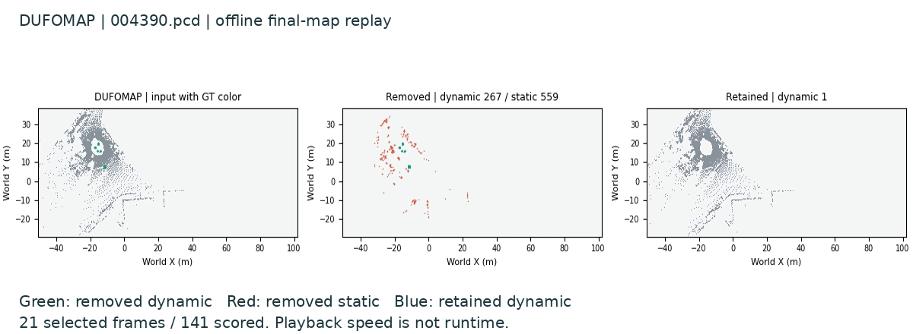
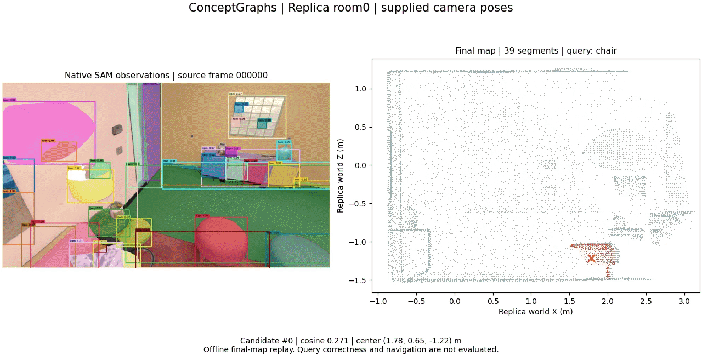
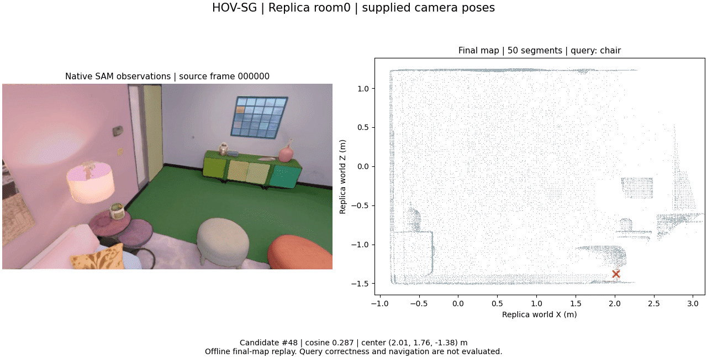
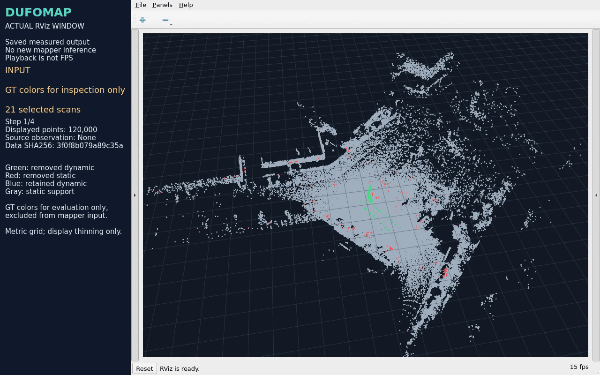
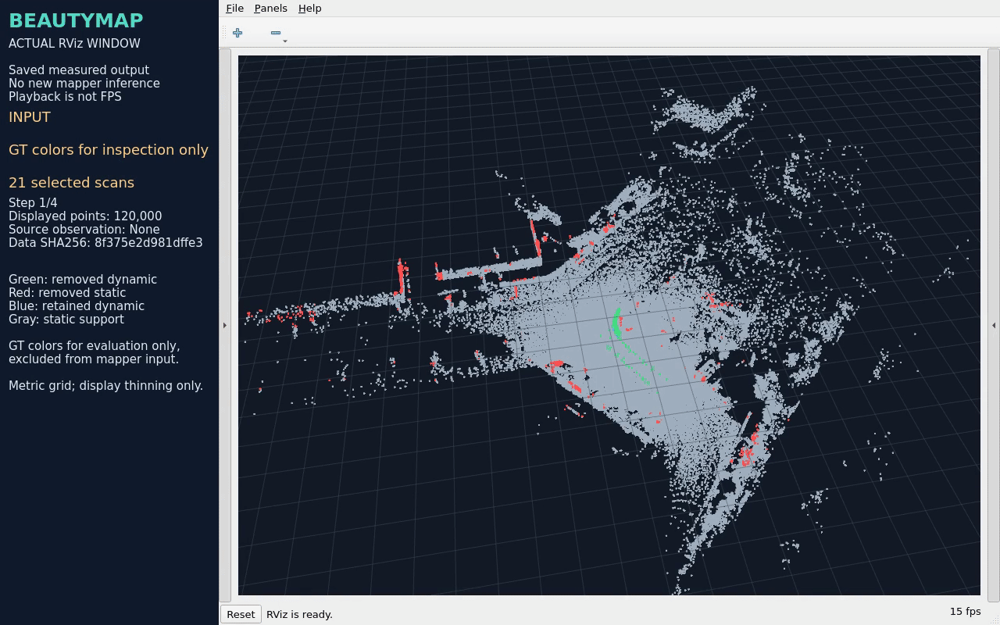
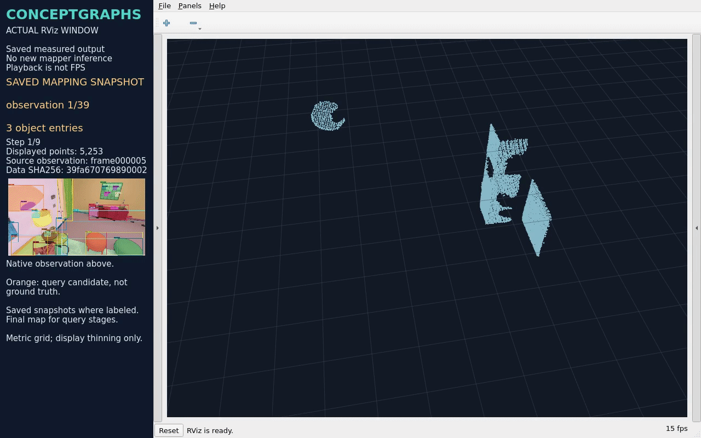
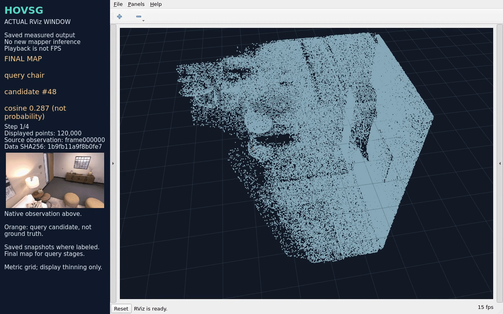
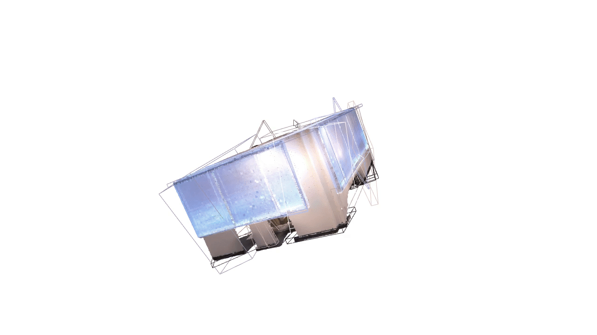

<div align="center">

# SLAM Learning

**位姿修正后，地图也修复了吗？**

动态环境稳健建图 · 语义建图与定位

[](https://github.com/p20030920p/SLAM_Learning/actions/workflows/ci.yml)
[](../src/pyproject.toml)

[English](../README.md) | 中文

[分析](research/STUDY.zh-CN.md) · [证据](README.zh-CN.md) · [安装](guides/REPRODUCE.zh-CN.md) · [结构](guides/STRUCTURE.zh-CN.md)

</div>


*保存地图回放；GT 仅用于评价／着色。[来源](../results/reference/reproduction-media-wsl/record.json)。*

四篇 2024 年建图工作 → 位姿误差对照 → 候选恢复假设。**H1 尚未验证。**

## SLAM 与两个方向

**SLAM — Simultaneous Localization and Mapping，同步定位与建图：**利用传感器观测，同时估计自身运动并构建地图。

- **动态环境中的鲁棒定位与 SLAM：**物体运动时，仍能可靠估计自身运动并维护稳定地图。
- **语义建图、视觉定位与导航：**描述物体及其位置，用图像确定自身位姿，并据此到达目标。

用五个要素理解这个过程：

```text
传感器数据 → 前端 → 后端（优化） → 地图构建
              ↓       ↑
           回环检测 ──┘
```

| SLAM 要素 | 改进带来的效果 | 动态方向侧重点 | 语义方向侧重点 |
| --- | --- | --- | --- |
| 传感器数据 | 观测更干净、同步更准确 | 观察运动与遮挡 | 对齐 RGB 与深度 |
| 前端 | 对应关系更可靠 | 匹配稳定结构 | 提取掩码／特征，关联观测 |
| 后端 | 位姿更一致 | 排除错误运动约束 | 对齐对象坐标 |
| 回环检测 | 重访约束帮助减少漂移 | 环境变化后仍能认出地点 | 支持重定位 |
| 地图构建 | 地图更可用 | 消除动态残影 | 维护身份与查询目标 |

第一个方向重在可靠运动与几何。第二个方向增加物体含义与目标检索。四篇复现均使用给定位姿，单独检查**地图构建**，尚未复现完整 SLAM 或导航。

## 相关工作

以下回放给定位姿建图后的保存结果。[GIF 来源](../results/reference/media-previews-v2/record.json)。

### [DUFOMap](papers/dufomap.zh-CN.md)



**KITTI-00 户外场景，141 帧激光雷达扫描。**用已观测的空区域识别动态点，位姿容差保护静态几何。GIF 节选 21 帧，对比原始、剔除与保留点，背景为最终地图。[MP4](media/dufomap/replay.mp4)。

### [BeautyMap](papers/beautymap.zh-CN.md)


**KITTI-00 户外场景，141 帧激光雷达扫描。**通过占据比较清理动态残影，用恢复机制保护静态几何。GIF 节选 21 帧，对比原始、剔除与保留点，背景为最终地图。[MP4](media/beautymap/replay.mp4)。

### [ConceptGraphs](papers/conceptgraphs.zh-CN.md)



**Replica room0 室内场景，40 帧 RGB-D。**用几何／CLIP 匹配融合观测，得到 39 个对象表示。GIF 节选 20 帧，展示图像分割、最终地图和红色文本查询候选；候选正确性未验证。[MP4](media/conceptgraphs/replay.mp4)。

### [HOV-SG](papers/hovsg.zh-CN.md)



**Replica room0 室内场景，8 帧 RGB-D。**融合多视角分割与 CLIP 特征，得到 50 个三维分段。GIF 展示输入分割、最终特征地图和红色查询候选；候选正确性未验证。本次仅运行分段建图，未复现论文的楼层／房间层级与导航。[MP4](media/hovsg/replay.mp4)。

## 共同依赖与开放问题

DUFOMap、BeautyMap 减少动态残影，保留静态几何。ConceptGraphs、HOV-SG 组织对象与语义，支持语言查询。

四者都依赖**位姿对齐 → 对应关系 → 地图判断**。错位可能影响点的删除、对象融合或特征归属。位姿容差、静态恢复和关联规则已经提供部分保护。

**位姿修正后，基于旧位姿做出的地图判断如何修复？**

例如，坐标已经正确，一个物体仍可能被拆开，两个物体仍可能被合并。这是候选失效机制，尚未证明是共同缺陷。先在相同位姿修正与候选上限下，检验 ConceptGraphs 的关联恢复。[检验与边界](research/STUDY.zh-CN.md)。

## 复现结果

后续作者原代码运行使用独立协议，固定快照 **535a278**：

| 工作 | 评分范围 | 结果 |
| --- | --- | --- |
| [DUFOMap](https://github.com/p20030920p/SLAM_Learning/blob/535a2780af7ca7eb3aa02f722e1340fe90bc2dcf/docs/DUFOMAP_TABLE4.zh-CN.md) | 表 IV，141 扫描公开数据 | SA 97.9635%、DA 98.7196%；15 项匹配论文两位小数 |
| [BeautyMap](https://github.com/p20030920p/SLAM_Learning/blob/535a2780af7ca7eb3aa02f722e1340fe90bc2dcf/docs/KITTI_PAPER_PROTOCOL.zh-CN.md) | 历史 KITTI-02，91 扫描 | XY=1 m 时 SA 83.3978%、DA 82.4092%；表 III 共 9 项匹配 |
| [ConceptGraphs](https://github.com/p20030920p/SLAM_Learning/blob/535a2780af7ca7eb3aa02f722e1340fe90bc2dcf/docs/CONCEPTGRAPHS_ROOM0_RESULTS.zh-CN.md) | room0，400 观测 | mIoU 21.3460%、类别频率加权 IoU 50.1379% |
| [HOV-SG](https://github.com/p20030920p/SLAM_Learning/blob/535a2780af7ca7eb3aa02f722e1340fe90bc2dcf/docs/HOVSG_HOME_RESULTS.zh-CN.md) | room0，20 帧资源变体 | mIoU 34.7500%、F-mIoU 62.8725%；默认 200 帧仍未完成 |

SA／DA 为静态保留／动态剔除；语义评分使用场景 GT 类别，计分位置／排除项不同，不测身份恢复或开放世界查询。分数不横向排名，完整轨迹与机器人导航仍未测试。[范围](https://github.com/p20030920p/SLAM_Learning/blob/535a2780af7ca7eb3aa02f722e1340fe90bc2dcf/docs/SCOPE.zh-CN.md)。

<details>
<summary>另外五个 GIF：真实三维窗口录像</summary>

每段均录制真实三维窗口，查看保存结果，未重新推理；查询高亮未验证正确性。

**DUFOMap · RViz**



**KITTI-00，141 扫描运行结果。**在 RViz 中切换原始、剔除与保留点云，检查动态点清理效果。[MP4](media/rviz/dufomap.mp4)。

**BeautyMap · RViz**



**KITTI-00，141 扫描运行结果。**在同一三维视角中对比原始、剔除与保留点云。[MP4](media/rviz/beautymap.mp4)。

**ConceptGraphs · RViz**



**Replica room0，40 帧 RGB-D。**GIF 按原顺序节选五个建图快照（第 1／10／20／30／39 次观测）与四个文本查询阶段。[MP4](media/rviz/conceptgraphs.mp4)。

**HOV-SG · RViz**



**Replica room0，8 帧 RGB-D。**查看最终的 50 分段特征地图与文本查询候选。[MP4](media/rviz/hovsg.mp4)。

**ConceptGraphs · 作者查看器**



**Replica room0，400 帧 RGB-D。**在作者原版查看器中旋转保存地图，切换 RGB／实例颜色。未展示查询或场景图关系。[60 秒视频](https://github.com/p20030920p/SLAM_Learning/blob/3b0b9a88ac7c77431268b6c869c369e01bd19b3e/evidence/videos/conceptgraphs-room0-original-window.mp4) · [来源](https://github.com/p20030920p/SLAM_Learning/blob/4361d4f353a7449c7d6964887643915d2fc72a11/results/reference/homepage-media/record.json)。

</details>

## 让问题收窄的证据


room1，30 cm 修正刚发生时：固定关联恢复率 **11.1%**，oracle **66.7%**，事后 support-1 **100%**；候选数为 **8.3／25／117**。三个种子均值、部分 AI 标注、候选上限不等。[结果](research/DELAYED_RESULTS.zh-CN.md)。

降低支持门槛即可消除这组目标的恢复缺口，同时暴露更多碎片；后续观测也能修复部分损失。**尚未证明必须重算关联。** 下一项实验匹配候选上限，并单独检查身份。

## 候选 H1 与下一项检验

保留观测来源与位姿版本，修正后在有界缓存内重放受影响的关联，比简单保护恢复更多有效目标。有界实现**尚未编写或测试**。

room2 固定一个前端、五个 AI 标注实例，第八次观测后交付精确修正。固定关联、阈值 1.0、可见性保护、oracle 重关联四组，比较支持门槛 1／2／3 与候选上限 25／50／100／不限。**28 个建图单元已运行，分析待完成。**[协议](https://github.com/p20030920p/SLAM_Learning/blob/4361d4f353a7449c7d6964887643915d2fc72a11/docs/IDENTITY_BUDGET.zh-CN.md)。

只有 oracle 在两个有限上限下比所有简单对照提升至少 10 个百分点、至少 2／3 配对种子同向，且没有种子增加已标重复／混合身份，才计划原型；否则收窄或停止 H1。相同候选上限不等于相同内存，AI 标注不能确认 H1。[判据与待办](research/PLAN.zh-CN.md)。

[Khronos](https://arxiv.org/html/2402.13817v2) 与 [DovSG](https://arxiv.org/html/2410.11989v2) 已有地图协调／更新。贡献须体现相对已有保护的恢复—成本收益，重放本身不构成创新。

## 分支

| 分支 | 用途 |
| --- | --- |
| main | 提交展示：问题、四篇复现、反证与候选 H1。 |
| [reproduce/author-originals](https://github.com/p20030920p/SLAM_Learning/tree/reproduce/author-originals) | 作者原流程、论文表格／语义评分与录制。 |
| [notes/personal-study-guide-20261008](https://github.com/p20030920p/SLAM_Learning/tree/notes/personal-study-guide-20261008) | 个人学习笔记与 `physical/` 实物实验，保留操作说明和失败记录。 |

迟到修正与候选预算实验保留为[固定快照](https://github.com/p20030920p/SLAM_Learning/tree/4361d4f353a7449c7d6964887643915d2fc72a11)；仍属探索，H1 尚未验证。

[AI 使用](guides/DISCLOSURE.zh-CN.md) · [来源／许可](guides/ATTRIBUTION.zh-CN.md) · [引用](CITATION.cff) · [许可](../src/LICENSE)
