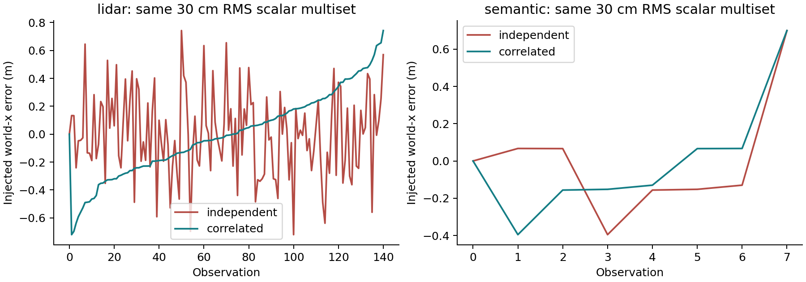
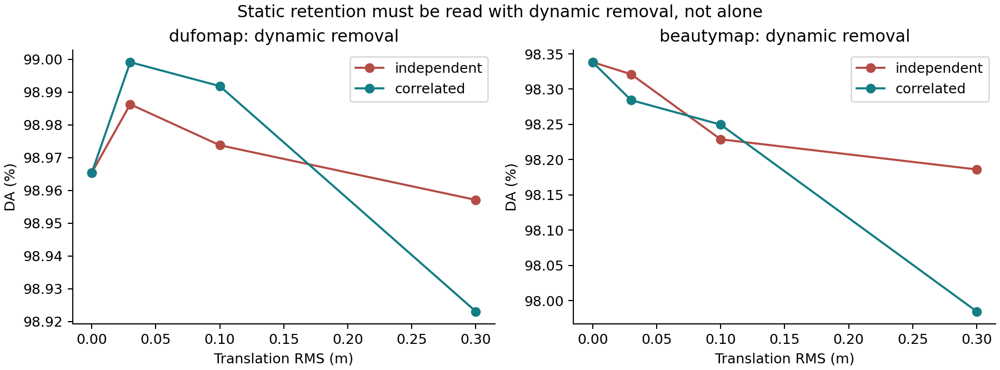
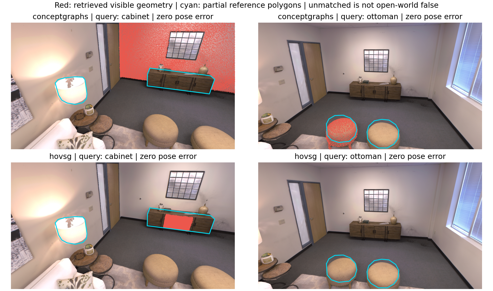

# What paired pose errors change in four map cores

English | [中文](PAIRED_RESULTS.zh-CN.md)

**Decision: keep H1 as a candidate and narrow the claim.** The completed exploratory study tests downstream map decisions under controlled pose errors. It does not establish a universal failure caused specifically by shared uncertainty, and it does not validate a new method. Temporal ordering can help one map objective and hurt another; simple parameter changes already explain part of the apparent improvement opportunity.

## Evidence and scope

The core papers remain [DUFOMap](https://arxiv.org/html/2403.01449v1), [BeautyMap](https://arxiv.org/html/2405.07283v1), [ConceptGraphs](https://arxiv.org/html/2309.16650v1) and [HOV-SG](https://arxiv.org/html/2403.17846v2). The first two connect to robust localization through dynamic-point filtering; the latter two connect to semantic maps and localization through posed observation fusion and target queries. Our runs estimate no trajectory and execute no navigation.

The [frozen exploratory protocol](PAIRED_PROTOCOL.md) specifies 76 primary cells and 21 follow-up parameter controls. LiDAR cells use all 141 teaser scans and 17,362,230 labelled points. Both semantic cores use the same eight source observations, 0,25,...175, with their disclosed native resolution adaptations. The earlier 40-observation ConceptGraphs reproduction remains separate.

Each method gets a zero-error control and three seeds at 3/10/30 cm world-x translation RMS. A temporal pair uses exactly the same scalar error multiset, fixed first pose and fixed observations/features. One order is shuffled; the other is sorted into monotone drift. Rotation is not tested. The two datasets have different observation counts, so error samples are matched within a dataset, not across modalities.

Sorting changes both adjacent-frame consistency and which viewpoint receives each error. Thus this is an intervention on temporal assignment, not an isolated causal estimate of lag-one correlation. Both conditions already share one pose error across all points in a frame; they do not compare a shared-latent estimator against independent uncertainty.

The fixed first pose creates an initial jump before the sorted tail. For seed 104 at 30 cm, lag-one correlation changes from -0.0029 to 0.9778 for LiDAR, and from -0.0220 to 0.4369 for the eight-view semantic sequence. Adjacent-error RMS changes from 0.4237 to 0.0634 m and from 0.3712 to 0.3055 m respectively. These are substantially different temporal stresses despite equal global RMS.

## Target annotation and measurement

Four raw-image polygons cover a cabinet, lamp shade and two ottomans in source frames 0 and 150. After boundary erosion and subsampling, their reference surfaces contain 3,372 / 2,032 / 1,914 / 2,092 points. They are **AI-assisted, visually inspected, partial-surface annotations, without independent human review**, not official Replica semantics. [Annotation coordinates](../annotations/room0/targets.json) and review overlays remain inspectable. Predictions never define the reference or enter its construction.

Semantic recovery requires at least 20% reference coverage and 50% visible projected precision at 10 cm tolerance. The three category queries are cabinet, ottoman and floor lamp; either labelled ottoman can satisfy its query. A miss against this small reference may still be a valid unlabelled instance elsewhere. These are restricted target diagnostics, not open-world precision, full-object IoU or navigation success.

The reference images also appear among the mapping observations; this is diagnostic resubstitution, not test-set generalization. Keeping the first pose exact particularly protects the cabinet/lamp reference geometry. High best-coverage scores are therefore weak evidence of global map robustness; new reference views and complete instance labels are needed for a stronger test.

LiDAR static retention SA and dynamic removal DA are scored at each original point's own perturbed position. DUFOMap additionally reports its direct identity labels; BeautyMap uses cleaned-map proximity. Semantic coverage uses the unchanged world reference because target-coordinate stability is the objective. Consequently, signs and magnitudes across the two tasks are not interchangeable.



## Measurements

The following values are means over three seeds at 30 cm RMS. Seed ranges and every individual cell are published; three seeds on one scene are not three independent scenes or a confidence interval.

| Method / metric | Zero error | Shuffled | Monotone drift |
| --- | ---: | ---: | ---: |
| DUFOMap direct-label SA (%) | 92.6341 | 76.5854 | 88.5977 |
| DUFOMap direct-label DA (%) | 98.9654 | 98.9571 | 98.9231 |
| BeautyMap proximity SA (%) | 96.9529 | 93.2688 | 95.8456 |
| BeautyMap proximity DA (%) | 98.3382 | 98.1861 | 97.9847 |
| ConceptGraphs partial coverage | 0.9256 | 0.5991 | 0.3984 |
| ConceptGraphs target recovery | 1.0000 | 0.6667 | 0.5000 |
| ConceptGraphs restricted query hit | 0.6667 | 0.7778 | 0.5556 |
| HOV-SG partial coverage | 0.9256 | 0.9061 | 0.9136 |
| HOV-SG target recovery | 1.0000 | 1.0000 | 1.0000 |
| HOV-SG restricted query hit | 0.6667 | 0.6667 | 0.3333 |

HOV-SG retains recovery of all four labelled surfaces at every tested error. At 30 cm, drift has slightly higher coverage than shuffled errors but half the restricted query-hit fraction. Segment counts rise from 50 to 93-108; this is not evidence of better semantics. Qualifying segment multiplicity is only a fragmentation/duplicate proxy without full instance ground truth. The four panels use different y-axis scales and measure different objectives; they cannot rank methods.


At 30 cm, drift improves DUFOMap direct static retention by 12.0123 percentage points relative to shuffled errors, with DA lower by 0.0340 pp. BeautyMap improves SA by 2.5768 pp with DA lower by 0.2014 pp. This refutes the proposed blanket rule that temporal correlation necessarily worsens every map decision. Locally coherent errors can preserve cross-frame geometric consistency even while absolute coordinates drift; this explanation is consistent with the result but is not uniquely identified by this experiment.

ConceptGraphs instead loses 0.2006 mean partial coverage under drift compared with shuffled errors. Its zero-error map recovers all four labelled surfaces but hits only two of the three restricted category queries. At 10 cm, drift has lower coverage yet higher query hit than shuffled errors. Geometry, retrieval and object count are different outcomes. A zero-error retrieval miss cannot be attributed to injected pose error.





## Simple controls matter

These controls were declared after initial DUFOMap results were inspected; they are exploratory, not a validation-selected operating point or a held-out comparison.

Increasing DUFOMap d_p from 1 to 2 improves static retention but decreases dynamic removal. At zero error, direct SA rises from 92.6341% to 99.7817%, while DA falls from 98.9654% to 96.3900%. A headline SA gain alone would disguise the tradeoff. No matched-recall claim follows.

Lowering ConceptGraphs association threshold from 1.2 to 1.0 improves several of these target outcomes. At 30 cm, all three drift seeds hit all three restricted queries. Threshold 1.4 often loses surface support. A future uncertainty method must beat this inexpensive baseline at matched recovery, query coverage and delay; baseline parameter sensitivity is not evidence for H1.

## Is shared localization error the common bottleneck?

| Proposition | Evidence-based decision |
| --- | --- |
| Posed observations must be assigned to compatible geometry before editing a map | Shared dependency in the four selected core interfaces; supported by source analysis. |
| Pose perturbation changes downstream map/target outcomes | Supported on these two exploratory subsets with the frontend fixed. |
| Correlated pose error is always worse | Rejected for this stress family and these measured objectives. |
| Treating shared uncertainty incorrectly is the dominant common cause | Not established: no uncertainty-estimator comparison, independent object-motion intervention or multiple-scene replication. |
| A reversible shared-pose sidecar improves the matched operating frontier | Untested; H1 remains a candidate. |

The narrower problem is **how to keep target/map validity accountable when locally consistent observations can still have wrong world coordinates, and when a later pose correction changes previous correspondences**. It joins the two selected themes without pretending that map cleaning and semantic retrieval have the same loss function. Visibility, frontend semantics and numerical execution remain separate sources of failure.

## Candidate H1: concrete implementation boundary

Keep a shared pose version, source-observation provenance and provisional map edits. Use stable background anchors to estimate a common registration residual, then replay affected observations after correction. Compare a joint pose/association guard with an independent-variance guard. Neither a cosine score nor an arbitrary residual margin is a calibrated probability.

The first implementation should target ConceptGraphs association/fusion, where the cached mask/feature observations can be replayed. Store frame IDs, original depth, compressed masks, per-mask features, pose version, candidate associations and a pre-window checkpoint. Do not store a gigabyte-scale pixel-feature tensor per frame. Begin with a 16-observation / 512 MiB cap and report achieved memory, not an assumed budget guarantee.

On new evidence, retain ambiguous correspondences as provisional. On a pose correction, restore the checkpoint and replay all contributors to the affected map component; commit only after the decision guard passes. Queries must return a validity state and timestamp so that deferral does not silently present stale coordinates. Corrections older than the retained window require a disclosed full rebuild or an unsupported-recovery flag. Merely keeping old objects forever fails the stale-target metric.

Exact undo is not automatically available in the other native APIs. A DUFOMap void flag may have several historical ray contributors; removing one frame's evidence requires complete provenance or rebuilding from a suitable checkpoint. The current binding exposes no verified local inverse integration. Use a full rebuild as its first correctness baseline. HOV-SG's delivered offline core would need a new online interface before claiming update-delay benefits. A bounded sidecar is therefore a feasible semantic MVP, not a completed universal wrapper.

[Khronos](https://arxiv.org/html/2402.13817v2) already jointly optimizes and reconciles maps. Memory, joint optimization and rollback are not novelty claims. A possible contribution is a measured, bounded interface between pose corrections and open-vocabulary target validity; novelty still needs a broader prior-art check.

## Falsifiable next experiment

Freeze new scenes/sessions, annotations, correction schedules and budgets before viewing results. Use the existing subsets only for debugging and tuning. Compare the original core, threshold/visibility guards, independent-variance guard, candidate shared-pose guard and an oracle full replay. Report estimated pose uncertainty separately from an oracle supplied pose/covariance.

With the [D435i/L2 physical protocol](REAL_WORLD.md), first fix the D435i on a tripod and record unchanged, occluded, moved and removed targets. A fixed pose isolates visibility and semantic failures. Then use a handheld loop with independently surveyed fiducials/background anchors; separate estimated odometry from the reference. The L2 supplies an additional geometric observation only after extrinsics and time offset are measured. Hardware data has not yet been collected; no robot navigation claim is needed.

Measure false static removal, actual change recall, restricted target coverage, identity fragmentation, target-coordinate error, stale duration, update latency, replay time and peak memory. Use scenes or capture sessions as units. Match recall, query coverage and delay before comparing risk. Sweep correction delays and include errors older than the buffer. No stable anchors is an explicit information-boundary case.

Reject an H1 gain if a simple guard matches the frontier, if gains vanish after pose correction alone, if the estimated shared uncertainty is uncalibrated, or if less deletion means longer stale-target duration. This completes the reasoning chain from author reproduction to controlled evidence, revised problem, candidate mechanism and a test that can disprove it; it does not turn the candidate into a validated result.

## Reproduce, inspect and defend

[Analysis record](../results/reference/paired-pose/record.json) binds measurements, targets, paired differences, controls, annotations, figures, all 97 cell records/logs and retained failed attempts. Large maps and error arrays remain local. Adapter changes, exact source versions and native HOV zero-error byte checks are disclosed. This is the audit trail for the tables above.

```bash
# First run both native semantic baselines; use their full local output directories.
.venv/bin/python scripts/run_paired_suite.py \
  --conceptgraphs-source results/runs/CG_NATIVE_ID \
  --hovsg-source results/runs/HOV_NATIVE_ID \
  --output results/runs/paired-new
.venv/bin/python scripts/run_paired_controls.py results/runs/paired-new \
  --output results/runs/controls-new
.venv/bin/python scripts/analyze_paired.py results/runs/paired-new \
  --controls results/runs/controls-new --output results/runs/analysis-new
```

The [four full-session local recordings](RECORDING.md#complete-local-execution-recordings) demonstrate fresh native execution. They complement measured map GIFs; terminal recording duration is not an algorithm runtime benchmark. For the interview, be ready to explain why exact marginal matching does not isolate every temporal mechanism, why restricted target hits are not open-world precision, and why a threshold control can undermine an attractive hypothesis.
