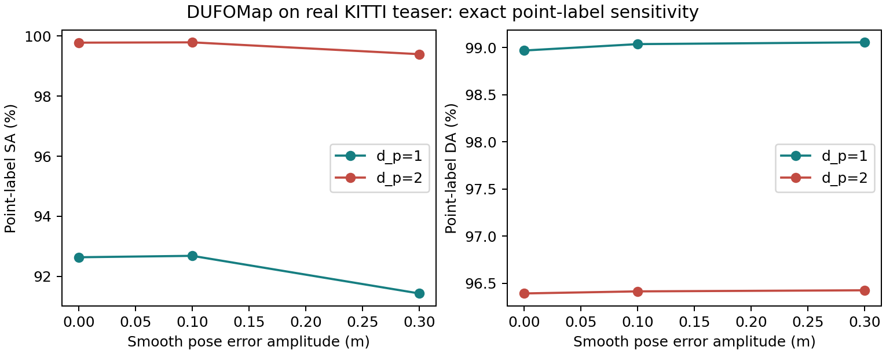
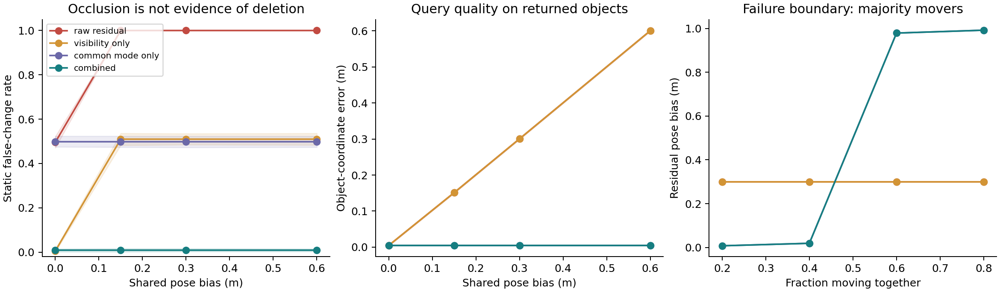
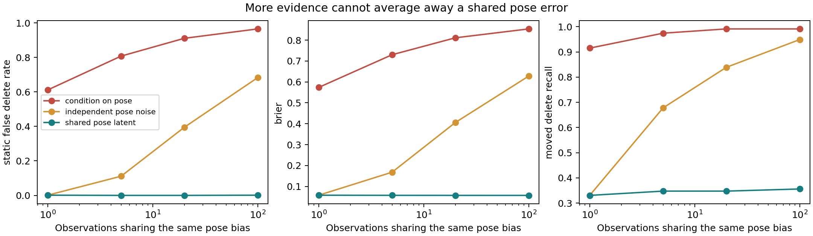

# 复现结果与探索性诊断

[English](RESULTS.md) | 中文

实测日期为 2026 年 10 月 7 日。可发布记录绑定命令、版本、源码／数据／产物哈希。Windows 作者方法与受控实验使用 Python 3.10.19；两种作者方法和六组真实敏感性实验，也在干净 GitHub Ubuntu 22.04 环境成功执行。[Linux 运行](https://github.com/p20030920p/SLAM_Learning/actions/runs/37622082701)、[元数据](../results/ci/linux-run.json)。Docker 未在本机构建。10 月 8 日，本机 WSL2 作者方法、PCL 对照与语义子集已完成，见第 5–6 节。

下列合成试验是形成候选假设的探索，不是看过结果后所选假设的独立确认。

## 1. 作者执行与论文差值

数据为 [DynamicMap 公开 KITTI-00 teaser](https://zenodo.org/records/10886629)，**141 帧、17,362,230 个标注点**：静态 17,266,247，动态 95,983。它是给定位姿的选定片段，不是完整 KITTI 里程计或轨迹估计实验。

| 方法／指标 | 实测 % | 论文 % | 差值，百分点 |
| --- | ---: | ---: | ---: |
| DUFOMap SA | 97.979798 | 97.96 | +0.019798 |
| DUFOMap DA | 98.702895 | 98.72 | −0.017105 |
| DUFOMap AA | 98.340682 | 98.34 | +0.000682 |
| BeautyMap SA | 96.952945 | 96.76 | +0.192945 |
| BeautyMap DA | 98.338247 | 98.38 | −0.041753 |
| BeautyMap HA | 97.640683 | 97.56 | +0.080683 |

目标来自 [DUFOMap 表 I](https://arxiv.org/html/2403.01449v1)、[BeautyMap 表 I](https://arxiv.org/html/2405.07283v1)。容差为预先声明的 **0.01 个百分点**。两方法都执行完成，但没有匹配全部目标，没有扩大容差来改成一致。

[DUFOMap 记录](../results/reference/dufomap/record.json)、[指标](../results/reference/dufomap/metrics.json)、[日志](../results/reference/dufomap/run.log)；[BeautyMap 记录](../results/reference/beautymap/record.json)、[指标](../results/reference/beautymap/metrics.json)、[兼容修正](../results/reference/beautymap/compatibility.patch)。[首次 Windows 失败](../results/reference/beautymap-windows-failure/record.json)为整数溢出，已用显式 64 位掩码修复。

评价器是独立 SciPy 最近邻实现。清理图中任一点在真值点 5 cm 内，该真值点视为保留，不考虑保留点来自哪个输入身份，附近几何可能掩盖逐点动态标签。10 月 8 日已与原 PCL 在两张已存地图上逐点对齐（第 5 节）；当前作者版本仍可能与论文时期不同，论文差值的单一原因未确定。

Linux 作者方法的计数和分数完全一致：[DUFOMap Linux](../results/reference/dufomap-linux/record.json)、[BeautyMap Linux](../results/reference/beautymap-linux/record.json)。该 CI 源码为 `9f3a9ef`：扫描 intensity 可见，但作者几何代码不使用它。后续 Windows 最终运行实际移除扫描标注，分数不变。没有事后改写 Linux 记录。[Linux 直接标签诊断](../results/reference/pose-stress-linux/record.json)、[数值](../results/reference/pose-stress-linux/sensitivity.csv)。

<!-- MEDIA: replication-frame / metric-correspondence -->
*复现定性图位：`docs/figures/replication_frame.png`；对应规则图位：`docs/figures/metric_correspondence.png`。先对齐口径，再归因失效。*

## 2. 真实数据位姿敏感性

DUFOMap 的 `segment` 接口对原点身份给标签，评分前验证全部真值坐标等于拼接扫描。对世界坐标扫描和传感器原点同时加入 $A\sin(2\pi i/(N-1))$ 的 x 平移，不改朝向，因此保留传感器相对几何，模拟时间相关位姿误差。

| 位姿容差 `d_p` | 平移幅度 m | 直接标签 SA % | 直接标签 DA % |
| --- | ---: | ---: | ---: |
| 1 | 0.0 | 92.6340 | 98.9675 |
| 1 | 0.1 | 92.6811 | 99.0352 |
| 1 | 0.3 | 91.4288 | 99.0540 |
| 2 | 0.0 | 99.7816 | 96.3921 |
| 2 | 0.1 | 99.7923 | 96.4139 |
| 2 | 0.3 | 99.3983 | 96.4254 |

更大容差保留更多静态点、检出更少动态点。这里 0.3 m 扰动降低静态保留，0.1 m 没有降低，反驳“任意位姿噪声都必然退化”。一段序列与一个确定性扰动不能建立典型部署失效结论。

此表使用不同绑定路径与直接身份，不能合并到最近邻表。第 5 节的同实例对照把大部分 SA 差距归于地图对应评分；较小的原生输出剩余差值尚未独立隔离。局部重复运行有少量整数计数变化，不能承诺原生多线程位级确定性。[记录](../results/reference/pose-stress/record.json)、[六组数值](../results/reference/pose-stress/sensitivity.csv)、[846 个逐帧行](../results/reference/pose-stress/per_frame.csv)。

## 3. 探索：可见性与公共运动混淆

30 个对象、已知身份和真可见性，噪声 σ=0.02 m，移动对象同向位移 1 m。四种偏差 × 四种运动比例 × 两种遮挡比例 × 四种方法 × 30 个留出于阈值选择的种子，共 **3,840 次配对试验**。99% 噪声门槛由独立验证种子选取。每方法／条件的均值区间按种子自助采样，不是配对差值区间；它们也不是新假设的确认集。

0.3 m 偏差、20% 运动、50% 遮挡时：

| 方法 | 静态误判变化 % | 返回目标坐标误差 m | 查询覆盖率 % |
| --- | ---: | ---: | ---: |
| 原始残差 | 100.00 | 0.3004 | 49.22 |
| 仅可见性 | 50.97 | 0.3004 | 49.22 |
| 仅公共修正 | 49.86 | 0.0053 | 49.22 |
| 组合 | 0.83 | 0.0053 | 49.22 |

组合误判率 95% 区间为 **0.28–1.67%**；所有移动对象召回仅 **42.22%**，看不见的变化为未知。低坐标误差必须与约 49% 覆盖率同时报告。这是合成对象坐标查询，不是 SLAM ATE 或实际导航。

80% 对象同向运动、0.3 m 偏差、无遮挡时，组合静态误判 **100%**、位姿误差 **0.9917 m**、查询误差 **0.9985 m**。运动多数被选成公共位姿偏移，暴露稳定锚点假设。此失败保留于结果。[记录](../results/reference/mechanism/record.json)、[原始试验](../results/reference/mechanism/trials.csv)、[区间与汇总](../results/reference/mechanism/summary.json)。

## 4. 探索：相关观测与置信度

一维高斯模型：1,000 个配对种子，变化先验 0.1，位姿 σ=0.15 m，传感器 σ=0.02 m，变化位移 σ=0.5 m。相同位姿偏差持续 1、5、20、100 次读数；变化概率大于 0.9 才删除。三个推断模型共 **12,000 次试验**。先验和噪声尺度已知，不是 SuperMap／PerSeM 实现。

| 模型 | 读数 | 静态误删 % | 变化召回 % | Brier 分数 ↓ |
| --- | ---: | ---: | ---: | ---: |
| 独立位姿噪声 | 1 | 0.1134 | 33.05 | 0.0582 |
| 独立位姿噪声 | 100 | 68.2540 | 94.92 | 0.6278 |
| 共享位姿潜变量 | 1 | 0.1134 | 33.05 | 0.0582 |
| 共享位姿潜变量 | 100 | 0.1134 | 35.59 | 0.0574 |

匹配生成模型下，实验展示了方差下界机制；共享模型变化召回明显更低，不能证明匹配召回时更优，也不能证明真实估计协方差下校准。Brier 衡量概率预测质量，单独一个分数不构成完整校准证明。[记录](../results/reference/evidence-stress/record.json)、[试验](../results/reference/evidence-stress/trials.csv)、[全部条件](../results/reference/evidence-stress/summary.json)。

## 5. 本机 WSL 与评价对照——10 月 8 日

两种 CPU 作者方法在 WSL2 Ubuntu 22.04、Python 3.10.12 再次完成，混淆计数未变；BeautyMap 的地图与扫描标注均物理隔离。[DUFOMap WSL](../results/reference/dufomap-wsl/record.json)、[BeautyMap WSL](../results/reference/beautymap-wsl/record.json)。

在固定 benchmark 提交上，用 GCC 11.4／PCL 1.12.1 编译**未修改的原 PCL 评价器**。每张地图的 17,362,230 个点身份与 SciPy 判定一致：**0 个分歧、0 个百分点差异**。[对照](../results/reference/evaluation-check-wsl/summary.json)、[编译／运行来源](../results/reference/evaluation-check-wsl/record.json)。这排除了这两张已存地图上评价器实现造成差值的解释，尚未解释与论文时期源码／参数的差异。

第二个对照使用同一个训练完成的 DUFOMap、零注入误差：先获取直接 `segment` 标签，用保留点构建地图，再调用原生 `outputMap`。

| 定义 | SA % | DA % |
| --- | ---: | ---: |
| 直接 `segment` 点身份 | 92.634271 | 98.957107 |
| 相同保留点，5 cm 地图最近邻 | 97.981802 | 98.686226 |
| 原生输出，5 cm 地图最近邻 | 97.979798 | 98.702895 |

只改变直接标签所生成地图的评分方式，SA 就提高 **5.347532 个百分点**。原生地图的额外差异为 SA −0.002004、DA +0.016670 个百分点。这把大部分 SA 差距定位到地图对应规则；较小的剩余差异不能单独归于绑定缺陷，原生波动与调用顺序尚未独立隔离。表中是评分定义，不是三个算法。[记录与绑定签名](../results/reference/api-check-wsl/record.json)、[原始计数](../results/reference/api-check-wsl/summary.json)。

[21 帧回放](../docs/figures/replication_hero.gif)使用原 PCL 标签、公共世界坐标范围和明确来源帧。展示最终离线地图，计数先于抽稀／裁剪。[渲染元数据](../results/reference/reproduction-media-wsl/render.json)。

## 6. 首个语义前端

ConceptGraphs 的 class-agnostic SAM／CLIP 分割、作者三维关联／融合已处理 **40 次提供位姿的 Replica `room0` 观测**，得到 **39 个后处理对象**。4 个文本查询返回提供的世界坐标系中的候选坐标；尚未评价正确检索、语义榜单准确率或导航成功率。SAM 分批适配和首次中止运行见[语义复现](SEMANTIC.zh-CN.md)，含完整环境命令与原始记录。

## 检查与未完成部分

当前检查 36 个通过，Ruff 无错误；Matplotlib 依赖产生弃用警告。导出和 Git 中的原始字节均经过哈希验证。多数 Windows 数值使用 `01e2105aeb8a26bf5cdbe7420b56c0dddf81272c`，最终 BeautyMap 为 `17591fa`，隔离扫描标注后数值未变。每记录保存对应源码哈希。

PCL／SciPy 对照和可执行语义子集、文本坐标检索已完成；完整语义榜单、标注目标正确率、机器人导航、多会话身份评价仍待完成。下一步查论文版本差异、补语义关联／目标标注和配对位姿误差对照，再冻结假设；[计划](PLAN.zh-CN.md)分别记录已做、探索、待做事项。
