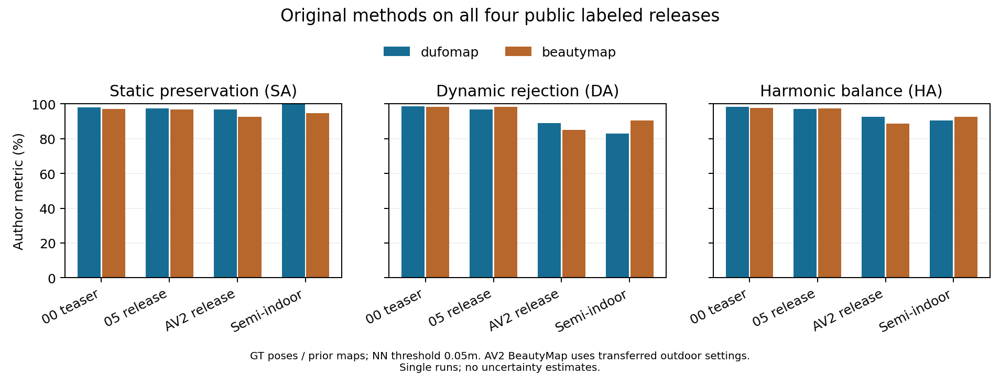
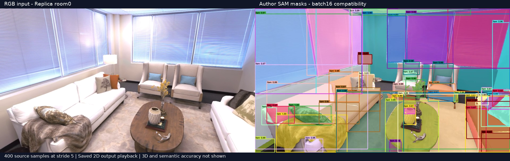
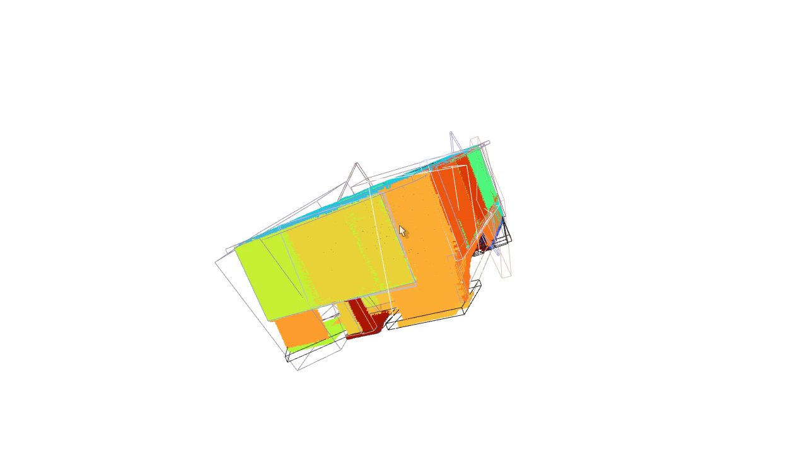

# 运行状态与解释

[English](STATUS.md) | 中文

更新日期：2026-10-09（莫斯科）。实际工作区：`/home/qzl/projects/SLAM_Author_Originals`。

| 当前阶段 | 完成情况 |
| --- | --- |
| DUFOMap / BeautyMap 公开标注数据 | 两种原始入口与原评分完成，各 1997 帧；两张论文消融表的 24 项匹配 |
| ConceptGraphs SAM-only | room0、office0、office1 原始链路与语义评分完成；mIoU 分别 21.3460%、20.4157%、14.9755% |
| ConceptGraphs Detect | room0、office0 原始链路与语义评分完成；mIoU 分别 25.5987%、17.5151% |
| HOV-SG 家用采样，room0 | 20 帧地图及原评分完成；mIoU 34.7500%、F-mIoU 62.8725% |
| 仍在推进 | 三帧显存兼容检查已通过；队列 09 重跑 office1 Detect，HOV 默认 06／后续 08 等待；完整 benchmark 尚未完成 |

## 1. 已实际执行

DUFOMap 原始 C++、BeautyMap 原始 Python、DynamicMap 作者 PCL 导出与 Python 评分均已在四份公开标注数据执行成功。00 / 05 / AV2 / 半室内分别为 141 / 321 / 575 / 960 帧，共 1997 帧，每个方法均使用全部已发布扫描。

00 是 teaser；这些公开数据包不等于 KITTI 全序列或论文全部消融。输入保留作者提供的位姿和 GT，不用于证明定位鲁棒性。

| 实际入口 | SA 静态保留率 % | DA 动态剔除率 % | AA % | HA % |
| --- | ---: | ---: | ---: | ---: |
| DUFOMap C++，作者默认 config.toml | 97.9635 | 98.7196 | 98.3408 | 98.3401 |
| BeautyMap Python，作者示例参数 40 / 1 / 0.5 | 96.9529 | 98.3382 | 97.6431 | 97.6407 |
| DUFOMap Python，作者默认体素输出 | 51.6256 | 98.1257 | 71.1744 | 67.6561 |

以上为 00。其余公开数据结果如下；DUFOMap 均为 C++ 原始点输出：

| 数据 | 方法 | SA % | DA % | AA % | HA % |
| --- | --- | ---: | ---: | ---: | ---: |
| 05 release | DUFOMap | 97.3035 | 96.7986 | 97.0507 | 97.0504 |
| 05 release | BeautyMap | 96.7933 | 98.2248 | 97.5065 | 97.5038 |
| AV2 release | DUFOMap | 96.6651 | 88.8985 | 92.7005 | 92.6193 |
| AV2 release | BeautyMap | 92.4013 | 85.1671 | 88.7105 | 88.6369 |
| 半室内 | DUFOMap | 99.6373 | 83.0049 | 90.9417 | 90.5638 |
| 半室内 | BeautyMap | 94.7785 | 90.4048 | 92.5659 | 92.5400 |

数值直接取自 [作者评分日志](../evidence/runs/released-lidar-01/scores/run.log)，图表来源与哈希见 [JSON](../evidence/figures/lidar-scores.json)。DUFOMap 使用作者默认 config；BeautyMap 在 KITTI 使用 40 / 1 / 0.5，半室内使用 10 / 0.5 / 0.2；AV2 沿用室外参数，属于 BeautyMap 论文未报告的补充迁移实验。

AA 是 SA、DA 的几何平均，HA 是调和平均。

两种方法在 AV2 的 DA 均低于两份 KITTI 数据；半室内的静态保留与动态剔除出现不同权衡。应同时报告 SA、DA 和场景，不能只用综合分数描述失败方式。这些结果尚不能确定失败的运动机制、证明语义一定能补救，或证明在线定位误差降低；当前未测 ATE/RPE、回环或闭环导航。

评价直接编译并调用作者 `export_eval_pcd`，阈值 0.05 m，然后运行作者 `evaluate_all.py`。只按 README 修改其三项配置：结果目录、方法列表、序列列表；修改副本和 diff 保留。未用主分支的替代评价实现。

DUFOMap C++ 输出 15,987,036 点。已补跑同一 Python 绑定的原始点输出：在 0.05 m 阈值下 SA/DA 为 99.8860/96.0305%，默认体素输出为 51.6256/98.1257%；体素阈值改为 0.10 m 后为 98.9436/95.2856%。

输出表示与评价阈值强烈影响评分，低 SA 不能直接解释为同等静态结构被删。Python 还硬编码 d_p=2、积分距离 0.2–50 m，C++ 默认 d_p=1 且无最大距离限制，二者差异不止输出表示。

[完整对照及界限](DUFOMAP_OUTPUT_AUDIT.zh-CN.md)。

BeautyMap 按作者流程读取 `gt_cloud.pcd` 的几何作为先验地图。核查固定版 `lib/bee_tree.py` 后确认，地图构建使用 `original_points[:, :3]`；输出保留原点属性，GT 标签未参与清理决策。这些分数不是用真实在线 SLAM 轨迹进行的系统级评价。

## 2. 论文消融新增结果

DUFOMap 表 IV 的五组参数设置已完成原始 C++、作者 PCL 导出与原评分，SA/DA/AA 共 15 个数值保留两位小数后均与论文一致。仅调整作者 TOML 公开参数，完整设置复用经 SHA-256 核对的原始成功输出。[逐项论文对照与重做命令](DUFOMAP_TABLE4.zh-CN.md)。CPU 配额与并行任务影响耗时，本轮不用于论文性能比较。

BeautyMap 表 III 的 02 三组网格消融也已匹配：按作者注明的历史 benchmark 完成原始提取、GT 生成与 PCL 导出，再用原作者含 HA 的评价脚本评分，SA/DA/HA 共 9 项均与论文两位小数一致。[历史协议、九项对照及未解决的 00/01 差距](KITTI_PAPER_PROTOCOL.zh-CN.md)。

核对论文后明确：这些动态清理表格使用选定帧段，完整复现不要求把整条 KITTI 序列作为相同表格的输入。当前发布包缺少论文 01/02 帧段；BeautyMap 的 AV2 运行属于补充迁移实验，不应要求它与未报告的“论文 AV2 参数”一致。[按论文核对的范围](SCOPE.zh-CN.md)。

另外完成 DUFOMap 原始默认参数在两份无标注作者数据的运行：twofloor（Livox，3305 帧）输出 56,315,484 点，KTH campus（Leica，18 帧）输出 20,051,966 点，退出成功，点云结构、有限坐标与哈希均通过检查。[输入下载与 CRC](../evidence/benchmark-qualitative-manifest.json)、[twofloor 检查](../evidence/runs/dufomap-released-qualitative-01/twofloor/validation.json)、[campus 检查](../evidence/runs/dufomap-released-qualitative-01/kthcampus/validation.json)。

两者无 GT，这些点数不代表清理准确率，未加入 SA/DA 表。

## 3. 新下载的 KITTI 01/02

原始 00/01/02 所需 333 帧、标签、标定、SuMa 位姿及 KITTI 真值位姿均已下载并校验。当前作者预处理、两种默认方法以及 02 的三组 BeautyMap XY 网格参数已全部完成原始评分。[六组结果与论文逐项对照](KITTI_SELECTED_RESULTS.zh-CN.md)。

01 的 DUFOMap / BeautyMap SA 分别为 98.9445 / 99.3033%；02 为 68.6114 / 83.4254%。00 重建的 141 个扫描点数均与旧发布包不同，提供的位姿也有差异；新结果单列，尚未匹配论文精度，不解释为定位改善或 H1 效果。[输入版本检查](DATA_ACCESS.zh-CN.md)。

ScanNet 官方要求本人用机构邮箱签署协议申请访问，本轮已下载空白表并整理五个目标场景与后续导出步骤，数据本身尚未获授权下载。

## 4. 兼容性记录

- 推荐的 g++-10 与 Ubuntu 22.04 的 oneTBB 编译失败，完整失败日志已保留。换用 g++-11 后，未修改 DUFOMap / UFOMap 源码，编译和运行成功。属于工具链兼容变体。
- ConceptGraphs 的 GSA/RAM 依赖与其推荐 LLaVA 依赖分别固定 Transformers 4.15 / 4.31、timm 0.4.12 / 0.6.13。统一依赖时保留独立配置副本及 diff，原仓库保持干净。
- HOV-SG 按原始 YAML 创建 Python 3.9 环境；未锁定依赖本轮解析到 Torch 2.8 / OpenCLIP 3.3，不能称与论文当年完全一致。详情见 [环境文档](ENVIRONMENT.zh-CN.md)。

## 5. 语义方法的进展与资源兼容

ConceptGraphs 作者公开 HDF5 语义 GT 与轨迹已经下载、CRC 校验并核对 8 场景文件哈希。HOV-SG 使用另一套原始 Replica 语义网格：17 个分卷已完整下载、解压并通过完整 gzip CRC，8 场景网格与语义信息哈希已记录。

原始 GT 场景名为 `room_0` / `office_0` 等，RGB-D 场景名为 `room0` / `office0`，评价使用显式名称映射；两种 GT 不能互相代替。

ConceptGraphs room0 原始 SAM 批量 144 运行逐帧变慢。Windows 性能计数器显示 WSL GPU 进程约 12 GB 专用 + 7.7 GB 共享内存；仅改分配器的试验仍占用大量共享内存。两次记录和部分输出保留，标为人工中断，不解释为算法精度失败或 CUDA OOM。

当前兼容运行只在独立入口副本把 SAM `points_per_batch` 从 144 改为 16，保留全部 12×12 提示点、400 个采样帧、权重与阈值，作者 checkout 不改。共享显存快照降至约 75 MB。

已比较的 26 个共同帧，匹配掩码最小 IoU 为 0.9999564，CLIP 余弦相似度约 1；这不是全序列或逐位一致性证明。[比较记录](../evidence/sam-batch-comparison.json) / [显存快照](../evidence/gpu-memory-observations.json)。

room0 的完整前端已执行成功并通过全部 400 个预期输出的检查，1024 维特征均为有限数值。首次三维关联在 295/400 附近触发 14 GiB cgroup 内存限制，exit -9；内核和 systemd 均确认 OOM，294 个部分检查点已保留，没有最终地图或语义分数。

[诊断](../evidence/runs/conceptgraphs-room0-batch16-stages-02/diagnostics/failure-diagnosis.json)。

第二次映射 `conceptgraphs-room0-batch16-stages-03` 关闭可选的 `save_objects_all_frames`，恢复作者 README 默认，全部 400 帧关联在约 5 分钟内完成。但最终序列化仍触发 17G RAM / 10G swap 的 cgroup OOM，exit -9。

截断文件已移入该运行的 `partial-outputs/`，没有最终地图，不用于评价。[第二次诊断](../evidence/runs/conceptgraphs-room0-batch16-stages-03/diagnostics/failure-diagnosis.json)。

关闭动画保存没有解决全部峰值内存问题。

HOV-SG `hovsg-room0-batch16-stages-02` 完成了 200/200 个原生 1200×680 帧的特征提取，随后在层级掩码合并阶段触发 14G RAM / 2G swap cgroup OOM，exit -9。原始入口在全流程结束后才保存特征图，本次没有可验证的最终 PLY/PT 文件。

[HOV-SG 诊断](../evidence/runs/hovsg-room0-batch16-stages-02/diagnostics/failure-diagnosis.json)。这不是语义精度失败，也不能复用为已完成特征图。

`conceptgraphs-room0-batch16-stages-04` 的原始映射已成功退出，最终后处理地图通过检查：77 个对象记录，357,134 个点记录（对象之间可能重复，不是唯一点数），几何与 1024 维特征均有限。原始 RGB PointFusion 的 400 帧也已完成，参考 HDF5／PCD 已保存。

[地图检查](../evidence/runs/conceptgraphs-room0-batch16-stages-04/map-validation/validation.json)。映射总耗时约 1043 秒，其中包含序列化与换页；资源采样起于运行中途，不能当完整峰值或论文性能比较。

原始语义评价此前因 chamferdist 缺少 CUDA 支持失败；同一份依赖源码已重编，真实 GPU KNN 检查通过。`conceptgraphs-room0-evaluation-cuda-05` 现已执行成功：**room0 mIoU 21.3460%、F-mIoU 50.1379%**。

复用地图／RGB 前重新核对 SHA-256，未重新建图或改评分；独立混淆矩阵复算通过。CSV 的 `all` 只汇总 room0，原 mF1 定义与标准调和 F1 不同。

[完整指标、分母与复查命令](CONCEPTGRAPHS_ROOM0_RESULTS.zh-CN.md)。[前次失败诊断](../evidence/runs/conceptgraphs-room0-batch16-stages-04/diagnostics/evaluation-failure.json)保留。

HOV-SG `hovsg-room0-batch16-stages-03` 完成 200/200 个原生帧提取后，在层级掩码融合中达到记录器的 7200 秒上限，于莫斯科时间 2026-10-09 02:29 超时结束；记录状态为 `timed_out`，父阶段返回 124，最终四份 PLY/PT 均未保存。[超时诊断](../evidence/runs/hovsg-room0-batch16-stages-03-features/diagnostics/timeout-diagnosis.json)绑定原记录和日志哈希。

这次是设定的墙钟超时，不能改写成 OOM 或语义准确率失败。

启动限额为 12G RAM / 48G swap，融合期间将该特征任务 RAM 限额提高至 16G；中途开始的资源采样分别观察到最多 16.00 GiB RAM 和 27.34 GiB swap，不能相加当同时峰值，也不是完整运行峰值。[调整记录](../evidence/runs/hovsg-room0-batch16-stages-03-features/diagnostics/resource-adjustment.json)。

新版包装脚本允许显式配置较长超时，不能追改本次已加载的 7200 秒记录。另启用任务目录内 48 GiB 临时交换文件；未改 WSL 全局配置或作者算法。

[交换空间记录](../evidence/swap-manifest.json)。交换空间会影响耗时，不能用本轮时间比较论文效率。

显存诊断期间旧默认 05 的等待调度器已取消，未启动作者阶段。新默认重试 `hovsg-room0-batch16-stages-06` 等待 CG 队列 09 结束；使用相同 `skip_frames=10`、SAM 批量 16，16G RAM / 48G swap，特征阶段显式时限 21600 秒、评价 7200 秒。它仍未开始特征计算，不算完成结果；其运行中状态暂不上传。旧 03 的超时状态不变。

`hovsg-replica-default-08` 等待默认 06 的 room0 通过；旧后续 07 已在等待阶段取消，未启动作者阶段。新队列再核验原记录、地图哈希与日志分数，串行运行其余七个 Replica 场景；任一未解决失败会停止后续 HOV 场景。不会用 20 帧家用图替代默认输入，完成前不生成八场景结果。旧 05 调度器仅在等待阶段因路径解析修正被替换；旧默认 04 和后续调度器 06 又在重启时中断，均未启动作者阶段。

队列 06 在重启前另完成了 CG SAM-only 的 office0、office1，以及 Detect 的 room0、office0。原版 Detect 使用 RAM + GroundingDINO + 逐框提示 SAM 及对应 README 映射参数，不套用 SAM-only 的批量 16 变体。

新增四份混淆矩阵独立复算通过；原始场景行与 `all` 行的类别集合不同，不能平均部分场景的 `all` 行来冒充完整 benchmark。[五条链路的指标、分母与图表](CONCEPTGRAPHS_SCENE_RESULTS.zh-CN.md)。

WSL 重启后，旧队列 06 与 office1 Detect 前端标为 `interrupted`。前端虽保存 400 帧且日志达到 400/400，缺少原退出码，不能记成功。

队列 08 重跑 office1 Detect 时首帧停滞，为隔离诊断主动取消，真实 exit -15 保留。缓存设置单帧试验仍超时，分阶段 GPU 驻留的三帧检查成功；新队列 `public-semantic-benchmark-09` 核验复用上述五条完成链路，保留失败前端后从头重跑，并继续其余 5 场景。

新 Detect 为明确披露的驻留兼容变体，不再称默认驻留执行。[诊断、diff 与边界](CG_GPU_RECOVERY.zh-CN.md)。

各自 8 场景成功后才运行未经修改的原八场景评价脚本，最终评价限额 12G/48G。[中断诊断](../evidence/runs/public-semantic-benchmark-06-restart-recovery-01/diagnosis.json)。

HOV-SG 另用作者公开的 `pipeline.skip_frames=100` 均匀取 20/2000 个原生帧、SAM 批量 16，已保存并验证 156 个分段、399,663 个全局点及对应 1024 维特征。首次原评价因我们的包装脚本误选缺少类 0 的生成颜色表而退出 1；改用作者提交的完整颜色表后，仅重试原评价并成功退出 0：**mIoU 34.7500%、F-mIoU 62.8725%、mAcc 43.7114%、pAcc 72.1861%**。

指标与绑定日志逐项核对，未声称独立矩阵复算。评价完成后已恢复队列。

[地图、原日志与评分边界](HOVSG_HOME_RESULTS.zh-CN.md)。该家用配置不计作默认采样或完整八场景 HOV benchmark。

完整前端另导出 40 秒、400 帧 RGB／SAM 对照回放，源图与已验证分割逐一匹配。它展示实际二维产物，不代表三维窗口操作或语义准确率。查看和重做命令见 [运行手册](RUNBOOK.zh-CN.md)。

已另录制作者原版 Open3D 窗口：60 秒、1280×720、15 fps，包含 RGB、实例颜色切换和视角旋转。[播放／下载三维窗口视频](../evidence/videos/conceptgraphs-room0-original-window.mp4)。这是同一份已验证地图的实时窗口采集；查看器按作者原代码以 0.05 m 下采样显示，保存的地图未改变。没有 CLIP 文本查询或关系图效果的声明。

## 6. 待完成

完整 Replica RGB-D 已下载并通过 CRC 校验，8 场景各有 2000 组 RGB-D/位姿；归档大小 12,442,855,671 字节，SHA-256 见 evidence。CG SAM-only 尚余 5 场景、Detect 尚余 6 场景；HOV-SG 默认采样未完成。HOV-SG 更早的重启中断记录仍为 interrupted；不能与后续已确认的 OOM、超时或配置错误混记。

HOV-SG 的楼层/房间/对象层级评价需要获授权的 HM3D/HM3DSem；尚未提供路径。ConceptGraphs 的原版 LLaVA-7B-v0 需要 LLaMA-7B 基础权重，用户确认本机没有，原始节点描述和关系图因此未完成。

DeepSeek 预算 1 美元，当前真实请求数 0、费用 0。预算模块已通过离线限额/超时测试。它按完整上下文上限预留每次费用，不释放失败请求的预留；当前保守配置最多允许 3 次调用。若预算停止流程，只能报告部分替代实验，不能称完整关系图。

2026-10-09 下午又发生重启：旧 CG 队列 07 的 office1 Detect 停在 152/400，退出码未知；产物已保留。之后 08 的首帧停滞单列诊断，当前恢复为 CG 09 与 HOV 06／08。

[第二次重启证据](../evidence/runs/public-semantic-benchmark-07-restart-recovery-01/diagnosis.json)。完成的五条 CG 链路和 HOV 家用评分不变。
