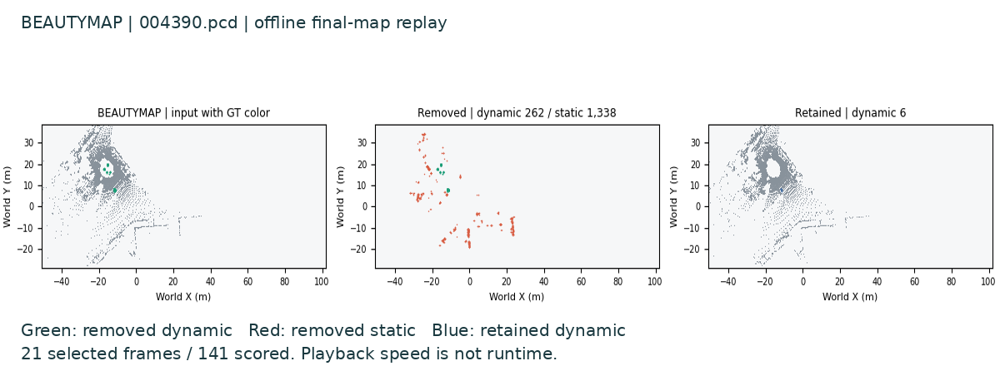

# BeautyMap：作者流程复现

[English](beautymap.md) | 中文 | [PDF](../../output/pdf/beautymap.zh-CN.pdf)

**已执行：**完整 141 扫描 KITTI-00 teaser，使用给定位姿与作者地图清理代码。未评价轨迹或导航。



[MP4](../media/beautymap/replay.mp4) · [GIF](../media/beautymap/preview.gif) · [运行记录](../../results/reference/beautymap-wsl/record.json) · [媒体来源](../../results/reference/paper-media-beautymap/record.json)

## 1. 方法与执行

[BeautyMap（2024）](https://arxiv.org/html/2405.07283v1)使用全局二进制占据矩阵、地面自适应及细化／恢复步骤清理点地图。恢复机制保护部分视角被遮挡的静态几何，因此不能将其概括为“没看到就是动态”。

```bash
bash scripts/setup_linux.sh
uv run slam-study fetch
uv run slam-study run --method beautymap
```

作者版本、可执行兼容补丁与数据哈希均已记录。保留 Windows 整数溢出的首次失败，以显式 64 位掩码修复兼容问题。未为对齐论文调阈值。最终运行在扫描和地图输入中物理移除 GT intensity，标注仅供评价。

## 2. 实测输出

| 指标 | 实测 % | 论文表 I % | 差值，百分点 |
| --- | ---: | ---: | ---: |
| SA：静态保留 | 96.952945 | 96.76 | +0.192945 |
| DA：动态移除 | 98.338247 | 98.38 | -0.041753 |
| HA：调和平均 | 97.640683 | 97.56 | +0.080683 |

处理全部 141 扫描，以 5 cm 地图近邻规则评价 17,362,230 个 GT 点。Windows、Ubuntu、WSL 计数一致；原 PCL／SciPy 对已保存地图的所有点零分歧。未满足 0.01 百分点论文容差。该地图上的评价器等价排除了评价实现差异，但论文时期版本／设置仍未解释。HA 不能当作 DUFOMap 的几何 AA 统一排名。

## 3. 缺陷与研究关联

全局坐标令占据比较高效，但哪个格子对应哪个位置仍由配准决定。地面自适应另有几何假设；恢复不可见静态点已是明确保护机制（III-A/C、V）。

我们的推断是：一致的配准误差可能令许多格子同时产生表面占据变化。当前 teaser 成功及参数敏感性并未证明这一失效。开放问题是：在相同动态召回和延迟下，共享配准门控及可撤销决策能否改善静态保留，并优于现有恢复和阈值选择？

这连接动态稳健建图与语义地图：删除持续存在的表面可能移除对象及查询目标的几何支撑。已知位姿误差仅属于 oracle 诊断，实物应单独评价估计的不确定性。固定相机控制可将可见性问题与位姿问题分开。[共享假设及否定控制](../STUDY.zh-CN.md)。

## 4. 视频如何解读

21 个扫描采用固定世界范围及最终实测地图。原始／移除／保留面板显示绿：正确移除，红：静态损失，蓝：动态漏检。这是离线回放，不代表在线地图演化或算法 FPS。[完整结果及失败记录](../RESULTS.zh-CN.md)。
