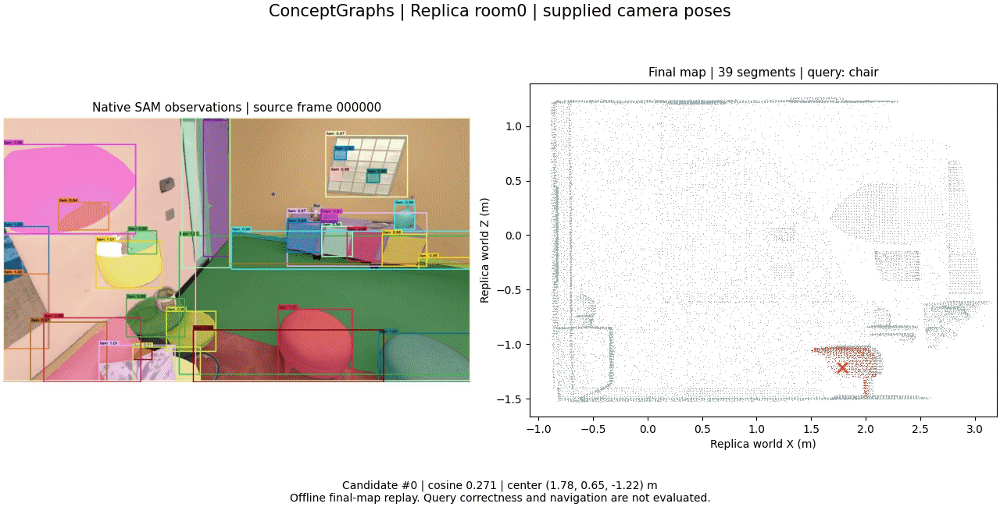

# ConceptGraphs

English | [中文](conceptgraphs.zh-CN.md)

**Replica room0, 40 RGB-D observations.** SAM/CLIP observations are associated and fused into object representations with supplied poses.

[MP4](../../results/reference/conceptgraphs/media/replay/replay.mp4) · [Run](../../results/reference/conceptgraphs/runs/conceptgraphs-wsl/record.json) · [Timing](../../results/reference/conceptgraphs/media/timing.json)

## Results

This subset produced 39 object representations; query correctness is unverified. A separate 400-observation room0 run completed original semantic scoring. It is not the full paper benchmark.

[Original-code paper protocol](https://github.com/p20030920p/SLAM_Learning/blob/535a2780af7ca7eb3aa02f722e1340fe90bc2dcf/docs/CONCEPTGRAPHS_ROOM0_RESULTS.md)

## Usage

[Setup and commands](../guides/REPRODUCE.md) · [Sources](../guides/ATTRIBUTION.md)

## Scope

Supplied poses isolate the declared mapping stages. Videos replay saved outputs; complete SLAM, navigation and hardware accuracy remain unverified.

## Longer recordings

The primary GIF retains the original 13.33-second summary.

- RViz: 69.6 s. [MP4](../../results/reference/conceptgraphs/media/rviz/review.mp4) · [GIF](../../results/reference/conceptgraphs/media/conceptgraphs-rviz.gif).
- Author viewer: 60 s. [GIF](../../results/reference/conceptgraphs/media/conceptgraphs-author-viewer.gif).

[Complete-recording sources and timing](../../results/reference/conceptgraphs/media/full-timing.json)
