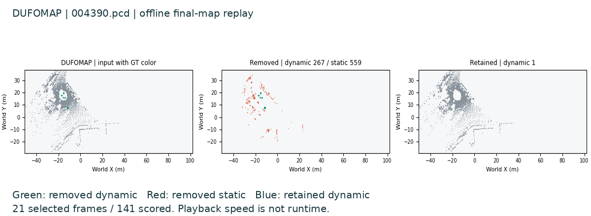

# DUFOMap：作者流程复现

[English](dufomap.md) | 中文 | [PDF](../pdf/dufomap.zh-CN.pdf)

**已执行：**完整 141 扫描的公开 KITTI-00 teaser，使用给定位姿。复现动态点移除和地图评价，未进行轨迹估计。



[MP4](../media/dufomap/replay.mp4) · [GIF](../media/dufomap/preview.gif) · [运行记录](../../results/reference/dufomap-wsl/record.json) · [媒体来源](../../results/reference/paper-media-dufomap/record.json)

## 方法与执行

[DUFOMap（2024）](https://arxiv.org/html/2403.01449v1)累计占据空间和已观察到的空域，依据一个位置是否曾被观测为空来分类点；位姿／量测容差用于保护配准与传感误差。使用作者 DUFOMap 1.1.1 实现，依赖及上游版本均已固定。

```bash
bash src/scripts/setup/setup_linux.sh
uv run --project src slam-study fetch
uv run --project src slam-study run --method dufomap
```

下载验证完整归档校验和。GT 只进入评价及着色；10 帧 smoke 不输出论文成绩。Windows、全新 Ubuntu CI 与本机 WSL 的完整 teaser 混淆计数一致。

## 实测输出

| 指标 | 实测 % | 论文表 I % | 差值，百分点 |
| --- | ---: | ---: | ---: |
| SA：静态保留 | 97.979798 | 97.96 | +0.019798 |
| DA：动态移除 | 98.702895 | 98.72 | -0.017105 |
| AA：几何平均 | 98.340682 | 98.34 | +0.000682 |

评价对象为 17,362,230 个标注点，采用 5 cm 地图最近邻规则。原作者 PCL 与 SciPy 逐点零分歧。流程执行成功，但并非全部论文数值满足预先规定的 0.01 百分点容差。绑定版本／参数差异仍可能存在，原因尚未确定。

同实例控制中，把相同保留点从直接身份评分改成地图近邻评分，SA 增加 5.347532 百分点。这是评分定义效应，并非算法提升。[控制与原始计数](../research/RESULTS.zh-CN.md)。

## 缺陷与研究关联

作者讨论了位姿敏感性、稀疏回波以及从未被看到为空的区域（III-B、V-C/E）。方法已有误差容差，不能说它完全忽略噪声。本库直接标签实验也显示，放大容差会交换静态保留与动态移除。

我们的开放问题是：在相同变化召回和观测预算下，能否区分时间相关配准误差与真实场景变化？共享一个位姿误差的多条射线，不自动成为独立证据。这关联动态环境稳健建图，也关联后续语义定位依赖的几何可信度。

存在静态锚点时，共享位姿／暂定更新的附加模块具有实现可行性，但必须在相同召回和延迟下优于容差扫描，否则应否定额外机制。从未看到为空属于信息不足，不能据此生成自信的删除。[四篇共性分析](../research/STUDY.zh-CN.md)。

## 视频如何解读

21 个具名扫描显示原始／移除／保留点，依据最终离线地图。绿：正确移除动态；红：误移除静态；蓝：漏移除动态。评分在显示抽稀前覆盖全部声明点。播放速度不代表运行速度；完整数据序列、轨迹及实物验证尚未完成。
