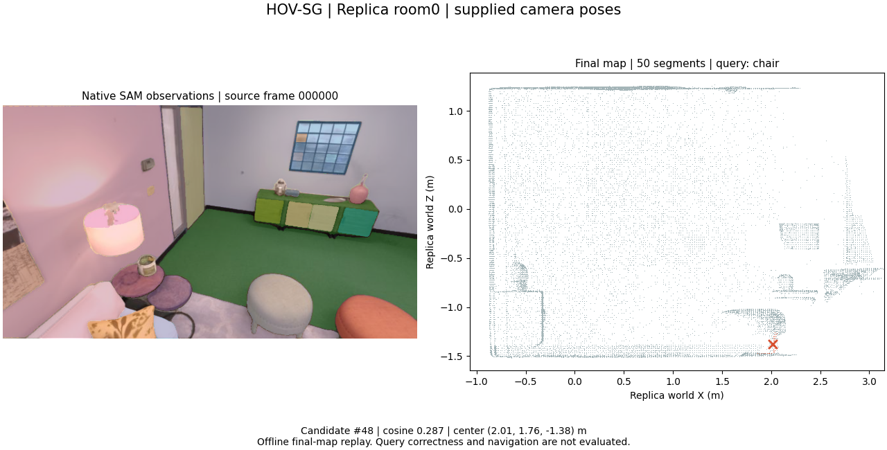

# HOV-SG — segment feature-map reproduction

English | [中文](hovsg.zh-CN.md) | [PDF](../../output/pdf/hovsg.en.pdf)

**Executed:** original 3D segment-level feature mapping on 8 supplied-pose Replica observations. This is the fourth related paper's mapping core; floor/room hierarchy and navigation are not reproduced.



[MP4](../media/hovsg/replay.mp4) · [GIF](../media/hovsg/preview.gif) · [Run](../../results/reference/hovsg-wsl/record.json) · [Media provenance](../../results/reference/paper-media-hovsg/record.json)

## Method and execution

[HOV-SG (RSS 2024)](https://arxiv.org/html/2403.17846v2) lifts SAM segments and CLIP features to reference geometry, merges observations, selects robust features, and constructs a floor/room/object hierarchy. This run calls the author Graph.create_feature_map(), including native geometric merging and feature selection, at source commit d6e65a53c8be6faec3f01f00d1644d967f89e605.

```bash
bash scripts/setup_hovsg.sh
.venv-hovsg/bin/python scripts/run_hovsg.py
```

The separate environment shares verified checkpoints and the 40-observation Replica subset with ConceptGraphs. Source indices 0,25,...175 are processed by skip_frames=5. RGB/depth are resized to 640×360; both intrinsic axes are rescaled from the pinned original 1200×680 calibration. SAM batch 36 and CLIP batch 4 are resource adaptations. Native segmentation/merging thresholds remain fixed; identical original-resolution masks are not claimed.

## Measured output and retained failure

| Item | Observed result |
| --- | --- |
| Processed posed observations | 8 |
| Final segments | 50; not necessarily 50 physical objects |
| Reference points | 166,777 |
| Queries | 4 texts × 3 candidates; correctness unannotated |
| Peak PyTorch allocation in mapper | 10,030,088,704 bytes; excludes driver allocations |

The first 40-observation attempt completed frontend extraction, then the hierarchical merge worker was killed with exit 137. Its record, log and intermediate hashes remain [published](../../results/reference/hovsg-wsl-interrupted/record.json). The cause is not established; no map score or confirmed OOM claim is attached to that attempt. The completed reduced subset is a different run, not a replacement result hidden under the original record.

The 50 segments cannot be ranked against ConceptGraphs' 39 objects: observation count, image settings and association/merging definitions differ. Cosine scores are not calibrated probabilities. No semantic mIoU or complete graph/navigation metric is reported.

## Limitation and research relevance

The paper explicitly identifies static-scene, processing-time and parameter limitations (V), and assumes accurate odometry for projection (III-A). A persistent static feature map lacks a moved target's temporal validity. A geometric error can assign a pixel's semantic evidence to the wrong reference point before a language query occurs.

Our open question is how to retain enough observation provenance to reconsider semantic assignments after a pose correction, without unlimited storage or delaying every query. A shared-pose/provisional-update sidecar is feasible for segments; extending it to full floor/room hierarchy is additional work. Test static/moved/removed/occluded cases and compare threshold and visibility controls at matched query coverage, recall and delay. [Common bottleneck and counterexamples](../STUDY.md).

## Video interpretation

All eight native SAM observations are replayed beside the final world-XZ segment map. A red segment is a query candidate, not verified ground truth. The supplied absolute camera-to-world matrices determine coordinates. This is measured final-map replay, not live navigation, incremental hierarchy growth or a runtime benchmark.
