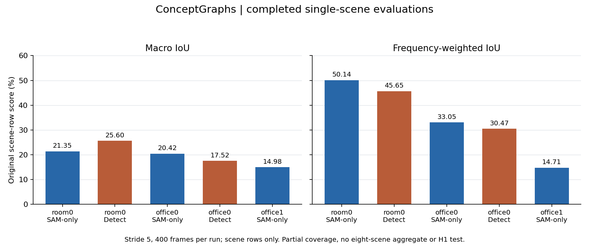

# ConceptGraphs：已完成场景与两种前端

[English](CONCEPTGRAPHS_SCENE_RESULTS.md) | 中文

2026-10-09。**SAM-only 已完成 room0、office0、office1；Detect 已完成 room0、office0。** 每条链路均包括 400 帧前端、作者对象映射、RGB 参考表面和原始语义评分。尚未完成八场景 benchmark；下表只列原 CSV 的场景行，不求部分场景均值。

| 场景 | 前端 | mIoU % | mRecall % | mPrecision % | 原 mF1 % | F-mIoU % |
| --- | --- | ---: | ---: | ---: | ---: | ---: |
| room0 | SAM-only，批量 16 | 21.3460 | 38.3156 | 29.3624 | 25.2661 | 50.1379 |
| room0 | Detect | 25.5987 | 39.3965 | 29.5614 | 29.4374 | 45.6541 |
| office0 | SAM-only，批量 16 | 20.4157 | 38.0756 | 24.7783 | 24.1696 | 33.0546 |
| office0 | Detect | 17.5151 | 29.1962 | 17.8463 | 19.6870 | 30.4729 |
| office1 | SAM-only，批量 16 | 14.9755 | 26.2454 | 16.5344 | 17.0925 | 14.7128 |



两种前端使用相同场景、stride=5 的 400 帧、原 GT 与同一份已核验 RGB 表面。SAM-only 将 SAM 提示点微批量由 144 改为 16；Detect 使用作者 RAM + GroundingDINO + 逐框提示 SAM，没有套用该微批量改动。两者还使用各自 README 的映射参数，因而这不是只改变检测器的组件消融。固定作者提交为 `93277a02`，canonical checkout 干净。

## 1. 原始证据与审计

| 场景／前端 | 原始 CSV | 混淆矩阵复算 | 计分类别／重建点 |
| --- | --- | --- | ---: |
| room0 SAM-only | [CSV](../../results/runs/conceptgraphs-room0-evaluation-cuda-05/results/none_overlap_maskconf0.95_simsum1.2_dbscan.1_merge20_masksub/replica_ex6_results.csv) | [审计](../../results/runs/conceptgraphs-room0-evaluation-cuda-05/evaluation-audit/validation.json) | 23 / 4,085,377 |
| room0 Detect | [CSV](../../results/runs/public-semantic-benchmark-06-room0-detect-stages/results/ram_withbg_allclasses_overlap_maskconf0.25_simsum1.2_dbscan.1/replica_ex6_results.csv) | [审计](../../results/runs/public-semantic-benchmark-06-room0-detect-stages/evaluation-audit/validation.json) | 23 / 4,085,377 |
| office0 SAM-only | [CSV](../../results/runs/public-semantic-benchmark-06-office0-cg-stages/results/none_overlap_maskconf0.95_simsum1.2_dbscan.1_merge20_masksub/replica_ex6_results.csv) | [审计](../../results/runs/public-semantic-benchmark-06-office0-cg-stages/evaluation-audit/validation.json) | 20 / 4,079,895 |
| office0 Detect | [CSV](../../results/runs/public-semantic-benchmark-06-office0-detect-stages/results/ram_withbg_allclasses_overlap_maskconf0.25_simsum1.2_dbscan.1/replica_ex6_results.csv) | [审计](../../results/runs/public-semantic-benchmark-06-office0-detect-stages/evaluation-audit/validation.json) | 20 / 4,079,895 |
| office1 SAM-only | [CSV](../../results/runs/public-semantic-benchmark-06-office1-cg-stages/results/none_overlap_maskconf0.95_simsum1.2_dbscan.1_merge20_masksub/replica_ex6_results.csv) | [审计](../../results/runs/public-semantic-benchmark-06-office1-cg-stages/evaluation-audit/validation.json) | 18 / 3,662,360 |

新增四条链路的 float64 复算与作者 float32 CSV 最大差异小于 `4.8e-7` 个百分点。旧记录器只绑定 CSV，混淆矩阵在首次审计时另取 SHA-256 并明确记录这一时点；没有追改旧执行记录。

新版记录器同时绑定 CSV 和矩阵。[图表、逐类表及来源哈希](../../results/runs/conceptgraphs-semantic-milestone-01/summary.json)可用于重查。

原 mF1 的非标准分母保持原样，标准 F1 仅作为审计补充。

## 2. 为什么场景行与 all 行不同

固定版作者先按该场景 GT 出现的类别选择场景行；`all` 行则按合计混淆矩阵中 GT 支持非零的类别选择，并同时裁切矩阵的行、列。某类出现在原 GT，却在关联后的重建支持面没有 GT 点时，两个集合就可能不同。

| 单场景运行 | 场景行类别数 → all 类别数 | 场景行 mIoU → all mIoU % | 场景行 F-mIoU → all F-mIoU % |
| --- | ---: | ---: | ---: |
| office0 SAM-only | 20 → 19 | 20.4157 → 21.4902 | 33.0546 → 33.0546 |
| office1 SAM-only | 18 → 17 | 14.9755 → 16.3958 | 14.7128 → 15.5714 |

office1 的裁列也移除了部分预测点，因此加权分数随之变化。这是[原作者评价入口](https://github.com/concept-graphs/concept-graphs/blob/93277a02bd89171f8121e84203121cf7af9ebb5d/conceptgraph/scripts/eval_replica_semseg.py)的行为，未改公式。

room0 的两行恰好相同，不能推广到其他场景；不能平均这些单场景 `all` 行来冒充八场景原分数。

## 3. 这些结果改变了什么判断

room0 的 Detect mIoU 比 SAM-only 高 4.25 个百分点，但 F-mIoU 低 4.48 个百分点；零 IoU 类别还从 10/23 增至 12/23。office0 的 Detect 两项 IoU 均更低，零 IoU 类别从 10/20 增至 14/20。因此不能写成“检测前端普遍更好”，也不能只选较好的一个指标。这里没有重复运行区间，尚不能对完整 benchmark 下结论。

这些分类分数未测对象身份、语言查询坐标或迟到位姿修正。它们提醒后续 H1 实验固定前端和原始支持面，分别测恢复；不能把更换前端的收益归为回放模块。与 HOV-SG 的 GT、文本提示和插值规则也不同，见[协议对照](SCOPE.zh-CN.md)。

## 4. 中断与后续队列

WSL 重启使旧队列 06 停在 office1 Detect 前端。其日志虽有 400/400，缺少原进程退出码，仍记为 `interrupted`。

[中断诊断与输出保留记录](../../results/runs/public-semantic-benchmark-06-restart-recovery-01/diagnosis.json)绑定旧日志和产物清单。之后队列 08 在首帧停滞，主动取消并保留真实 exit -15。

三帧显存兼容检查通过后，新队列 09 核验复用上述五条链路，以明确披露的分阶段 GPU 驻留方案重跑 office1 Detect，再继续 office2/3/4、room1/2 的两种流程；只有各自八场景全部成功，才执行未经修改的原八场景评价入口。

在[运行手册](../guides/RUNBOOK.zh-CN.md)设置 `RUNTIME` 后只读检查：

```bash
cat "$RUNTIME/runs/public-semantic-benchmark-09/outcomes.json"
tail -c 1500 "$RUNTIME/runs/public-semantic-benchmark-09/orchestration.log"
```

08 还处理了后续重启：旧 07 的 office1 Detect 在 152/400 中断，部分输出另行保留；HOV 的等待任务没有启动作者阶段。[终态记录与保留清单](../../results/runs/public-semantic-benchmark-07-restart-recovery-01/diagnosis.json)。
