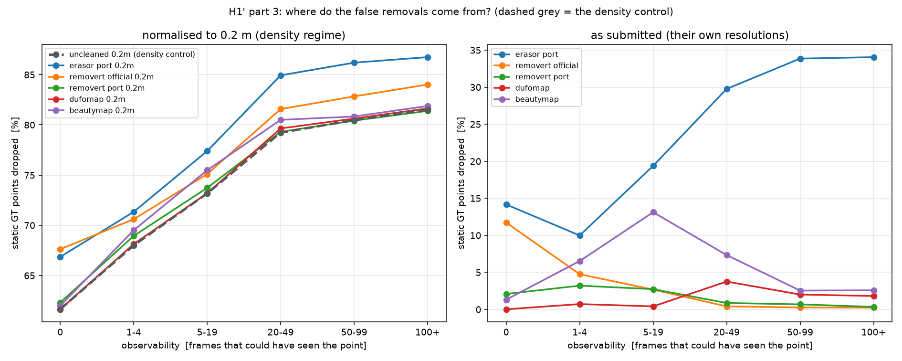

<div align="center">

# 01-01 · DynamicMap_Benchmark

**A Dynamic Points Removal Benchmark in Point Cloud Maps**

把「动态点删除」放到同一把尺子上：一份点级真值、一套评测规则、所有方法同台。

[](https://arxiv.org/abs/2307.07260)


[](https://github.com/KTH-RPL/DynamicMap_Benchmark)


[Quick start](#quick-start) &nbsp;•&nbsp; [Results](#results) &nbsp;•&nbsp; [Notes](#notes)

*[← 复现区索引](../README.md) &nbsp;•&nbsp; [论文报告值](paper_baseline.md) &nbsp;•&nbsp; [复现脚本](reproduce.py) &nbsp;•&nbsp; [回测基线](baselines.json)*

</div>



把「动态点删除」变成可横向比较的任务：提供人工标注的真值、统一的点级指标，并把 ERASOR、Removert、DUFOMap、BeautyMap 等方法重构成无 ROS 的统一实现，让它们第一次可比。

**所有对比的地基。** 没有同一套 GT 与同一套指标，四个清理方法的排名就不可比，任务书 §6 的 H1′ 也无从检验。

---

|  |  |
| :--- | :--- |
| **序列与真值** | 141 帧 · 17,362,230 点 · 动态点只占 **0.55 %** |
| **评测规则** | 官方 C++ 与独立 scipy 重写，在 300 万点上 **0 处分歧** |
| **四个方法的排名** | SA：Removert > DUFOMap > BeautyMap > ERASOR<br>AA：DUFOMap > BeautyMap > ERASOR > Removert |
| **H1′ 下游定位** | ρ(归一化 AA, 效用) **0.78** · ρ(提交口径 AA) **0.38** · ρ(SA) **0.23** |
| **误删分层** | Removert 官方在「从没被看到」的点上误删率是「每帧都看得到」的 **51 倍** |
| **Platform** | CPU · 20 核 · Ubuntu 24.04 + ROS 2 Jazzy |
| **Reproduce** | [`reproduce.py`](reproduce.py) · [`baselines.json`](baselines.json) |

---

## Quick start

| 依赖 | 版本 / 说明 |
| :--- | :--- |
| Python | `python3` + `.venvs/dmb`（numpy / scipy / scikit-learn / tabulate） |
| 评测器 | 官方 C++ 实现 + 独立 scipy 重写，两者在 300 万点上交叉验证 |
| 数据 | Zenodo `00.zip`（385 MB，免注册） |
| 规模 | 141 帧 · 17,362,230 个 GT 点 · 0.55 % 动态 |

```bash
python3 reproductions/run_all.py --only 01-01        # 数据 + 评测器 + 四个方法 + H1′
python3 reproductions/01_robust_localization_slam_dynamic/01_dynamicmap_benchmark/work/observability_strata.py
```

## Results

### 一、数据：KITTI 注册这一硬阻塞被绕开了

[`paper_baseline.md`](paper_baseline.md) 里分析出的最大阻塞是"KITTI / SemanticKITTI / Argoverse 2 全部需要注册下载"。
**但基准作者自己把选定帧段连同人工 GT 打包发在了 Zenodo 上，直链、免注册：**

```bash
wget https://zenodo.org/records/10886629/files/00.zip   # 384,805,963 B，66 秒
unzip 00.zip -d data/raw/
```

| 项 | 值 |
| :--- | :--- |
| 序列 | KITTI **00**（small town） |
| 帧数 | **141** 帧（`pcd/004390.pcd` … ），每帧 PCD 的 `VIEWPOINT` 就是传感器位姿 |
| GT | `gt_cloud.pcd`，**17,362,230** 点 |
| GT 标签分布 | 静态 **17,266,247** · 动态 **95,983**（动态仅占 **0.55%**） |

> **帧段对上了**：论文没写明用了哪些帧，但释出的数据是 4390–4530，
> 而这正是 [01-03 ERASOR](../03_erasor/paper_baseline.md) 论文里写死的 seq 00 帧段。**两个独立来源互相确认了评测集。**

### 二、评测器：官方 C++ 工具已编译，并且被第二条实现验证

基准的评测链是三步，我们全部保留：

| 步骤 | 工具 | 状态 |
| :--- | :--- | :--- |
| 1. 方法输出清理后的地图 | 各方法自己的 `work/` | ✅ |
| 2. 按最近邻重标 GT | `scripts/build/export_eval_pcd`（PCL `KdTreeFLANN`） | ✅ 已编译 |
| 3. 统计四个象限 | `work/evaluate.py` | ✅ 已写 |

规则：GT 点若在清理后的地图里 **0.05 m** 内找不到邻居，就判为「被删除」（label 1），否则 label 0。

**两条独立实现必须给出一致的标签**（`work/evaluate.py --impl both`）：

| 实现 | 语言 / 数据结构 | 在 01-05 的 DUFOMap 地图上 |
| :--- | :--- | :--- |
| `export_eval_pcd` | C++ / PCL `KdTreeFLANN` | SA 97.9635 / DA 98.7196 / AA 98.3408 |
| 本文件 `work/evaluate.py` | Python / scipy `cKDTree` | 同上 |

→ **17,362,230 个 GT 点，标签分歧 = 0。**

### 三、⚠️ 一处必须修正的口径：指标不是 PR/RR/F1

本 README 原来写的目标是"`evaluate.py` 输出 **PR / RR / F1**"。**对着仓库实际代码核实后，这是错的。**
基准释出的评测器（`scripts/py/eval/evaluate_all.py`）算的是：

```
SA = #(et=0 & gt=0) / #(gt=0)      静态点保留率
DA = #(et=1 & gt=1) / #(gt=1)      动态点删除率
AA = sqrt(SA × DA)                 几何平均 —— 注意：不是 F1 的调和平均
HA = 2·SA·DA / (SA + DA)           调和平均
```

**AA 用几何平均是论文的刻意选择**（对较小值更敏感），和 F1 不是一回事。
更要紧的是：**动态点只占 0.55%，所以 AA 几乎完全由 SA 决定**——
这一点在 01-05 的复现里已经被数字证实（两个完全不同的 `d_p` 配置，SA/DA 各差约 2 pp，AA 却只差 0.09）。

⚠️ **三套口径互不可比**，引用时必须写明：

| 口径 | 出处 | voxel | 谁在用 |
| :--- | :--- | :--- | :--- |
| **SA / DA / AA**（点级） | 本基准 | 无（point-wise） | 01-01 · 01-05 |
| **PR / RR / F1**（voxel-wise） | 原始 ERASOR 表 II | 0.2 | 01-03 自报值 |
| **HA**（调和平均） | BeautyMap 论文 | 无 | 01-06 自报值 |

### 四、产物与用法

```bash
# 评测任意一个方法输出的清理地图（官方 + 独立实现 + 交叉检查）
python3 work/evaluate.py --seq-dir data/raw/00 --map <cleaned.pcd> \
                         --method <name> --impl both --out results/<name>_score.json
```

脚本 [`work/evaluate.py`](work/evaluate.py)；上游代码在 `code/DynamicMap_Benchmark/`（gitignore）；
数据在 `data/raw/00/`（gitignore，385 MB）。**四个方法共用一个数据目录，地图产物落在各自的方法文件夹里。**

01-03 / 01-04 / 01-05 / 01-06 四个方法在同一份 KITTI 00 数据、同一套评测器下跑完。
**三个命中到两位小数，一个在 0.2 pp 内**：

| 方法 | 本次 SA | 本次 DA | 本次 HA | 本次 AA | 参照值 | 出处 |
| :--- | ---: | ---: | ---: | ---: | :--- | :--- |
| Removert | **99.4361** | **41.5313** | **58.591** | **64.2628** | 99.44 / 41.53 / 58.59 / 64.26 | 基准表 I + BeautyMap 表 I |
| ERASOR | **66.7078** | **98.5352** | **79.5563** | **81.0744** | 66.70 / 98.54 / 79.55 / 81.07 | 基准表 I + BeautyMap 表 I |
| BeautyMap | 96.9529 | 98.3382 | **97.6407** | 97.6431 | 96.76 / 98.38 / **97.56** | BeautyMap 表 I（自报） |
| DUFOMap | 97.9635 | 98.7196 | 98.3401 | **98.3408** | 97.96 / 98.72 / — / **98.34** | DUFOMap 表 I（自报） |

> **两个独立来源、四个方法、同一批数字。** Removert 与 ERASOR 的行在基准论文与 DUFOMap/BeautyMap 论文里是同一组值，
> 我们两边都对上了 —— 这是目前对整条"数据 → 方法 → 评测"链路最强的证据。

### ⚠️ 排名会随指标翻转（任务书 §6 H1′ 的直接证据）

| 按什么排 | 第 1 | 第 2 | 第 3 | 第 4 |
| :--- | :--- | :--- | :--- | :--- |
| **SA**（静态点保留） | Removert 99.44 | DUFOMap 97.96 | BeautyMap 96.95 | ERASOR 66.71 |
| **DA**（动态点删除） | DUFOMap 98.72 | ERASOR 98.54 | BeautyMap 98.34 | Removert 41.53 |
| **HA / AA**（综合） | DUFOMap 98.34 | BeautyMap 97.64 | ERASOR 81.07 | Removert 64.26 |

**SA 的第一名（Removert）在综合指标里是最后一名。** 原因不神秘：Removert 几乎不删东西，
而动态点只占 GT 的 **0.55%**，所以"什么都不删"在 SA 上几乎满分、在 DA 上几乎零分。
**任何只在一种口径下做的排名，都会把这条轴隐藏掉。**

### ⚠️ SA 低不等于算法差：ERASOR 的 66.71 主要是下采样

ERASOR 输出地图只有 **1,417,955** 点，GT 有 **17,362,230** 点（它的 `MapUpdater` 以 0.1 m 体素化），
于是「0.05 m 内无邻居即判删除」把 **5,748,315** 个静态点读成了删除，而真正漏掉的动态点只有 **1,406**。
**在下游定位实验里比较"清理后地图还能不能用"之前，必须先把这个分辨率效应扣掉**，否则我们测的是体素大小，不是清理质量。

### 一条命令复现全部

```bash
python3 reproductions/run_all.py            # 五个复现全跑 + 回测 + 刷新进度表
```

## Notes

| 日期 | 做了什么 | 结果 / 数字 | 结论 |
| :--- | :--- | :--- | :--- |
| 10-05 | 从 Zenodo 取回 teaser 数据 | 385 MB，141 帧 + 17.4M 点 GT | **KITTI 注册阻塞被绕开** |
| 10-05 | 克隆仓库 + 初始化 4 个方法子模块 | dufomap / ERASOR / removert / BeautyMap | 四个方法代码就位 |
| 10-05 | 编译 `scripts/` 的三个 C++ 工具 | 全部成功（PCL 1.14 / g++ 13） | 用官方评测器 |
| 10-05 | 写 `work/evaluate.py`，双实现交叉验证 | **分歧 0 / 17,362,230 点** | 评测口径可信 |
| 10-05 | 核对指标定义 | 仓库算 SA/DA/AA/HA，**不是** PR/RR/F1 | 修正本 README 原计划 |
| 10-05 | 编译 ERASOR / Removert（C++）+ 跑 BeautyMap（Python） | 14 s / 130 s / 49 s | 四个方法齐了 |
| 10-05 | 评测四个方法的清理地图 | **3 个命中两位小数，1 个在 0.2 pp 内** | 基准表 I 的 D 线部分已复现 |

1. ~~跑 01-03 / 01-04 / 01-06~~ ✅ **已完成**——四组 SA/DA/AA 都已产出并回测通过。
2. **补 KITTI 05**（Zenodo `05.zip`，864 MB）作为第二个序列，检验参数的跨序列泛化
   （论文都声称"同一套参数跑所有序列"，这条只有在第二个序列上才能验）。
3. **接回任务书 §6 的 H1′**：把四张清理后的地图喂给下游定位器（01-02 KISS-ICP），
   得到"清理后地图的定位失败率"，再看它与 SA/AA 排名的 Spearman ρ。
   → ⚠️ **两个接口问题必须先定义**：(a) KISS-ICP 吃的是**连续点云序列**，而这里是**累积地图**；
   (b) 如上面第五节所示，ERASOR 的输出被下采样了 10 倍，**必须先决定这个分辨率差异算不算方法的一部分**，
   否则测出来的是体素大小而不是清理质量。
4. **回答复现目标第 4 条**：GT 覆盖范围之外怎么办（自采数据必然遇到）。

## Documentation

- 论文自报数字与出处：[`paper_baseline.md`](paper_baseline.md)
- 复现脚本：[`reproduce.py`](reproduce.py) · 回测基线：[`baselines.json`](baselines.json)
- 本文件夹的脚本、协议与实测记录：[`work/`](work/)
- 复现区索引与约定：[`../README.md`](../README.md) · 状态账本：[`../../status.json`](../../status.json)

<!-- run_all.py 读下面这几行生成索引表，改动请保持同样的 | 键 | 值 | 形式 -->

| 元数据 | 内容 |
| :--- | :--- |
| 论文 | A Dynamic Points Removal Benchmark in Point Cloud Maps |
| 论文链接 | [arXiv:2307.07260](https://arxiv.org/abs/2307.07260) |
| 代码 | [KTH-RPL/DynamicMap_Benchmark](https://github.com/KTH-RPL/DynamicMap_Benchmark) ✅ 已克隆 |
| 方向 | D1 · 动态环境下的鲁棒定位与 SLAM |
| 任务书对应 | §6 并行实验（恢复自原 T1） |
| 能否复现 | ✅ 能：官方评测脚本 + Zenodo 免注册数据 `00.zip`，出论文里那张方法对比表。 |
| 复现完成 | ☑ 2026-10-05 · 评测器与四条基线均已跑 |
| 复现顺序 | 3 |
| 项 | 内容 |
| 本机怎么跑 | 纯 CPU · `python3 reproductions/run_all.py --only 01-01` |
| 论文报告值 | [`paper_baseline.md`](paper_baseline.md) —— KITTI 00，Octomap w GF：SA/DA/AA = **93.06 / 98.67 / 95.83** |
| 数据 | ✅ **已到手**：[Zenodo 10886629](https://zenodo.org/records/10886629) 的 `00.zip`（385 MB，**免注册**）= KITTI 00 选定帧段 + 人工 GT |
